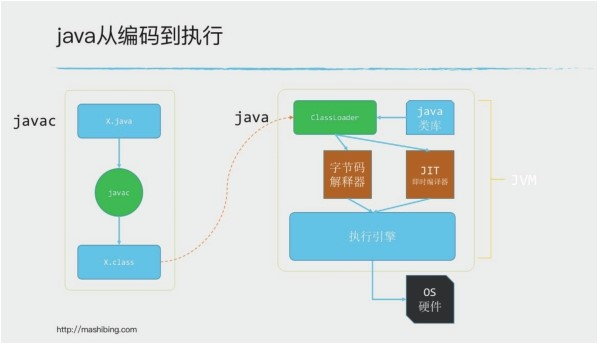
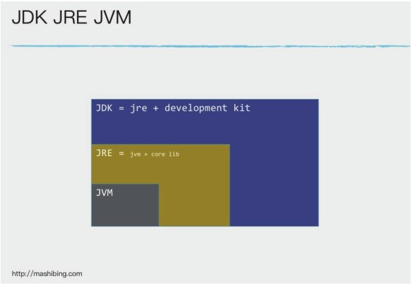
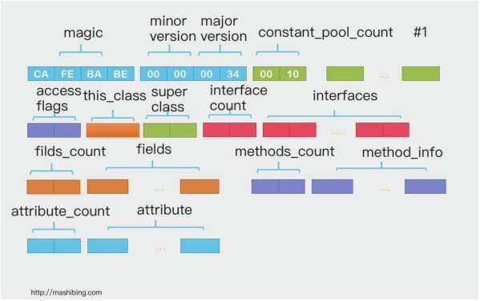
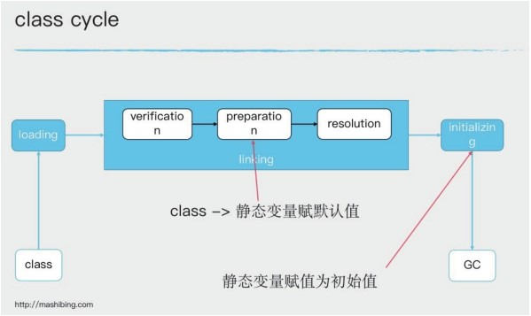
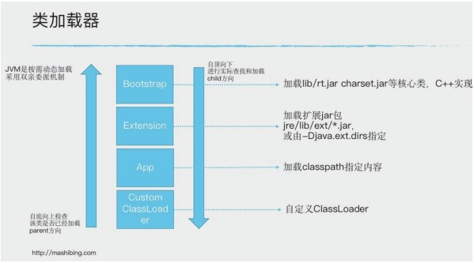
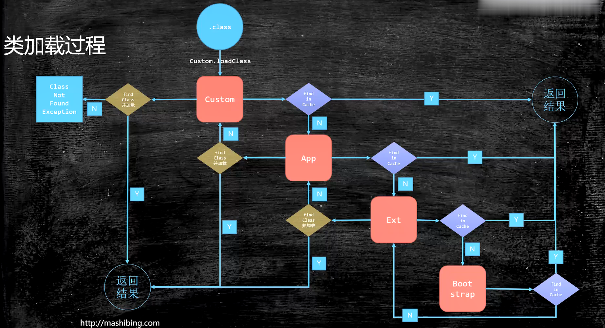
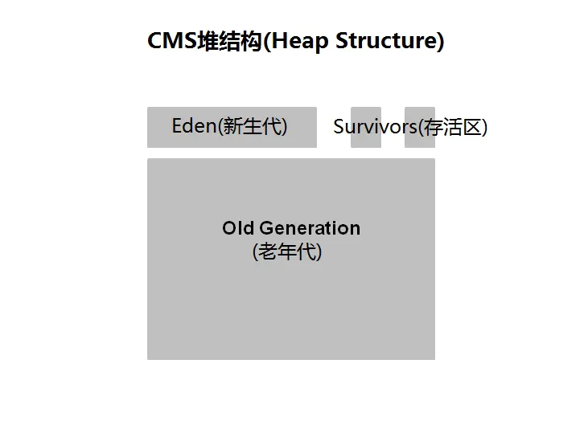
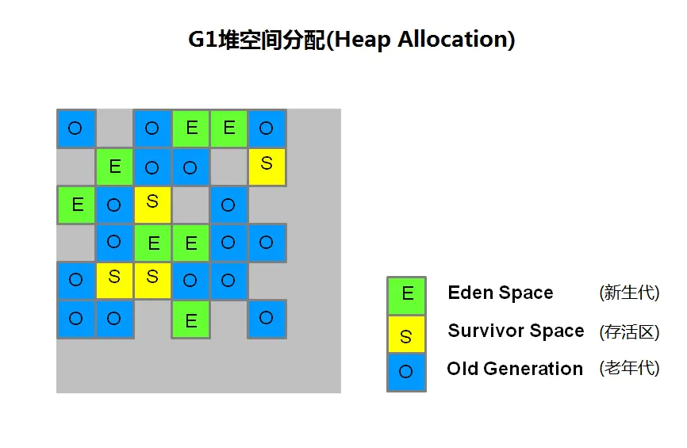

## JVM基础概念

### Java从编码到执行，Java是解释和编译混合型语言



JVM是跨语言的平台，有许多语言可以直接在JVM虚拟机上执行。

### JVM与class文件格式

​	JVM跟java无关。

​	JVM是一种规范，可参考oracle官网，
​	https://docs.oracle.com/en/java/javase/13/
​	https://docs.oracle.com/javase/specs/index.html

​	JVM是虚构出来的一台计算机。有自己的字节码指令集（汇编语言）、有自己的内存管理：栈、堆、方法区等。

### 常见的JVM实现

Hotspot：oracle官方，我们做实验用的JVM，执行命令Java -version
Jrockit：BEA，曾经号称世界上最快的JVM，后被Oracke收购，合并于hotspot
J9：IBM
Microsoft VM
TaobaoVM：hotspot深度定制版
LiquidVM：直接针对硬件
azul zing：最新垃圾回收的业界标杆，官网www.azul.com

JDK JRE JVM



## class文件结构

- 二进制字节流（Java虚拟机解释为二进制字节流）

- 数据类型：u1 u2 u4 u8和_info(表类型)

  - u1表示1个字节 u2表示2个字节 u3表示3个字节 u4表示4个字节
  - _info的来源是hotspot源码中的写法

- 查看16进制格式的ClassFile

  - sublime/ notepad
  - IDEA插件-BinEd

- 有很多可以观察ByteCOde的方法

  - javap：javap -v 文件名
  - JBE - 可以直接修改
  - JClassLib - IDEA插件之一

- ClassFile构成

  


## 类加载-初始化

### class文件怎么从硬盘上到内存中，并且开始执行



Class进入内存有三步：

- 第一步Loading(加载)
- 第二步Linking:第二步包含三小步，verification、preparation、resolution
- 第三步Initializing(初始化)

Loading:

​	把一个class文件load内存装到内存里去，他本来是class文件上的一个一个的二进制，一个一个的字节，装完之后就是接下来的Linking。

Linking的过程分为三小步：

​	将创建的类合并至Java虚拟机中，使之能够执行的过程。分为以下三个阶段：

- Verification：校验，校验装进来的class文件是不是符合class文件的标准，假如装进来的不是这个CA FE BA BE，在这个步骤就被拒掉了。
- Preparation：准备，把class文件静态变量初始化默认值，不是赋初始值，比如static i = 8，在这个步骤是先把把i赋值为0.
- Resolution：解析，是把class文件常量池里面用到的符号引用给转换为直接内存地址，直接可以访问到的内容。

Initializing：把静态变量赋值为初始值。	

当父类和子类都有静态代码块和构造函数的时候，执行顺序入下：
父类静态代码块 > 子类静态代码块 >父类构造函数 > 子类构造函数
 Java虚拟机加载类的时候，就会执行静态代码块，且只执行一次。

### 类加载器



JVM她本身有一个类加载器的层次，这个类加载器本身就是一个普通的class，JVM有一个类加载器的层次分别来加载不同的class，JVM所有的class都是被类加载器加载到内存的，那么这个类加载可以叫做ClassLoader。

**第一个类加载器层次**

Bootstrap：它是加载lib里JDK最核心的内容，比如rt.jar、charset.jar等核心类，所以说什么时候我们调用getClassLoader()拿到这个器的结果是一个空值的时候代表已经到达了最顶层的加载器。Bootstrap是C++实现的，在Java中没有一个类与之对应，所以输出为null

**第二个类加载器层次**

Extension：这个是Extension加载器扩展类，加载扩展包里的各种各样的文件，这些扩展包在JDK安装目录jre/lib/ext下的jar

**第三个类加载层次**

Application:用于加载classpath指定的内容。

**第四个类加载层次**

CustomerClassLoader：自定义加载器，加载自己定义的加载器。

### 类加载过程



### Class对象到底什么样

​		一个class文件平时躺在硬盘上，这个内容被load内存之后，内存会创建两块内容，第一块内容是存储String.class二进制，第二块内容是于此生成了一个class类的对象，这一块对象指向了第一块内容。；

​		反射过程：使用反射，我们通过class对象去拿它的方法，甚至可以调用方法，他一定是哪些方法的信息存在这个对象里，然后真让这个方法执行的时候，一定是去找那个class文件里面的二进制码，翻译成Java指令一步一步执行。

### 双亲委派

- 父加载器

  父加载器不是 类加载器的加载器，也不是加载器的父类加载器，父加载器，是class对象里面的一个parent对象。(类加载器的加载器是null)

- 双亲委派是从子到父，然后从父到子方向的双亲委派过程。
- 思考：为什么要双亲委派
  
  - java.lang.String类由自定义类加载器加载行不行？

### 类加载器范围

来自Launcher源码

- BootstrapClassLoader加载路径：sun.boot.class.path
- ExtensionClassLoader加载路径：java.ext.dirs
- AppClassLoader加载路径：java.class.path

```
com.ltt.jvm.classloader.T003_ClassLoaderScope.java例子
```

### 自定义类加载器

- 继承ClassLoader
- 重写模板方法findClass
  - 调用defineClass
- 自定义类加载器加载自加密的class
  - 防止反编译
  - 防止篡改

```
com.ltt.jvm.classloader.T004_LoadClassByHand
com.ltt.jvm.classloader.T005_MSBClassLoader
```

### Java编译器

​	Java是解释型和编译型混合语言。

- 解释型
  - bytecode intepreter
- JIT
  - Just In-Time compile
- 混合模式（默认模式）
  - 混合使用解释器 + 热点代码编译
  - 起始阶段采用解释执行
  - 热点代码检测
    - 多次被调用的方法（方法计数器：检测方法执行频率）
    - 多次被调用的循环（循环计数器：检测循环执行频率）
    - 进行编译
- -Xmixed 默认为混合模式：开始解释执行，启动速度较块，对热点代码实行检测和编译
- -Xint 使用解释模式，启动很快，执行稍慢
- -Xcomp 使用编译模式，执行很快，启动很慢

### 懒加载LazyLoading

- 严格应该交LazyInitializing
- JVM规范并没有规定何时加载
- 但是严格规定了什么时候初始化
  - new、getStatic（访问实例）、putStatic、invokestatic（访问静态方法），访问final变量除外。
  - java.lang.reflect对类进行反射调用时
  - 初始化子类的时候，父类首先初始化
  - 虚拟机启动时，被执行的主类必须初始化
  - 动态语言支持java.lang.invoke.MethodHandle解析的结果为REF_getstatic REF_putstatic  REF_invokestatic的方法句柄时，该类必须初始化。

```
com.ltt.jvm.classloader.T007_LayzeLoading
```

# 


# JVM内存结构


# 面试

## 为什么使用双亲委派？

最主要是安全，假如任何的类都可以自定义load到内存，那如果把java.lang.String类交给自定义classloader，load到内存，如果把这一部分打成jar包，给客户端使用，那么就能把客户端输入的String字符串，我都可以拿到，包括账号密码。其次可以节省资源，如果父加载器已经加载了就不用再次加载。


# JVM垃圾回收机制

堆空间分为了年轻代和老年代（比例是1：2），年轻代又分为Eden区和Survive区，Suivive区又分为from区和to区，Eden：from：to=8：1：1。

可以使用参数设置比例和大小：

- -XX:NewSize=n：设置年轻代大小

- -XX:NewRatio=n：设置年轻代和老年代的比值，例如n为3，表示年轻代与老年代的比值是1：3.
- -XX:SurvivorRatio=n：Eden区和Survive区的比值。Survive有两个区，如果n是3，表示Eden:Survive=3:2，一个Survive占整个年轻代的1/5.
- -Xmx：初始堆大小
- -Xmx：最大堆大小

## 垃圾回收算法

### 标记清除算法


### 复制算法


### 标记整理算法


### 分代收集算法

创建的对象会分配到Eden区，当Eden区内存不够的时候，触发Minor GC，根据可达性分析算法将存活的对象进行标记，并移动到Survive的from区，同时将对象的年龄加1；此时Eden区有了空闲内存，新创建对象仍会在Eden区分配内存，当Eden区内存又满了之后，Eden区和from区存活的对象进入到to区，存活对象年龄加1，交换form和to区的引用，即此时存活对象在from中，to区保持空闲。如果from区中对象年龄达到阈值15（默认15）或者from区或to区达到整个对象的50%（此处整个对象是指Survive？），则存活对象进入到老年代，如果老年代内存不够用会触发Full GC，即新生代和老年代会一起进行垃圾回收，此时可能会触发SWT机制（stop-the-world），造成程序的停顿。

## 垃圾收集器

### CMS收集器



CMS（Concurrent Mark Sweep）收集器是一种以获取最短回收停顿时间为目标的收集器。这是因为CMS收集器在工作时，GC工作线程与用户线程可以并发执行，以此达到降低收集停顿时间的目的。CMS仅作用于**老年代**的收集，是基于标记-清除算法的。

CMS收集器的作用过程分为4个步骤：

1. 初始标记：标记GC Roots能直接关联到的对象，速度很快，需要在safepoint位置暂停所有执行线程（stop-the-world）。
2. 并发标记：并发标记阶段就是进行GC Roots Tracing的过程，遍历完从root可达的所有对象，该阶段与工作线程并发执行。
3. 重新标记：修正并发标记期间因用户线程继续运作而导致标记产生变动的那一部分对象的标记记录，需要在safepoint位置暂停所有执行线程（stop-the-world），该阶段远比并发标记的时间段。
4. 并发清理：内存回收阶段，将死亡的内存对象占用的空间增加到一个空闲列表（free list），供以后分配使用

**优点：**并发收集、低停顿

**缺点：**

- CMS收集器堆CPU资源非常敏感
- CMS收集器无法处理浮动垃圾
- CMS收集器是基于标记-清除算法，该算法的缺点都有，所以会产生大量碎片内存

**安全点(Safepoint):**安全点，即程序执行时并非在所有地方都能停顿下来开始GC，只有在达到安全点是才能暂停。

**CMS是如果解决内存碎片的：**使用-XX:CMSFullGCsBeforeCompaction=n 默认是0，在转入Full GC的时候都会做压缩。

### G1收集器



G1收集器重新定义了堆空间，打破了原有的分代模型，将堆划分为一个个区域（Region）。这么做的目的是在进行收集时不必在全堆范围内进行，这是它最显著的特点。

区域划分的好处是带来了停顿时间可预测的收集模型：用户可指定收集操作在多长时间内完成。即G1提供了接近实时的收集特性。

G1收集器的运作过程：

1. 初始标记（initial marking，STW）：标记GC Roots能直接关联到的对象，并修改TAMS(Next Top Mark Start) 的值，让下一阶段用户程序并发运行时，能在正确可用的Region中创建对象，这阶段需要停顿线程，但耗时很短。
2. 并发标记（Concurrent Marking）：是从GC Roots开始对堆中对象进行可达性分析，找出存活的对象，这阶段耗时较长，但可以用户程序并发执行。
3. 最终标记（Final Marking，STW）：是为了修正并发标记期间用户程序继续运行而导致标记产生变动的那一部分标记记录，虚拟机将这段时间对象变化记录在线程Rememberd Set Logs里面，最终标记需要把Remembered Set Logs的数据合并到Remembered Sets(也叫RSets)中，这阶段需要停顿线程，但是可并行执行。
4. 筛选回收（Kive Data Counting  and Evacuation，STW）：首先对各个Region的回收价值和成本进行排序，根据用户所期望的GC时间来制定回收计划。这个阶段可做到与用户程序并发执行，但是因为回收一部分Region，时间是用户可控的，而且停顿用户线程将大幅提高收集效率。

**记忆集（Remembered Sets）：**Rememered Sets也叫RSets，用来跟踪对象引用。

**卡表（Card Table）**

有一个场景，老年代的对象可能引用新生代的对象，那标记存活对象的时候，需要扫描老年代中的所有对象。因为该对象拥有对新生代对象的**引用**，那么这个**引用**也会被称为GC Roots。那不是要做全堆扫描？成本太高了吧。

HotSpot给出的解决方案是一项叫做卡表的技术，该技术将整个堆划分为一个个大小为512字节的卡，并且维护一个卡表，用来存储每张卡的一个标识位。这个标识位代表对应的卡是否可能存有执行新生代对象的引用。如果可能存在，那么就认为这张卡时脏的。


### Parallel收集器


### Parallel Old收集器


### Parallel Scavenge收集器


**G1分代垃圾回收：**


使用什么参数调正堆中内存的大小（eden、suviver区）

什么情况下对象直接进入老年代，使用了什么机制