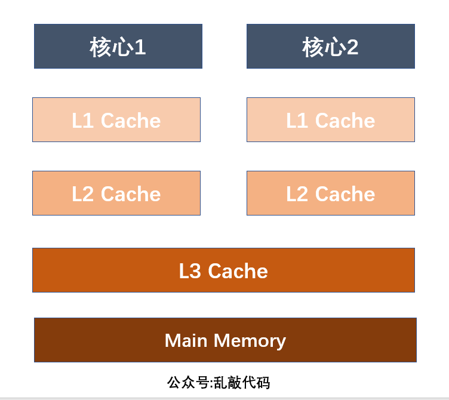
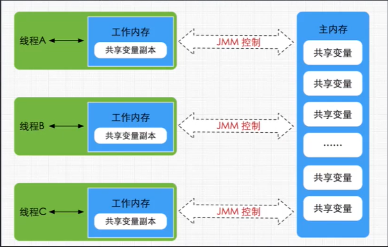
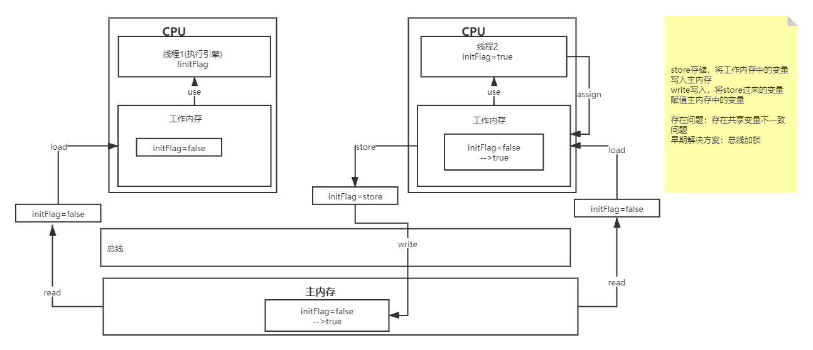
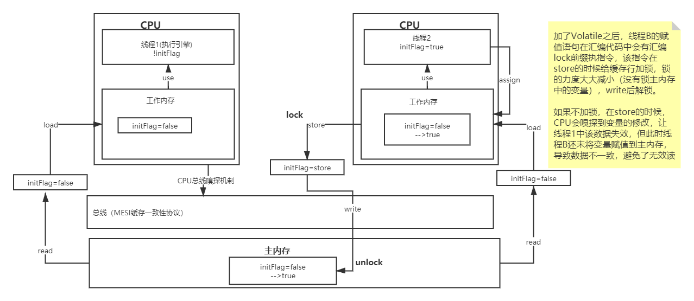
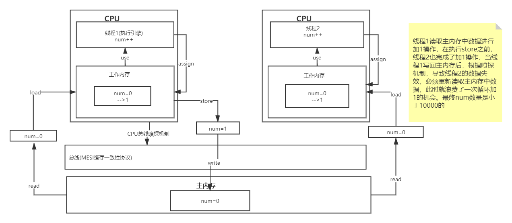

# JMM（Java Meomry Model）

## 多核并发缓存架构



现代计算机有多个CPU，每个CPU还可能会有多核，每个核心都有L1缓存或L2缓存，而共享L3缓存或者L2缓存。加入缓存的原因是随着计算机发展CPU的处理速度越来越高，但是主内存的存取速度没什么进展，为了解决CPU与主内存交互速度不匹配的问题，在两者中间加入缓存，加快处理速度。

L3缓存包括L2缓存数据，L2缓存数据包含L1缓存数据。CPU首先从L1缓存中找数据（时间最短），找不到再从L2缓存中找，L2缓存没有再从L3缓存找，L3缓存中没有就从主内存中读取。

## JMM内存模型

Java线程内存模型跟CPU缓存模型类似，是基于CPU缓存模型来建立的，Java线程内存模型是标准化的，屏蔽了底层不同计算机的区别。



如下代码，会存在线程之间变量不可见现象，导致线程一直循环。

```
public class VolatileVisibilityTest {

	private static /* volatile */ boolean initFlag = false;
	
	public static void main(String[] args) throws InterruptedException {
		new Thread (new Runnable() {
			@Override
			public void run() {
				System.out.println("waiting data...");
				while(!initFlag) {
					
				}
				System.out.println("success");
			}
		}).start();
		
		// 保证先执行第一个线程的执行
		Thread.sleep(2000);
		
		new Thread(new Runnable() {
			@Override
			public void run() {
				prepareData();
			}
		}).start();
	}
	
	public static void prepareData() {
		System.out.println("prepare data....");
		initFlag = true;
		System.out.println("prepare data end....");
	}
}
```

使用Volatile关键字可以保证线程之间内存共享变量的可见性。

## JMM数据原子操作

- read(读取)：从主内存中读取数据
- load(载入)：将主内存读取到的数据写入工作内存
- use(使用)：从工作内存读取数据来计算
- assign(赋值)：将计算好的值重新赋值到工作内存中
- store(存储)：将工作内存中的数据写入主内存
- write(写入)：将store过去的变量赋值主内存中的变量
- lock(锁定)：将主内存变量加锁，标识为线程独占状态
- unlock(解锁)：将主内存变量解锁，解锁后其他线程可以锁定该变量

结合上面代码和数据原子操作，画除原子操作过程：



存在共享变量数据不一致问题。

扩展：CPU和主内存交互是通过总线的。

## JMM缓存不一致问题

解决方案：

**总线加锁（性能太低）**

CPU从主内存读取数据到高速缓存区，会在总线对这个数据加锁，这样其他CPU就无法读或写这个数据，直到CPU使用完数据释放锁之后，其他CPU才能读取该数据。

**MESI缓存一致性协议**（硬件底层实现）

多个CPU从主内存读取同一个数据到自己的高速缓存，当其中一个CPU修改了缓存里的数据，该数据会马上同步回主内存，其他CPU通过**总线嗅探机制（硬件底层实现）**可以感知到数据的变化从而将自己缓存里的数据失效。


## Volatile可见性底层实现原理

底层实现主要是通过汇编lock前缀指令，它会锁定这块内存区域的缓存（缓存行锁定）并写回到主内存。

IA-32架构软件开发者手册对**lock指令**的解释：
1、会将当前处理器缓存行的数据立即写回到系统内存
2、这个写回内存的操作会引起在其他CPU里缓存了该内存地址的数据无效（MESI）



```
加了Volatile关键字后,程序汇编代码中initFlag = true;前会加上lock
	public static void prepareData() {
		System.out.println("prepare data....");
		initFlag = true;
		System.out.println("prepare data end....");
	}
```

## Volatile可见性、原子性、有序性

并发编程三大特性：可见性、原子性、有序性。

Volatile保证可见性和有序性，不保证原子性，保证原子性需要借助synchronized这样的锁机制。

```
public class VolatileAtomicTest {
	
	private static volatile int num = 0;
	
	public static void increase() {
		num++;
	}
	
	public static void main(String[] args) throws InterruptedException {
		Thread[] threads = new Thread[10];
		for (int i = 0; i < threads.length; i++) {
			threads[i] = new Thread(new Runnable() {
				@Override
				public void run() {
					for(int i = 0; i< 1000; i++) {
						increase();
					}
				}
			});
			threads[i].start();
		}
		
		for (Thread thread : threads) {
			thread.join();
		}
		System.out.println(num);
	}
}
```

**volatile不能保证原子性**，此小程序输出的num<=1000的，原因如下：



线程1读取主内存中数据进行加1操作，在执行store之前，线程2也完成了加1操作，当线程1写回主内存后，根据嗅探机制，导致线程2的数据失效，必须重新读取主内存中数据，此时就浪费了一次循环加1的机会。最终num数量是小于10000的.

**volatile保证有序性**


```
public class VolatileSerialTest {

	static /* volatile */ int x=0, y=0;
	
	public static void main(String[] args) throws InterruptedException {
		Set<String> resultSet = new HashSet<String>();
		Map<String,Integer> resultMap = new HashMap();
		
		for(int i = 0;i<100000; i++) {
			x=0;y=0;
			resultMap.clear();
			Thread one = new Thread(new Runnable() {
				@Override
				public void run() {
					int a = y;//3
					x = 1;// 1
					resultMap.put("a", a);
				}
			});
			
			Thread other = new Thread(new Runnable() {
				@Override
				public void run() {
					int b = x;//4
					y = 1;//2
					resultMap.put("b", b);
				}
			});
			one.start();
			other.start();
			one.join();
			other.join();
			resultSet.add("a="+resultMap.get("a")+",b="+resultMap.get("b"));
			System.out.println(resultSet);
		}
	}
}

输出(a,b)结果有：(0,1),(1,0),(0,0),(1,1)
输出(1,1)原因：因为CPU会进行优化，做一些指令重排序，将没有逻辑关系的语句进行调整.使用volatile关键字可避免指令重排序。

```

