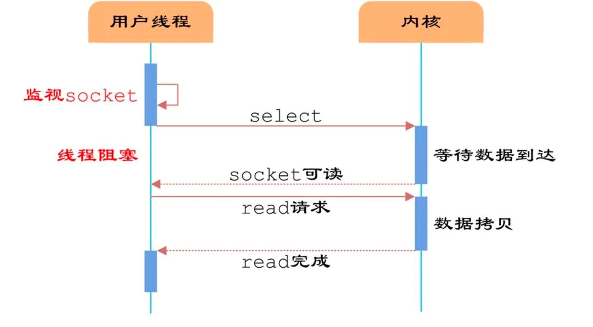

# Redis为什么不设计为多线程？

因为没有必要，多线程的目的是通过并发方式来提升I/O利用率、CPU利用率，而Redis的操作基本都是基于内存的，CPU资源根本不是性能瓶颈。

那么使用多线程技术提升I/O利用率是否有必要呢？Redis确实是一个I/O操作密集的框架，数据操作过程中，会有大量的网络I/O和磁盘I/O的发生。要想提升Redis性能，提升I/O利用率，这是毋庸置疑的，但是提升I/O利用率不是只有多线程技术这一条路的。Redis采用多路复用I/O技术。

多线程带来的并发问题也给这些语言和框架带来了更多的复杂性。而且，在多线程的互相切换也会带来一定的性能开销。

多路复用I/O技术：

Linux多路复用技术，就是多个线程的IO可以注册到同一个管道上，这个管道统一和内核进行交互，当管道中的某一个请求需要的数据准备好后，进程再把对应的数据拷贝到用户空间。

Redis的高性能有如下几个原因：

- 完全基于内存，绝大部分请求是纯粹的内存操作，非常快速
- 数据结构简单，对操作数据也简单，如哈希表、跳表都有很高的性能
- 采用单线程，避免了不必要的上下文切换和竞争条件，也不存在多进程或多线程导致的切换而消耗CPU
- 使用多路复用IO模型

# Redis6.0引入多线程

Redis并不是单纯的单线程，Redis单线程指的是“其网络IO和键值对读写是由一个线程操作的”，也就是说只有网络请求模块和数据操作模块是单线程的，其他如持久化存储模块、集群支撑模块等是多线程的。

Redis6.0中的多线程，也只是针对网络请求过程采用了多线程，而数据的读写命令仍然是单线程的。

随着越来越复杂的业务场景，经过分析，限制Redis的性能瓶颈在网络IO的处理上，虽然之前采用了多路复用技术，但是多路复用的IO模型本质上是同步阻塞IO模型

										多路复用IO模型select函数处理过程

上图中，在多路复用的IO模型中，在网络请求时，调用select（其他函数同理）的过程是阻塞的，也就是说这个过程会阻塞线程，如果并发量很高，此处可能会成为瓶颈。如果能采用多线程，使得网络请求能够并发进行，可以大大提高性能，多线程除了可以减少网络IO等待造成的影响，还可以充分利用CPU的多核优势。

那么，在引入多线程后，如何解决并发带来的线程安全问题呢？

这就是“Redis6.0的多线程只用来处理网络请求，而数据的读写还是单线程”

