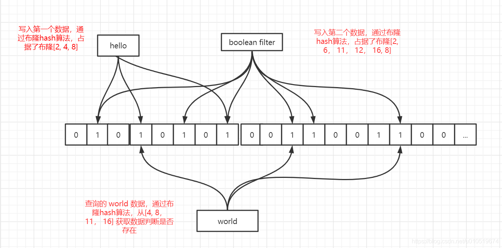

# Redis为什么不设计为多线程？

因为没有必要，多线程的目的是通过并发方式来提升I/O利用率、CPU利用率，而Redis的操作基本都是基于内存的，CPU资源根本不是性能瓶颈。

那么使用多线程技术提升I/O利用率是否有必要呢？Redis确实是一个I/O操作密集的框架，数据操作过程中，会有大量的网络I/O和磁盘I/O的发生。要想提升Redis性能，提升I/O利用率，这是毋庸置疑的，但是提升I/O利用率不是只有多线程技术这一条路的。Redis采用多路复用I/O技术。

多线程带来的并发问题也给这些语言和框架带来了更多的复杂性。而且，在多线程的互相切换也会带来一定的性能开销。

多路复用I/O技术：

Linux多路复用技术，就是多个线程的IO可以注册到同一个管道上，这个管道统一和内核进行交互，当管道中的某一个请求需要的数据准备好后，进程再把对应的数据拷贝到用户空间。

Redis的高性能有如下几个原因：

- 完全基于内存，绝大部分请求是纯粹的内存操作，非常快速
- 数据结构简单，对操作数据也简单，如哈希表、跳表都有很高的性能
- 采用单线程，避免了不必要的上下文切换和竞争条件，也不存在多进程或多线程导致的切换而消耗CPU
- 使用多路复用IO模型

# Redis6.0引入多线程

Redis并不是单纯的单线程，Redis单线程指的是“其网络IO和键值对读写是由一个线程操作的”，也就是说只有网络请求模块和数据操作模块是单线程的，其他如持久化存储模块、集群支撑模块等是多线程的。

Redis6.0中的多线程，也只是针对网络请求过程采用了多线程，而数据的读写命令仍然是单线程的。

随着越来越复杂的业务场景，经过分析，限制Redis的性能瓶颈在网络IO的处理上，虽然之前采用了多路复用技术，但是多路复用的IO模型本质上是同步阻塞IO模型

										多路复用IO模型select函数处理过程

上图中，在多路复用的IO模型中，在网络请求时，调用select（其他函数同理）的过程是阻塞的，也就是说这个过程会阻塞线程，如果并发量很高，此处可能会成为瓶颈。如果能采用多线程，使得网络请求能够并发进行，可以大大提高性能，多线程除了可以减少网络IO等待造成的影响，还可以充分利用CPU的多核优势。

那么，在引入多线程后，如何解决并发带来的线程安全问题呢？

这就是“Redis6.0的多线程只用来处理网络请求，而数据的读写还是单线程”

# Reids数据类型

string、hash、有序列表list、无序集合set、去重复可排序Sorted set

# 淘汰策略

FIFO淘汰最早数据、剔除最近最少用、剔除最近使用频率低的

# 持久化

Redis提供可RDB和AOF两持久化方式，RDB把内存中的数据集以快照的形式写入磁盘，实际操作是通过fork子进程执行，采用二进制压缩存储。AOP是以文本日志的形式记录Redis的每一个写入和删除操作。

**RDB**把整个Redis的数据保存在单一文件中，比较适合做灾备，但缺点是如果在快照保存之前发生了宕机，这段时间的数据将会丢失，另外保存快照可能导致服务短时间不可用。

**AOF**对日志文件的写入操作使用追加模式，有灵活的同步策略，支持每秒同步、每次修改同步和不同步，缺点就是相同规模的数据集，AOF要大于RDB，AOF在运行效率上往往会慢于RDB。

# Reids缓存问题

缓存更新方式

在更新数据源的时候主动更新缓存

数据不一致

对数据的实时性要求不高，当因网络抖动更新失败后，可以增加重试；如果对耗时敏感可以通过异步补偿任务来处理失败的更新；或者短期数据不一致不影响业务，只要下次更新时成功就行。

**缓存穿透**

可能是恶意攻击，攻击者使用不存在的key频繁请求接口，导致缓存不命中，然后穿透DB查询依然不命中，这时会有大量请求穿透缓存访问到DB。

解决：使用BloomFilter过滤器，BloomFiler的特点是存在性检测，如果BloomFilter中不存在，那么数据一定不存在，如果BloomFilter中存在，实际数据也有可能不存在。

**BooleanFilter：**它本身是一个很长的二进制向量，存储的数据只能是0或1；由于采用二进制向量，只能存储数据状态，非常节省内存空间；核心是判定不在的数据一定不存在，存在的数据不一定存在；布隆过滤器存在一定的误判。

**缓存击穿**

就是当某些热点数据失效时，大量针对这个数据的请求会穿透到数据源。

解决：1、可以使用互斥锁更新，保证同一个进程中针对同一个数据不会并发请求到DB，减少DB压力。
2、使用随机退避的方式，失效时随机sleep一个很短的时间，再次查询
3、针对多个缓存失效的情况，失效时可以在固定时间+一个随机数，避免大量缓存同时失效

**缓存雪崩**

产生原因是缓存挂掉，这时所有请求都会穿透到DB。

解决：1、使用熔断策略，减少DB的压力
2、使用主从模式和集群模式尽量保证缓存的高可用

# 哨兵模式