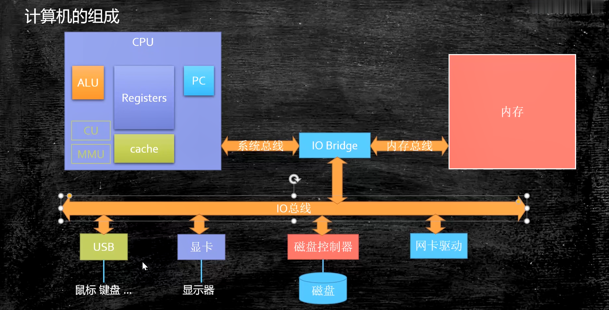
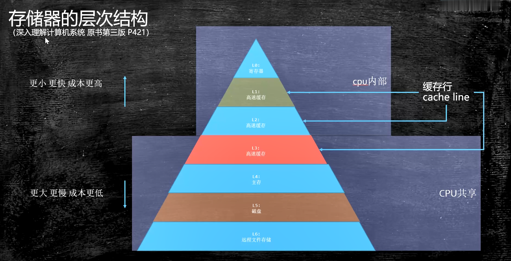
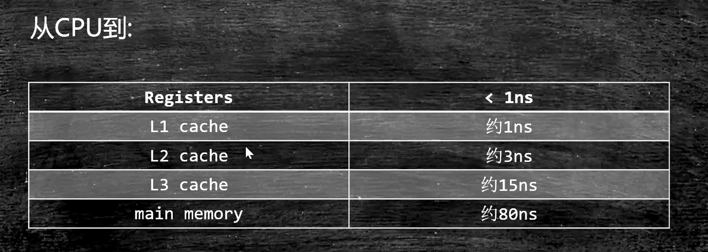
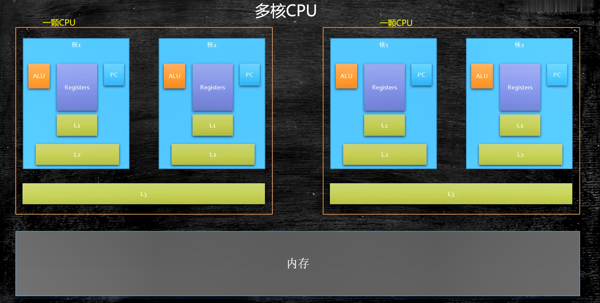

## 计算机的组成

## 汇编语言

汇编语言（机器语言）本质：机器语言的助记符其实它就是机器语言。

汇编语言的执行过程：计算机通电->CPU读取内存中程序（电信号输入）->时钟发生器不断震荡通断电->推动CPU内部一步一步执行（执行多少步取决于指令需要的时钟周期）->计算完成->写回（电信号）->写给显卡输出

## CPU的制作过程

intel CPU的制作过程:
https://haokan.baidu.com/v?pd=wisenatural&vid=3044401651754083413

CPU是如何制作的(文字)：
https://www.sohu.com/a/255397866_468626

## CPU的原理

计算机需要解决的最根本问题：如果代表数字。
晶体管是如何工作的：
https://haokan.baidu.com/v?pd=wisenatural&vid=8838479161899682141

晶体管的工作原理：
https://www.bilibili.com/video/av47388949?p=2

## 量子计算机

## CPU的基本组成

PC-> Program Counter 程序计数器，记录当前指令地址

Registers-> 寄存器，暂时存储CPU计算需要用到的数据，寄存器数量非常多

ALU-> Arithmetic & Logic Unit 算术逻辑单元

CU-> Control Unit 控制单元

MMU-> Memory Management Unit 内存管理单元

超线程：一个ALU对应多个PC | Registers ，所谓的四核八线程

存储器的层次结构：

从CPU到不同部件需要的时间：

缓存

