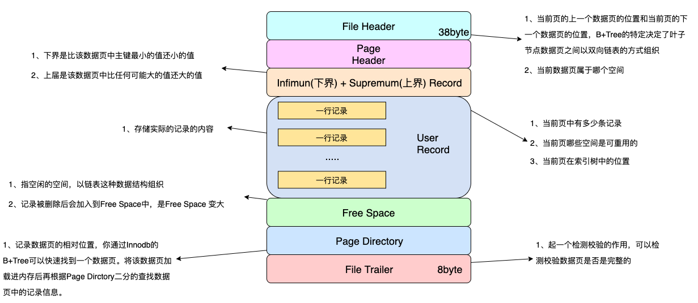

# 

# 项目中遇到的难点

分布式事务：

https://zhuanlan.zhihu.com/p/183753774

采用AP的理论，即保证可用性和分区容错性


# 多线程

线程之间共享变量可以使用volatile关键子，保证可见性和禁止重排序


## Lock和synchronized的区别

https://www.cnblogs.com/dolphin0520/p/3923167.html

synchronized是Java语言内置的一个特性，有以下缺陷：

一个代码块块被synchronized修饰，当一个线程获取了锁，在执行过程中，其他线程只能一直等待，等待获取锁的线程释放锁，synchronized释放锁有两种情况：

- 获取所得线程执行完了该代码块，线程释放对锁的占用
- 线程执行发生异常，此时JVM会让线程自动释放锁

如果这个获取锁的线程由于要等待IO或者其他（网络）原因被阻塞了，但是又没有释放锁，其他线程只能等待，这会影响程序执行效率。通过Lock可以手动释放锁。

1. Lock不是Java语言内置的，synchronized是Java语言的关键子，因此是内置特性，Lock是一个类，通过这个类可以实现同步访问。
2. synchronized在代码块执行完后，系统会自动让线程释放对锁的占用；Lock必须用户手动释放锁，如果没有主动释放锁，可能导致死锁现象。

### Lock锁

lock声明了四个方法来获取锁

1. void lock()：如果锁已经被其他线程获取，则进行等待。

   ```
   Lock lock = ...;
   lock.lock();
   try{
       //处理任务
   }catch(Exception ex){
        
   }finally{
       lock.unlock();   //释放锁
   }
   ```

   

2. boolean tryLock()：尝试获取锁，如果获取成功，则返回true，如果获取失败则返回false，也就是这个方法无论如何都会立即返回，拿不到锁时不会一直在哪等待。

3. Boolean tryLock(time)

   


加载bean过程


bean在注入的时候除了反射还有什么方式去找bean。

spring除了反射还有那种注解方式


Mybatis缓存


索引创建，失效场景


Redis在项目中的使用，如何部署的，哨兵机制，主从复制

哨兵机制


Kafka是怎么产生和消费的，当消费失败怎么处理

消费失败请求重新发送，对于重复数据可使用幂等性来保证只消费一次


排查线上omm的工具，怎么定位到具体代码


# ThreadLocal


https://mp.weixin.qq.com/s/_RBBvB-GjC8djXjz-FSyUg


# Java内存模型JMM

https://www.cnblogs.com/Scramblecode/p/11392639.html

Java内存模型的作用是用来屏蔽掉不同操作系统中的内存差异性来保持并发的一致性。同时JMM规范了JVM如何与计算机内存进行交互。简单说Java内存模型就是Java的一套协议来屏蔽各种硬件和操作系统的内存访问差异，实现平台一致性达到最终的“一次编写，到处运行”。

Java 内存模型是通过内存屏障来禁止重排序的。

JMM抽象示意图：


**多线程之间的通信和同步：**

线程之间的通信方式有两种，共享内存和消息传递。
**共享内存：**在共享内存方式的并发模型中线程是通过读取主内存的共享信息来进行隐性通信的；在共享内存中同步是显性进行的，在代码中必须要去指定方法需要同步执行比如加同步锁等。（堆内存中共享变量之间的通信）

**消息传递：**在消息传递通信中线程之间没有公共的状态，只能通过发送消息来进行显式通信；在消息传递的并发模型中发送消息必须在消息接收之前，所以同步时隐式的。（线程栈的不共享变量之间的通信）


静态变量是存在那个区域的？

方法区


cms，G1垃圾回收、垃圾回收算法、B+和红黑树、线程池状态、java为什么选择synchronize，有什么优势、 


线程的状态有哪些

就绪、可运行状态、运行、阻塞、阻塞等待、销毁

如果多个线程要同时执行，怎么让多个线程先执行


# MyBatis Plus中的接口是怎么实现数据的查询的？

https://mp.weixin.qq.com/s/fnCghGI5Se1skCZyCJLIkA


# MyBatis中#和${}区别？

在MyBatis的映射配置文件中，动态传递参数有两种，#{}占位符，${}拼接符。

1. #{}是预编译处理（PreparedStatement）范畴的；${}是字符串替换。
2. 使用#{}可以有效地防止SQL注入，提高系统安全性；${}会导致SQL注入。
3. #{}的变量替换是在DBMS中；${}的变量替换是在动态解析过程中。
4. 变量替换后，#{}对应的变量会自动加上单引号''，${}对应的变量不会加上单引号''。

```
#{}：select * from t_user where uid=#{uid}
${}：select * from t_user where uid='${uid}'
(动态解析过程)传入参数uid为1，然后:
#{}：select * from t_user where uid= ?
${}：select * from t_user where uid= '1'
（DBMS中）最后：
#{}：select * from t_user where uid= '1'
${}：select * from t_user where uid= '1'
```


## 如果一条SQL中同时存在#和$，会先解析哪一个

在动态解析阶段的处理不同，在预处理的时候，#{}会把参数部分用一个占位符？代替；而${}则只是简单的字符串替换。

```
示例：select * from user where name=#{}
如果name值为张三，动态解析后为SQL语句：select * from user where name=?

select * from user where name=${}
如果name值为张三，动态解析后为：select * from user where name='张三'
```


## 什么情况下使用$

1、当表名用参数传递进来的时候，只能使用${}，所以我们要小心SQL注入的问题。

```
示例：select * from ${tablename} where name=#{name}
如果传过来表名为user;delete user; --,则动态解析之后SQL如下：
select * from user;delete user; -- where name=?
```

2、MyBatis排序时使用order by动态参数时使用&


## 为什么表名和order by要使用${}

因为#{}在变量替换之后会自动加上单引号''，${}输出变量的值，没有单引号。


# Spring容器和Spring MVC容器

spring容器和SpringMVC容器是父子关系，spring容器时SpringMVC的父容器，子容器可以获取父容器的属性，父容器不能获取子容器的属性。


# BeanFactory和FactoryBean区别

BeanFactory是个Factory，也就是IOC容器或对象工厂，FactoryBean是个bean。在spring中，所有bean都是由BeanFactory来进行管理的。

FactoryBean是一个能生产或者修饰对象生成的工厂bean，它的实现与设计模式中的工厂模式和修饰器模式类似

# spring AOP实现原理

采用横向抽取机制，底层使用动态代理


# Spring循环依赖问题

声明A、B对象

```
@Component
public class A {
  private B b;
  public void setB(B b) {
    this.b = b;
  }
}
@Component
public class B {
  private A a;
  public void setA(A a) {
    this.a = a;
  }
}
```

Spring是通过递归的方式获取目标bean及其所依赖的bean
Spring实例化一个bean的时候，式分两步的，首先实例化目标bean，然后为其注入属性。

https://zhuanlan.zhihu.com/p/162316846

1. 构造器的循环依赖无法解决

2. filed属性注入（setter）循环依赖

3. Prototype field属性注入循环依赖

   非单例bean默认不初始化，只有使用的时候才会初始化。不能解决

提前将对象的实例暴露出去，即对象实例化之后将实例放入缓存中，缓存引入了三级缓存。

Spring通过三级缓存，解决循环依赖的问题。

1. SingletonObjects：用于存放完全初始化好的bean
2. EarlySingletonObjects：用于存放原始的bean对象，实例化完成，但是未填充属性，用于解决循环依赖。
3. SingletonFactories：单例对象工厂的cache，存放bean工厂对象，用于解决循环依赖问题。
4. 其他缓存：不是解决循环依赖问题的
   1. Set<String> singletonsCurrentlyInCreation  它在Bean开始创建时放值，创建完成时会将其移出
   2. Set<String> alreadyCreated 当这个Bean被创建完成后，会标记为这个

相关方法：

**getSingleton(String beanName, boolean allowEarlyReference)**：获取单例bean。

- 先从一级缓存SingletonObjects中获取，如果获取到直接返回
- 如果获取不到或者对象正在创建中（isSingletonCurrentlyInCreation()）,就从二级缓存EarlySingletonObjects中获取，获取到直接返回
- 如果获取不到，且允许SingletonFactories（allowEarlyReference=true）通过getObject获取，就从三级缓存SingletonFactory.getObject获取，如果获取到，就将对象放入二级缓存，并从三级缓存SingletonFactories中移除

第一次getSingleton A对象，缓存中肯定没有，必须要创建对象。

CreateBean(beanName, mbd, args):

**doCreateBean(final String beanName, final RootBeanDefinition mbd, final @Nullable Object[] args)：**


**执行过程：**


**为什么使用三级缓存，二级缓存不能解决吗？**


代理导致循环依赖：（@Transactional代理）执行过程如下


提前曝光的对象放入Map<String, ObjectFactory> singletonFactories缓存中，如果创建的bean有对应的代理对象，但是spring无法提前知道这个对象是不是有循环依赖的情况，而正常情况下（没有循环依赖情况），spring都是创建好完成品bean之后才创建对应的代理。

怎么做到提前曝光对象而不生成代理呢？spring在对象外面包装一层objectFactory，提前曝光ObjectFactory对象，在被注入时踩在ObjectFactory.getObject()方法内实时生成代理对象，并将生成好的对象放入第二级缓存earlySingletonObjects中。

为什么不选择二级缓存，而要加一层缓存？如果使用二级缓存解决循环依赖，意味着bean在构造完成后就创建代理对象，这样违背了spring设计原则。

# SpringBean的生命周期

https://www.jianshu.com/p/1dec08d290c1

Spring Bean的生命周期分为四个阶段和多个扩展点。扩展点又可以分为影响多个bean和影响单个bean。

**四个阶段：**

- 实例化（Instantiation）：createBeanInstance()
- 属性填充（Populate）：populateBean()
- 初始化（Initialization）：initializingBean()
- 销毁（destruction）：disposableBean()

**多个扩展点**

- 影响多个bean
  - BeanPostProcessor
  - InstantiationAwareBeanPostProcessor
- 影响单个bean
  - Aware
    - Aware Group1（虚拟的组，实际不存在）
      - BeanNameAware
      - BeanClassLoaderAware
      - BeanFactoryAware
    - Aware Group2
      - EnvironmentAware
      - EmbeddedValueResolverAware
      - ApplicationContextAware
      - MessageSourceAware
  - 生命周期
    - InitializingBean
    - DisposableBean


另一篇博客解释

https://www.zhihu.com/question/38597960


1. 实例化Bean

   对于BeanFactory容器，当客户向容器请求一个尚未初始化的bean时，或初始化bean的时候需要注入另一个尚未初始化的依赖时，容器会调用createBean进行实例化。

   对于ApplicationContext容器，当容器启动结束后，便实例化所有bean，并进行依赖注入。

   实例化对象被包装在BeanWrapper对象中，BeanWrapper提供了设置对象属性的接口，从而避免了使用反射机制设置属性。

   Spring实例化Bean相当于程序中的new XX()

2. 设置对象属性（依赖注入）

   实例化后的对象被封装在BeanWrapper对象中，并且此时对象仍然是一个原生的状态，并没有进行依赖注入。
   紧接着，SPring根据BeanDefinition中的信息进行依赖注入。
   并通过BeanWrapper提供的设置属性的接口完成依赖注入。

3. 注入Aware接口

   紧接着，Spring会检测该对象是否实现XXAware接口，并将相关XXAware实例注入给bean。

4. BeanPostProcessor

   当经过上述几个步骤后，bean对象已经被正确构造，但如果想要对象被使用前（初始化之前）再进行一些自定义的处理，就可以通过BeanPostProcessor接口实现。该接口提供了两个函数：

   - postProcessorBeforeInitialzation（Object bean，String beanName）

     当前正在被初始化的bean对象会被传进来，我们就可以对这个bena做任何处理。这个函数会先于initialzationBean执行，因此成为前置处理器
     所有Aware接口的注入就是在这一步完成的

   - postProcessorAfterInitialzation（Object bean，String beanName）

     当前正在初始化的bean对象会被传进来，我们就可以对这个bena做任何处理。这个函数会在InitialzationBean完成后执行，因此成为后置处理器

5. InitializingBean与init-method

   当BeanPostProcessor的前置处理完后就会进入本阶段，InitializingBean接口只有一个函数：
   **afterPropertiesSet**():这一阶段也可以在bean正式构造完成前增加我们自定义的逻辑，但它于前置处理器不同，该方法不会把当前bean对象传进来，因此在这一步没办法处理对象本身，只能增加一些额外逻辑，若要使用它，我们需要让bean实现该接口，并把要增加的逻辑写在该函数中，然后Spring会在前置处理完成后检测当前bean是否实现了该接口，并执行afterPropertiesSet()。

   当然，spring为了降低客户代码的侵入性，给bean的配置提供了init-method属性，该属性指定了在这一阶段需要执行的函数名，spring便会在初始化阶段执行我们设置的函数。init-method本质上仍然使用了InitializingBean接口。

6. DisposableBean和destory-method

   和init-method一样，通过给destory-method指定函数，就可以在bean销毁前执行指定略记


# Spring启动

spring启动就是IOC容器启动的过程。

```
ApplicationContext context = new ClassPathXmlApplicationContext("applicationContext.xml");
```

容器启动步骤：

1. 资源定位：找到配置文件
2. BeanDefinition载入和解析
3. BeanDefinition注册
4. bean的实例化和依赖注入

**BeanDefinition载入、解析、注册：**

- 找到配置文件Resouce
- 将配置文件解析成BeanDefinition
- 将BeanDefinition向Map中注册Map<name,beandefinition>

以上三步我们将配置在配置文件中的<bean/>节点，全部封装到上述Map<name,beandefinition>中，为后续getbean打下了基础

**Bean的实例化和依赖注入：**

此过程由getBean()触发，此过程根据上述的BeanDefition

- 通过反射或则Cglib的方式创造bean
- 根据配置的依赖将所需要的bean注入进来，此过程会递归调用getBean()方法
- 根据bean的scope决定是否缓存该Bean，一般情况为单例，容器会缓存对象


# Redis分布式锁


# 假如reids内存为4G，但是缓存数据非常多，如果不允许删除，怎么处理？

可以使用ZipList压缩列表，是redis为了节约内存而设计的一种线性数据结构


# Redis的压缩列表


# 常用设计模式


# Spring 事务隔离级别

**隔离级别：**

1. default（默认）：使用数据库默认隔离级别，另外四个与JDBC的隔离级别相对应
2. READ_UNCOMMITTED（读未提交）：
3. READ_COMMITTED（读已提交）：
4. REPEATABLE_READ（可重复读）：
5. SERIALIZABLE（串行化）

# Spring事务传播机制：

https://zhuanlan.zhihu.com/p/148504094

1. required（默认属性）：如果存在一个事务，则支持当前事务。如果没有事务则自己 开启一个新的事务。被设置成这个级别时，会为每一个调用的方法创建一个逻辑事务域。如果前面的方法已经创建了事务，那么后面的方法支持当前的事务，如果当前没有事务会重新建立事务
2. Mandatory：支持当前事务，如果当前没有事务，就抛出异常
3. Never：以非事务方式执行，如果当前存在事务，则抛出异常
4. Not_supports：以非事务方式执行操作，如果当前存在事务，就把事务挂起
5. requires_new：新建事务，如果当前存在事务，把当前事务挂起
6. Supports：支持当前事务，如果当前没有事务，就以非事务方式执行
7. Nested：支持当前事务，薪资新增Savepoint点，与当前事务同步提交或回滚。
   嵌套事务一个非常重要的概念就是内层事务依赖于外层事务。外层事务失败时，会回滚内层事务所做的动作。而内层事务操作失败并不会引起外层事务的回滚。


# Spring框架的事务管理有哪些优点

Spring事务管理**有声明式事务**和**编程式事务**。编程式事务需要写大量的代码，声明式事务可以通过使用spring的<tx:advice>定义事务通知与AOP相关配置实现，另一种通过注解@Transactional

1. 它为不同的事务API如JDBC、Hibernate、JPA提了一个不变的编程模式。
2. 它为编程事务管理提供了一套简单的API而不是复杂的事务API。
3. 它支持声明式事务
4. 他和Spring各种数据访问抽象层很好的集成

# Spring创建对象是单例还是多例？如何创建多例

Spring默认创建的类是单例的，可以通过scope属性更改为多例，scope范围有：

singleton：单例

prototype：多例

```
XML配置文件：
<bean id="user" class="modle.User" scope="prototype">
  </bean>
注解形式：
@Scope(value = ConfigurableBeanFactory.SCOPE_PROTOTYPE) 可设置为多例
public class User {
}
  
```


# 单例模式

双重锁检查

```
public class SingletionClass {

	private static volatile SingletionClass singletionClass;
	
	private SingletionClass() {
		
	}
	
	public static SingletionClass getSingleton() {
		if(singletionClass == null) {
			synchronized (SingletionClass.class) {
				if(singletionClass == null) {
					singletionClass = new SingletionClass();
				}
			}
		}
		return singletionClass;
	}
}
```

## 如何破坏一个单例

单例模式一般都是通过私有化构造方法和静态变量。通过调用指定的public成员方法获取单例模式的对象。所以如果能够使用私有化的构造方法创建对象，就可以创建一个新的对象，即破坏了单例模式。

**使用反射机制破坏单例：**

1. 首先获取该单例的Class对象，通过调用该对象getDeclaredConstructors()方法，获取所有构造方法。
2. 设置构造方法的访问权限为true，调用Constructor的newInstance()方法，即可返回该单例的一个新对象，与原对象的地址不同。

```
public static void main(String[] args) throws InstantiationException, IllegalAccessException, IllegalArgumentException, InvocationTargetException {
		SingletionClass t1 = SingletionClass.getSingleton();
		SingletionClass t2 = SingletionClass.getSingleton();
		System.out.println(t1);
		System.out.println(t2);
		System.out.println(t1 == t2);
		
		Class clazz = SingletionClass.class;
		Constructor[] cons = clazz.getDeclaredConstructors();
		Constructor constructor = cons[0];
		constructor.setAccessible(true);
		SingletionClass newIns = (SingletionClass)constructor.newInstance();
		System.out.println(newIns);
	}
	
	输出：
	com.example.demo.singleton.SingletionClass@15db9742
    com.example.demo.singleton.SingletionClass@15db9742
    true
    com.example.demo.singleton.SingletionClass@6d06d69c
```

​	


# SpringBoot的加载过程

## SpringBoot的优点：

- 独立运行的spring项目
- 内嵌servlet容器
- 无XML配置
- 提供starter简化配置
- **自动装配Spring**

SpringBoot最重要的功能是**自动配置**，无需XML配置文件，能自动扫描包路径装载并注入对象，并能做到更具classpath下的jar包自动配置。


@SpringBootApplication注解是一个组合注解，其中有三个重要的Annotation：

- @Configuration
- @EnableAutoConfiguration
- @ComponentScan

## @Configuration

用来代替applicationContext.xml配置文件，所有这个配置文件里面能做到的事情都可以通过这个注解所在类来进行注册。

下面的注解也很重要：

**@Bean**

用来代替XML配置文件里面的<bean/>配置

**@ImportResource**

如果有些通过类的注册方式配置不了的，可以通过这个注解引入额外的XML配置，有些老的配置文件无法通过@Configuration方式配置的非常管用

**@Import**

用来引入额外的额一个或者多个@Configuration修饰的配置文件类

**@SpringBootConfiguration**

这个注解就是@Configuration注解的变体，只是用来修饰是Spring Boot配置而已，或者可利于Spring Boot后续的扩展。

## @ComponentScan

Spring 3.1 添加的一个注解，用来代替配置文件中component-scan配置，开启组件扫描，即自动扫描包路径下的@Component注解进行注册bean实例到context中。该注解是可重复注解，即可配置多个，用来配置注册不同的子包。

## @EnableAutoConfiguration

这是自 Spring Boot 诞生时添加的注解，用来提供**自动配置**，上面的两个都是 `spring-context` 包下的，不属于 Spring Boot。该注解种最主要的注解为@AutoConfigurationPackage

自动配置类指的是META-INF/spring.factories文件中声明的XXAutoConfiguration的注解


1. Spring Boot在启动的时候除了扫描与启动类同包下的组件外，还会检查各个jar包中是否存在META-INF/spring.factories文件，为自动装配做准备。
2. 第三方的spring-boot-start会通过将自己的自动装配类写到META-INF/spring.factories文件，让spring boot加载到容器中
3. 第三方的自动装配类会通过利用@conditional系列注释保证自己能在各种的环境中成功自动装配


Spring boot admin对spring boot应用进行监控


# Mybatis和JPA持久层框架区别

JPA单表查询很方面，但对于业务复杂的多表关联查询很不友好

JPA是面向对象的思想，一个对象就是一个表，面向对象就更容易移植，因为数据对象不依赖数据源。

mybatis则是面向SQL，结果完全来源于sql，如果要更换数据库，代价很大。

# 发生oom怎么排查

**OutOfMemoryError**可能出现的错误消息：

- java.lang.OutOfMemoryError: Java heap space
- java.lang.OutOfMemoryError: PermGen space
- java.lang.OutOfMemoryError: Requested array size exceeds VM limit
- java.lang.OutOfMemoryError: request bytes for . Out of swap space?
- java.lang.OutOfMemoryError: (Native method)

https://www.cnblogs.com/c-xiaohai/p/12489336.html

1. **使用dmesg命令查看系统日志**

   dmesg |grep -E ‘kill|oom|out of memory’，可以查看操作系统启动后的系统日志，这里就是查看跟内存溢出相关联的系统日志。

2. **需要启动项目，使用ps命令查看进程**

   ps -aux|grep java 命令查看一下你的java进程，就可以找到你的java进程的进程id

3. **接着使用top命令，查看运行的进程的cpu负载、内存使用、所占资源等**

   top命令显示的结果列表中，会看到%MEM这一列，这里可以看到你的进程可能对内存的使用率特别高。以查看正在运行的进程和系统负载信息，包括cpu负载、内存使用、各个进程所占系统资源等。

   

   

   查看进程中线程的使用情况：
   top  -H -p PID

   

   

4. **使用jstat命令，打印Java堆的状况，包括新生代的两个S0、S1区、Eden区，以及老年代的内存使用率，还有Minor GC和Full GC的次数。**

   用jstat -gcutil 20886 1000 10命令，示每1000毫秒打印一次Java堆状况，打印10次，就是用jstat工具，对指定java进程（20886就是进程id，通过ps -aux | grep java命令就能找到），按照指定间隔，看一下统计信息，这里会每隔一段时间显示一下，包括新生代的两个S0、s1区、Eden区，以及老年代的内存使用率，还有young gc以及full gc的次数。

   通过jstat基本能看出来，其实就是大对象没法回收，一直在内存里占据着。

   

5. **使用jmap命令，可以打印出当前堆中所有每个类的实例数量和内存占用**

   执行jmap -histo pid可以打印出当前堆中所有每个类的实例数量和内存占用，如下，class name是每个类的类名（[B是byte类型，[C是char类型，[I是int类型），bytes是这个类的所有示例占用内存大小，instances是这个类的实例数量。

6. **使用jmap -dump:format=b,file=文件名 [pid]，把当前堆内存的快照转储到.hprof文件中**

   使用jmap -dump:format=b,file=文件名 [pid]，就可以把指定java进程的堆内存快照搞到一个指定的文件里去，但是jmap -dump:format其实一般会比较慢一些，也可以用gcore工具来导出内存快照。然后就可以使用MAT工具，来对hprof文件进行分析。或者使用jdk的目录下的bin目录下的：jvisualvm.exe


但是 JDK 自带了很多监控工具，都位于 JDK 的 bin 目录下，其中最常用的是 jconsole 和 jvisualvm 这两款视图监控工具。jconsole：用于对 JVM 中的内存、线程和类等进行监控；jvisualvm：JDK 自带的全能分析工具，可以分析：内存快照、线程快照、程序死锁、监控内存的变化、gc 变化等。


# AQS

https://blog.csdn.net/mulinsen77/article/details/84583716

AQS即AbstractQueuedSynchronizer，抽象的队列式同步器。是除了Java自带的synchronized关键字之外的锁，这个类在java.util.concurrent.locks包下。

AQS的核心思想就是，如果被请求的共享资源空闲，则将当前请求资源的线程设置为有效的工作线程，并将共享资源设置为锁定状态，如果被请求的共享资源被占有，那么就需要一套线程阻塞等待以及被唤醒时锁分配的机制，这个机制AQS是使用CLH队列锁实现的，即将暂时获取不到锁的线程加入到队列中。

CLH（Craig，Landin，and Hagersten）队列是一个虚拟的双向队列，即不存在队列实例，仅存在节点之间的关联关系，

**AQS是将每一条请求共享资源的线程封装成一个CLH锁队列的一个节点，来实现锁的分配。**

用大白话说，AQS就是基于CLH队列，用volatile修饰共享变量state，线程通过CAS去改变状态符，成功则获取锁成功，失败则进入等待队列，等待被唤醒。

**注意：**AQS是自旋锁。等待唤醒的时候，经常会使用自选的方式，不停的尝试获取锁，直到被其他线程获取成功。


# 自己用AQS实现共享


# CMS和G1收集器区别

CMS收集器是并发的且基于标记-清除算法的，会**产生内存碎片**。它清理垃圾的步骤大致分为初始标记、并发标记、重新标记和并发清理。初始标记和重新标记会Stop The World，并发清理是保留上一步骤标记出的存活对象，清理掉其他对象，正是因为采用了并发清理，所以在清理过程中用户线程又会产生垃圾，而导致**浮动垃圾**，只能通过下次垃圾回收进行处理。

清理垃圾的步骤大致分为**初始标记、并发标记、重新标记和并发清理。**
CMS垃圾回收的内存模型还是我们常用的年轻代和老年代的结构；
CMS是基于标记-清除算法的，所以会产生内存碎片；
CMS的并发清理阶段，用户线程会产生垃圾，导致浮动垃圾，只能下次垃圾回收进行处理；
CMS收集器作用于回收老年代；

G1收集器回收垃圾的处理步骤大致为：**初始标记、并发标记、最终标记和筛选回收**。
G1收集器将堆空间划分为若干个等大的Region块，但还是保留了新生代、老年代的概念，但主要以Region为单位进行垃圾回收；
G1收集器是采用标记-整理算法，所以不会产生内存碎片；
G1最终的回收是STW的，所以不会产生浮动垃圾，Region的区域大小是固定的，所以回收时间也是可控的；
G1使用Remembered Set来避免全堆扫描；
G1适用在新生代和老年代；

|                          | **CMS**                      | **G1**                                                       |
| ------------------------ | ---------------------------- | ------------------------------------------------------------ |
| **JDK版本**              | 1.6以上                      | 1.7以上                                                      |
| **回收算法**             | 标记——清除                   | 标记——整理                                                   |
| **运行环境**             | 针对70G以内的堆内存          | 可针好几百G的大内存                                          |
| **回收区域**             | 老年代                       | 新生代和老年代                                               |
| **内存布局**             | 传统连续的新生代和老年代区域 | Region(将新生代和老年代切分成Region，默认一个Region 1 M,默认2048块) |
| **浮动垃圾**             | 是                           | 否                                                           |
| **内存碎片**             | 是                           | 否                                                           |
| **全堆扫描**             | 是                           | 否                                                           |
| **回收时间可控**         | 否                           | 是                                                           |
| **对象进入老年代的年龄** | 6                            | 15                                                           |
| **空间动态调整**         | 否                           | 是（新生代5%-60%动态调整，一般不需求指定）                   |
| **调优参数**             | 多（近百个）                 | 少（十几个）                                                 |


# 什么情况下对象直接进入老年代，使用什么机制

1. 当**分代年龄=-XX:MaxTenuringThreshold **指定的大小时，进入老年代；
2. **动态晋升机制**，根据**-XX:TargetSurvivorRatio**（默认50，即50%）指定的比例，乘以survive一个区的大小，得出**目标晋升空间大小**。然后将分代对象大小，按照分代年龄从小到大相加，**直到大于目标晋升空间大小**，然后，将得出的这个分代年龄以上的对象全部晋升到老年代。（例如：一个survive区的大小为100M，目标晋升空间=50M，对象按年龄从小到大排序，按照顺序把对象占用的空间相加，加到对象年龄=5的时候，对象占用空间>目标晋升空间，然后，将5岁以上的对象全部晋升到老年代）
3. 对于一些GC算法，可能直接在老年代上分配，例如G1 GC中的大对象分配，就是对象在超过Region一半大小的时候，直接在老年代的连续空间分配。

# 垃圾回收算法

### 标记清除算法


### 复制算法


### 标记整理算法


### 分代收集算法

堆内存分为年轻代和老年代。Java默认启动分代GC。

1. 新建对象分配到Eden区，Eden区内存不够时，触发Minor GC；
2. 经过Minor GC会使存活对象进入from区，年龄加1（from区和to区会交换引用地址）；
3. 当**分代年龄=-XX:MaxTenuringThreshold **指定的大小时，进入老年代；
4. **动态晋升机制**，根据**-XX:TargetSurvivorRatio**（默认50，即50%）指定的比例，乘以survive一个区的大小，得出**目标晋升空间大小**。然后将分代对象大小，按照分代年龄从小到大相加，**直到大于目标晋升空间大小**，然后，将得出的这个分代年龄以上的对象全部晋升到老年代。（例如：一个survive区的大小为100M，目标晋升空间=50M，对象按年龄从小到大排序，按照顺序把对象占用的空间相加，加到对象年龄=5的时候，对象占用空间>目标晋升空间，然后，将5岁以上的对象全部晋升到老年代）
5. 当老年代内存不够会触发Full GC，年轻代和老年代会一起进行垃圾回收，此时会触发SWT机制，造成程序的停顿。


创建的对象会分配到Eden区，当Eden区内存不够的时候，触发Minor GC，根据可达性分析算法将存活的对象进行标记，并移动到Survive的from区，同时将对象的年龄加1；此时Eden区有了空闲内存，新创建对象仍会在Eden区分配内存，当Eden区内存又满了之后，Eden区和from区存活的对象进入到to区，存活对象年龄加1，交换form和to区的引用，即此时存活对象在from中，to区保持空闲。如果from区中对象年龄达到阈值15（默认15）或者from区或to区达到整个对象的50%（此处整个对象是指Survive？），则存活对象进入到老年代，如果老年代内存不够用会触发Full GC，即新生代和老年代会一起进行垃圾回收，此时可能会触发SWT机制（stop-the-world），造成程序的停顿。


# 内存单薄？？？


# 为什么要有自定义加载器


# 双亲委派机制


# Redis分布式锁有什么缺点


# Redis的哨兵和集群模式区别


# 怎么保证数据的一致性

Q先更新数据库，后更新缓存，存在一定时间内数据的不一致，怎么保证数据的不一致

A通过redis定时删除和淘汰策略

Q可以不通过redis去实现呢


# Kafka吞吐量高原因

# eureka和zookeeper的区别

服务访问不到eureka怎么处理


# Eureka注册中心

eureka使用的是几级缓存，是因为缓存实现高可用的，使用了二层缓存


Eureka作为服务注册中心，采用CS架构，Eureka提供服务注册和服务发现，包含服务注册中心（Eureka Server）、服务提供者（Service Provider）、服务消费者（Service Consumer）。

- Eureka Server：提供服务注册和发现，多个服务之间会同步数据，做到最终一致。
- Service Provider：将自身服务注册到Eureka
- Service Consumer：从Eureka获取注册服务列表，从而能够消费服务

**服务发现有两种模式：**一种是客户端发现模式，一种是服务端发现模式。Eureka采用的是客户端发现模式。

**服务注册：**

1. Eureka Client客户端启动后**Register**注册到Eureka Server服务端，并从服务端获取注册列表缓存在本地。
2. 客户端每隔一定周期（默认30s），向服务端发送心跳，这时Eureka的**Renew**（更新/续借）
3. 如果服务端在多个心跳周期（默认90s）没有收到客户端发送的心跳，服务端将会在服务注册列表中提出该节点。
4. 如果客户端停止应用，向服务端发送**Cancel**取消请求，服务端收到取消请求后，将客户端从服务注册列表中剔除。

**服务中心：**

1. 当各个微服务节点启动后，Eureka Server服务端会存储服务提供者注册上来的服务信息，并提供二层缓存机制来维护整个注册中心。
2. 如果服务端节点都宕掉，因为服务提供者本地缓存了服务注册列表，所以仍然可以找到服务提供者，但是会出现信息不一致。

**Eureka自我保护机制：**

使用自我保护机制能够使集群更加健壮稳定的运行。

自我保护机制是说，如果15分钟内超过85%的客户端节点都没有正常的心跳，那么Eureka Server认为客户端与注册中心发生了网络故障，Eureka Server进入自我保护机制。

**为什么要开启自我保护？**

如果Eureka Server在一定时间内（默认90s）没有收到客户端的心跳，会将客户端节点从服务注册列表中剔除，但是在某些时候，遇到网络分区故障，服务节点实际上是正常状态，但是无法和Server通信，如果没有引入自我保护机制，Server会将该服务节点剔除。

**自我保护机制缺点**

如果在自我保护机制中，刚好某些服务节点非正常下线，但是Eureka Server并不会剔除该服务节点，服务消费者就会获取到一个无效的服务实例。

**Eureka Server 进入自我保护机制后**

1. Eureka Server不在从注册表中剔除因为长时间没有和注册中心续约的服务。
2. Server仍能够接收新服务的注册和查询请求，但是不会同步到其他Server节点上。
3. 网络正常后，当前Server节点会将新的服务节点信息同步到其他Server节点上。

**如何开启自我保护**

eureka.server.enable-self-presercation=true/false 开启或关闭

**解除自我保护**

1. 当服务的网络分区故障接触后，客户端能够和服务端进行交互，在续约的时候，更新每分钟的续约数，当每分钟的续约数大于85%时，则自动解除。
2. 重启服务

**Eureka的健康检查**


**Eureka的重试机制**

Eureka实现的服务治理机制强调了CAP的AP，机可用性和分区容错性，牺牲了一定的一致性。

从 Camden SR2 版本开始，Spring Cloud 就整合了 Spring Retry 来增强 RestTemplate 的重试能力。


**Eureka多级缓存机制**

Eureka Server的缓存是通过一个只读，一个读写缓存来实现的。先从一级缓存取，如果没有再从二级缓存取

- 一级缓存：ConcurrentHashMap<key,value> readOnlyCacheMap本质上是一个HashMap，无过期时间，保存数据信息对外输出。readOnlyCacheMap依赖于定时器的更新，通过与readWriteCacheMap的值对比，以readWriteCacheMap为准。

  responseCacheUpdateIntervalMs：readOnlyCacheMap缓存更新间隔，默认30s

- 二级缓存：LoaDing<key,value>readWriteCacheMap本质是Guava缓存，包含失效机制，保护数据信息对外输出。

**当服务节点发生注册，下线，过期，状态变更等变化时**

1. 在内存中更新注册表信息
2. 同时过期掉二级缓存readWriteCacheMap缓存，缓存清除只是会清除readWriteCacheMap缓存，readOnlyCacheMap只读缓存并没有更新，它只能依赖那个30s的定时任务来更新。
3. 一段时间后（默认30s），后台线程发现readWriteCacheMap缓存为空，于是将readOnlyCacheMap中的缓存清空。
4. 当有服务消费者拉取注册表信息时，会调用ClassLoad的load方法，将内存中的注册表信息加载到各层缓存中，并返回注册表信息。

在Eureka Server中会有两个线程，一个是定时同步两个缓存的数据，默认30s，一个是定时检测心跳，默认90s。


https://zhuanlan.zhihu.com/p/334711540


# Eureka场景实现

如果现在有10个服务，当一个服务要升级，如何保证服务下线后请求不会打到该服务上？服务启动后，有一个慢启动的过程，怎么样保证刚启动的时候分发到该服务上的请求较少？


# CAP理论

CAP理论是指一个分布式系统最多只能同时满足Consistency（一致性）、Availability（可用性）、Partition Tolerance（分区容错）这三项中的两项。


## Consistency 一致性

一致性是指所有的节点在同一时间的数据完全一致。对于一致性，也可以从客户端和服务端两个不同的视角来理解。

**客户端：**从客户端看，一致性主要指多并发访问时更新后的数据如何获取的问题。

**服务端：**从服务端看，则是更新后的数据如果分布到整个系统，以保证数据最终一致。

一致性的程度不同，大致分为强一致性、弱一致性和最终一致性三大类。

- **强一致性：**对于关系型数据库，要求更新过的数据能被后续的访问看到。
- **弱一致性：**能容忍后续的部分或全部访问不到。
- **最终一致性:**如果经过一段时间后要求能访问到更新后的数据。

## Availability可用性

可用性指服务一直可用，而且是正常响应时间。不管什么时候访问，都可以正常的获取数据值。

## Partition tolerance 分区容错性

分区容错性指遇到某节点或网络分区故障的时候，仍然能够对外提供满足一致性和可用性的服务。

## CAP特性取舍

- 满足CA舍弃P：也就是满足一致性和可用性，舍弃分区容错性。就意味着系统不是分布式的了，因为涉及分布式的想法就是把功能分开，部署到不同机器上。
- 满足CP舍弃A：满足一致性和分区容错性，舍弃可用性。如果允许系统有段时间的访问失效等问题，这个是可以满足的。例如并发买票，后台网络出现故障，买的时候系统崩溃。
- 满足AP舍弃C：满足可用性和分区容错性，舍弃一致性。意味着你的系统在并发访问的时候会出现数据不一致的情况。

事实证明，大多数是实现了一致性，向12306、淘宝，看到还有一张票，但是买的时候已经没有了。


项目中因为对数据不要求实时性，只要能够满足最终一致性即可，但必须保证服务的可用性，所以时牺牲掉了一致性，即满足AP舍弃C


# MySQL语句limit

limit：limit i,n   i为查询结果的索引值（默认从0开始）；n表示查询结果返回的个数。


# MySql有哪些索引

ALTER TABLE table_name ADD [INDEX | UNIQUE | PRIMARY KEY] index_name(column_list)

有普通索引	、唯一索引和主键索引。

**组合索引（a,b,c），查询语句select * from user where a="" and c="" and b="",会使用到索引吗？**

可以使用，索引的最左前缀匹配原则指出，MySQL会一致向右匹配直到遇到范围查询（>,<,between,like），比如a=1 and b<1 and c=1,c是用不到索引的，可以把范围查询的索引放到最后一个，即组合索引为（a,c,b）


possible_keys：可能使用到的索引.

key：实际使用到的索引。

key_len：索引中被使用部分的长度，以字节计。

ref：列出是通过常量（const），还是某个表的某个字段（如果是join）来过滤（通过key）的。

rows：MySQL所认为的它在找到正确的结果之前必须扫描的记录数。


主键索引又为聚簇索引，主键索引的叶子节点存放了整张表的行记录数据；非聚簇索引又为非主键索引，叶子节点存储的是主键索引值，通过非主键索引查找数据时会回表，找到主键索引。

B+树利用空间局部性原理，相比于平衡二叉树，红黑树，它的高度低，减少磁盘IO次数。

# MySQL索引为什么使用B+树结构

MySQL的InnoDB存储引擎默认使用了B+ tree。为什么使用B+树？和Hash索引区别

B+ Tree是一种多路平衡查询树，所以他的节点是天然有序的（左子节点小于父节点，右子节点大于父节点），对于范围查询的时候不需要做全表扫描。

Hash索引在存储关系上是无序的，对于区间查询是无法直接通过索引查询的，需要全表扫描，适合做等值查询。

哈希索引不支持组合索引的最左前缀匹配规则 如果有大量重复键值得情况下，哈希索引的效率会很低，因为存在哈希碰撞问题

时间复杂度：O(lognM)以n为底m的对数。n为树高，m为含有的值的个数。

红黑树是自平衡的二叉树，它的搜索、插入、删除时间复杂度为O(log2n)以2为底的n对数。

扩展：

**覆盖索引：**指一个查询语句的执行只用从索引中就能取得，不必从数据表中读取。例如组合索引（name,age）,SQL语句select age from user where name='zhang'，可以通过覆盖索引查询，无需回表。

**最左前缀匹配：**在检索数据时会从联合索引的最左边开始匹配，直到遇到范围查询。

**索引下推：**5.6中的优化，可以减少存储引擎查询基础表的次数，也可以减少Mysql服务器从存储引擎接受数据的次数。
针对下面SQL，如果没有使用索引下推优化，MySQL会通过zipcode=’95054‘从存储引擎中查询对应的数据，返回到MySQL服务端，然后MySQL服务端基于lastname和address的条件来判断数据是否符合条件;
如果使用了索引下推优化，MySQL首先会返回符合zipcode=‘95054’的索引，然后根据lastname和address筛选出符合条件的索引，然后回表，找到数据返回给服务端，可以减少回表次数。

```
SELECT * FROM people WHERE zipcode=‘95054’ AND lastname LIKE ‘%etrunia%’ AND address LIKE ‘%Main Street%’;
```

当使用explan进行分析时，如果使用了索引条件下推，Extra会显示Using index condition。

# MySQL索引失效场景

- ~~存在null值条件**（验证可以使用索引）**~~
- 列与列对比，比如select * from user where id=c_id
- NOT条件
- LIKE通配符，尽量采用后置通配符，可以走INDEX RANGE SCAN
- 条件上包含函数
- 查询条件数据类型的转换
- 符合索引前导列区分大
- Connect By Level
- 谓词运算
- Vistual Index
- Invisible Index


# MySQL自增主键

自增id不建议做业务id。AutoIncrement最大值18446744073709551615，超过这个值继续生成则还是18446744073709551615，不会再增加。

**优点：**

- 避免页分裂，自增id能保证新的数据在一页中被读取，如果主键不是自增id，为了确保索引有序，MySQL就需要将每次插入的数据放到合适的位置
- 占用空间比较小,因为普通索引叶子节点存储的是主键id的值，太长会使用更多的空间

# MySQL页分裂

InnoDB从磁盘中读取数据的最小单位是数据页，页的大小默认是16KB。

数据页样子：



**什么是数据区：**在MySQL的设定中，同一个表空间内的一组连续的数据页为一个extent（页），默认区的大小为1MB，页的大小为16KB，16*64=1024，也就是说一个区里面会有64个连续的数据页，连续的256个数据区为一组数据区。

**数据页分裂问题：**

页分裂的目的是保证：后一个数据页的所有行主键值比前一个数据页中主键值大。

B+树中的叶子结点之间是通过双向链表关联起来的，且是有序的，如果插入的数据是无序的，会产生页分裂。

规律总结：页分裂会发生在插入或更新，并且造成页的错位（dislocation，落入不同的区）。

**页合并：**

​	当删除一行记录时，实际上记录并没有被物理删除，记录被标记为删除并且它的空间允许被其他记录声明使用。

当页的删除记录达到MERGE_THRESHOLD(默认页体积的50%)，InnoDB会开始寻找最靠近的页（前或后）看看是否可以将两个页合并以优化空间使用。

规则就是：页合并发生在删除或更新操作中，关联到当前页的相邻页，如果页合并成功，在`INFOMATION_SCHEMA.INNODB_METRICS`中的`index_page_merge_successful`将会增加。


# MySQL是否解决幻读，如何解决幻读?


MySQL默认的事务处理级别是可重复读，提供的**四种隔离级别**：

- 读未提交（Read Uncomitted）：允许读取到其他事务未提交的数据。会产生脏读、不可重复读和幻读
- 读提交（Read Committed）：保证一个事务修改的数据提交之后才能被另一个事务读取。可以避免脏读，但可能出现不可重复读和幻读.
- 可重复读（Repeated Read）：它除了保证一个事务不能读取另一个事务未提交的数据外，还保证了不可重复读。可以避免脏读、不可重复读，但是会出现幻读。(在同一事务内的查询都是事务开始时刻一致的)
- 串行读（Serializable）：完全串行化读，每次读都要获得表级共享锁，读写相互都会阻塞。解决了脏读、不可重复读、幻读

**脏读：**读取到了其他事务还未提交的数据，而如果事务操作失败执行了回滚，则读取的就是错误数据，造成了脏读

**不可重复读：**同一查询在同一事务中多次进行，由于其他提交事务所做的**修改或删除**，每次返回不同的结果集,就造成了不可重复读

**幻读：**同一查询在同一事务中多次查询，由于其他提交事务所做的**插入**操作，发现多了一条前一次查询没有的数据，此时发生幻读

解决幻读方案：

1. 串行化隔离级别：使用串行化隔离级别锁住了整张表，不存在幻读
2. MVCC+临建锁：
   1. MVCC解决了基于快照读下的幻读，事务读取的要么是事务开始之前就已经存在的，要么是自身插入或修改过的。
   2. 临建锁（Next-Key lock）：MVCC无法解决**当前读**下的幻读，临建锁是间隙锁和行锁的结合，都属于InnoDB的锁机制，临建锁或确定一段范围，然后对这个范围加锁，保证在where条件下读到的数据是一致的。因为在这个范围内其他事务无法插入和删除数据，都被临建锁堵在一边阻塞掉了。

```
select * from user where id > 100 for update；
1.主键索引id会给id=100的记录加上record行锁
2.索引id会加上gap锁，锁住id>100(100+无穷大)这个范围
```

当前读：

```
select * from tb where ? lock in share mode;
select * from tb where ? for update;
```

--------------------------------------------------

MySQL通过加锁解决了幻读，MySQL中InnoDB锁住的是索引，当没有索引的时候就会锁表。

**行锁的算法**

MySQl通过加锁解决了幻读，但是如果行锁只是锁住了一行记录，好像并不能防止幻读，所以行锁锁住一条记录只是一种情况，行锁有三种算法：记录锁、间隙锁和临键锁。临键锁防止了幻读。

- 记录锁（Record Lock）：当我们的查询能命中一条记录的时候，InnoDB就会使用记录锁，锁住所命中	的这一行记录。
- 间隙锁（Gap Lock）：当我们的查询没有命中记录的时候，这时候InnoDB就会加上一个间隙锁。间隙锁主要是会阻塞插入操作。
- 临键锁（Next-Key Lock）：临键锁就是记录锁和间隙锁的结合。当我们进行一个范围查询，不但命中过了一条或者多条记录，且同时包括了间隙，这时候就会使用临键锁，临键锁是InnoDB中默行锁的默认算法。

https://juejin.cn/post/6885614691595321357


**可重复读隔离级别下普通select幻读通过MVCC机制解决；对于sleect...lock in share mode/select...for update/insert/update/delete（加锁操作以及update/insert等）的幻读通过临建锁来解决。**

# MySQL如何保证事务的ACID

https://zhuanlan.zhihu.com/p/148035779

MySQL的事务ACID，原子性、一致性、隔离性、持久性

## 如果保证事务的原子性

原子性是通过undo log日志文件实现的，undo log记录了数据的逻辑变化，比如insert一条语句，undo log中对应着一条delete 语句，对于每个update语句，对应着一条相反的update语句，这样在发生错误的时候，能够回滚到之前的数据状态。

## 如何保证事务的一致性

事务应确保数据库的状态从一个一致状态转变为另一个一致状态。一致状态的含义是数据库中的数据应满足完整性约束。


## 如何保证事务的隔离性

隔离性是指多个事务并发执行时，一个事务的执行不应该影响其他事务的执行。

MySQL提供了四种隔离级别：读未提交、读已提交、可重复读、串行化。

通过快照读和MVCC实现隔离性

## 如何保证事务的持久性

持久性：一个事务对数据的所有修改，都会永久的保存在数据库中。

MySQL事务的持久性是通过redo log来实现的，redo log是InnoDB存储引擎特有的。具体实现机制是：当数据发生修改（增、删、改）的时候，InnoDB存储引擎会将记录写到redo log中，并更新内存，此时更新就算完成了。同时InnoDB会在合适的时机将记录刷到磁盘中。

redo log是物理日志，记录的是在某个数据页做了什么修改，而不是SQL的形式。它有固定的大小，是循环写的方式记录日志，空间用完后会覆盖之前的日志。


# MySQL的三大日志文件

Mysql日志包括错误日志、查询日志、慢查询日志、事务日志、二级制日志等。我们需要重点关注的是**二进制日志（binlog）**和**事务日志（包括redo log和undo log）**

## **binlog**

binlog用于记录数据库执行的写入操作（不包括查询）信息，以二进制的形式保存在磁盘中，binlog是MySQL的逻辑日志，并且是由Server层进行记录，使用任何存储引擎的MySQL数据库都会记录binlog日志。

- **逻辑日志：**可以简单理解为记录的就是sql语**句**
- **物理日志：**MySQL数据最终是保存在数据页的，物理日志记录的就是数据页变更

binlog采用追加的方式写入的，可以通过max_binlog_size参数设置每个binlog文件的大小，当文件大小达到定值之后，会生成新的文件来保存日志。

**binlog使用场景:**主从复制和数据恢复

**binlog刷盘时机：**

MySQL通过sync_binlog参数控制binlog的刷盘实际，取值范围0-N。

0：不强制要求，由系统判断何时写入磁盘

1：每次commit的时候都要将binlog写入磁盘

N：每N个事务，才会将binlog写入磁盘

**binlog日志格式：**STATMENT、ROW和MIXED


## redo log

redo log包括两部分，一个是内存中的日志缓冲（rodo log buffer）和磁盘上的日志文件（redo log file）

MySQL没执行一条MDL语句，先将记录写入redo log buffer，后续某个节点再一次性将多个操作记录写到redo log file，这种先写日志，再写磁盘的技术就是MySQL里经常说的WAL（Write-Ahead Logging）技术。

redo log buffer写入redo log file的过程：


MySQL支持三种将redo log buffer 写入redo log file的时机，可通过innodb_flush_log_at_trx_commit参数配置：


## redo log file和binlog区别


由 `binlog` 和 `redo log` 的区别可知：`binlog` 日志只用于归档，只依靠 `binlog` 是没有 `crash-safe` 能力的。

但只有 `redo log` 也不行，因为 `redo log` 是 `InnoDB`特有的，且日志上的记录落盘后会被覆盖掉。因此需要 `binlog`和 `redo log`二者同时记录，才能保证当数据库发生宕机重启时，数据不会丢失。

## undo log

数据库的四大特性中的原**子性是通过undo log**实现的。undo log主要记录了数据的**逻辑变化**，比如一条insert语句，undo log中对应一条delete语句，对于每个update语句，对应一条相反的update语句，这样在发生错误时，就能**回滚**到之前的数据状态。

同时undo log也是MVCC（多版本并发控制）实现的关键。

# MySQL的MVCC多版本并发控制

https://baijiahao.baidu.com/s?id=1629409989970483292&wfr=spider&for=pc

通过undo log实现数据的多版本，而并发控制通过锁实现。

MVCC全程Multi Version Concurrency Control,多版本并发控制，思想就是记录数据的版本变迁，通过选择不同数据的版本从而能够对用户呈现一致的结果。MVCC实现了快照读。

## 版本链

在InnoDB引擎中，它的聚簇索引记录中有两个必要的隐藏列：

- trx_id：这个id用来存储每次对某条聚簇索引记录进行修改的时候的事务id

- roll_pointer：每次对那条聚簇索引记录有修改的时候，都会把老版本写入undo 日志中，这个**roll_pointer就是存了一个指针**，它指向这条聚簇索引记录的**上一个版本的位置**，**通过它来获得上一个版本的记录信息**

  


## ReadVIew

读已提交和可重复读的区别就在于他们发生ReadView的策略不同。

ReadView中主要就是有个列表存储我们系统中当前活跃的读写事务，即begin了但是还未提交的事务。通过这个列表来判断记录的某个版本是否对当前事务可见。假设当前列表里的事务id为[80,100]

- 如果你要访问的记录版本的事务id为50，比当前列表最小的id80小，说明这个事务在之前就提交了，所以对当前活动的事务来说是可访问的。
- 如果访问的记录版本的事务id为70，发现此事务在列表id最大值和最小值之间，那就再判断是否在列表内，如果在，说明事务未提交，所以版本不能被访问，如果不在说明事务已提交所以版本可以被访问。
- 如果访问的记录版本的事务id为110，那比事务列表最大id还要大，说明这个版本是在ReadView生成之后才发生的，所以不能被访问。

这些记录都是去版本链里面找的，先找最近的记录，如果最近的记录不符合条件，不可见的话，再去找上一个版本再比较当前事务的id和这个版本事务id看能不能访问，以此类推直到返回可见的版本或者结束。

​	读已提交隔离级别下的事务在每次查询的开始都会生成一个独立的ReadView，而重复读隔离级别则在第一次读的时候生成一个ReadView，之后的读都复用之前的ReadView。


----------------------------

能说一下MVCC原理吗？

在实现MVCC时用到了一致性试图，用于支持读提交和可重复读的实现。

在实现可重复读的隔离级别，只需要在事务开始的时候创建一致性试图，也叫做快照，之后的查询都会共用到这个一致性试图，后续的事务对数据的更改对当前事务是不可见的，这样就实现了可重复读。

在读提交隔离级别下，每一个语句执行前都会重新计算出一个新的视图，这个也是可重复读和读提交在MVCC实现层的区别。

快照（视图）在MVCC底层是怎么工作的？

对于MySQL中的每一行数据都可能存在多个版本，在每次事务更新数据的时候，都会发生一个新的数据版本，并把自己的事务id赋值给当前行数据的trx_id

**快照遵循什么规则？**

- 版本未提交的都是不见的
- 版本已提交，但是在试图创建之后提交的也是不可见的
- 版本已提交，但是在试图创建之前提交的是可见的

**两个事务执行写操作，怎么保证并发？**

假如事务1和事务2都要执行update操作，事务1先执行update数据行的时候，先会获取行锁，锁定数据，当事务2要进行update操作的时候，也会获取行锁，但是已经被事务1占有，事务2只能等待。若事务1长时间没有释放锁，事务2就会出现超时异常。

**这个是在update的where后的条件是有索引的情况吧?**

如果没有索引的条件下，会获取所有行，都加上锁，然后MySQL会再次过滤符合条件的行并释放锁，只有符合条件的锁才会继续持有。

# MySQL闭包表


# Mysql的锁机制

MySQL的锁可以分为共享锁/读锁（Shared Locks）、排他锁/写锁（Exclusive Locks）、间隙锁、行锁（Record locks）、表锁、

- 共享锁：针对一份数据，多个读操作可以同时进行，但不能写操作
- 排他锁：针对写操作，写加锁，其他读写都阻塞
- 行锁：锁定当前数据行，锁的力度小，加锁慢，发生锁冲突的概率小，并发度高
- 表锁：锁的粒度大，加锁块，开销小，所冲突概率大
- 间隙锁：间隙锁分为两种：Gap locks和Next-key Locks。
  - Gap locks会锁住两个索引之间的区间，比如select * from User where id>3 and id<5 for update，就会在区间（3，5）之间加上Gap Locks。
  - Next-Key Locks：临建锁，是Gap Locks+Record Locks形成闭区间锁，select * from User where id>=3 and id=<5 for update，就会在区间[3,5]之间加上Next-Key Locks

**什么时候加锁：**

在数据库中增删改会加排他锁，只查询不会加锁。通过在select语句后显示的加ock in share mode或则for update来加共享锁或则排他锁。

# Mybatis缓存

**一级缓存:**基于PerpetualCache的HashMap本地缓存，它的声明周期是和sqlSession一致的，有多个sqlSession或则分布式的环境中数据库操作，可能会出现脏数据。当session flush或close之后，该session中所有Cache将清空，默认以及缓存是开启的。

**二级缓存：**也是基于PerpetualCache的HashMap本地缓存，不同在于其存储作用域为Mapper级别的，如果多个SQLSession之间需要共享缓存，需要开启二级缓存，并且二级缓存可自定义数据源，如Ehcache。默认不打开二级缓存。要开启二级缓存，使用二级缓存属性类需要实现 Serializable 序列化接口· (可用来保存对象的状态)。

开启二级缓存数据查询流程：二级缓存-->以及缓存-->数据库


# Mysql为什么使用B+树而不是二叉树

**表存储结构：**

单位：表-->段-->区-->页-->行

在数据库中，不论读一行还是

# 聚簇索引和非聚簇索引区别

**聚簇索引：**

- 叶子节点存储行记录
- 索引项的排序和数据行的存储排序完全一致。利用这一点，想修改数据的存储顺序，可以通过修改主键的方式
- 一个表只能有一个聚簇索引（理由：数据一旦存储，顺序只有一种）

**非聚簇索引：**

- 叶子节点存储主键id，需要回表查询行记录数据
- 一个表可以有多个非聚簇索引

# MySQL题目

高并发环境下，用户在线答题，答对加1，打错不加不减，求分数前十的用户

根据时间查询，字段create_time datime类型，存储年月日十分秒，要查询当天数据，怎么用到索引？dateformat(create_time)='2021-4-21'可以吗？
5.7之前可以使用范围以及date_add()函数查询：
date_add(date,INTERVAL expr type)向日期添加指定的时间间隔
where create_time >= '2021-4-21'  and create_time < date_add('2021-4-21',INTERVAL 1 day)

8.0加入了函数索引，创建索引语句为later table user add key idx_create_time(date(create_time)
查询语句：where date(create_time) = '2021-4-21'


# 项目中对高可用做了哪些东西


对系统进行集群部署，内部采用负载均衡、实时监控、优化配置；外部增加硬件配置


# 集群中的服务挂掉了怎么处理


# Redis数据结构底层是怎么实现的


# Redis集群

redis主从复制，有且仅有一个为主节点，主节点master可读可写，从节点slave只读。

redis集群模式有三种：主从模式、哨兵模式、cluster（集群）模式

## 哨兵模式

当主节点master宕机，需要从 从节点选举一位。sentinel是一个独立的进程

**Sentinel主从切换方案**

Sentinel主要负责三个方面的任务：

1. 监控（Monitoring）：se	ntinel会不断检查主服务器和从服务器是否运作正常

2. 提醒（Notification）：当被监控的某个redis服务器出现问题时，sentinel可以通过api向管理员或者其他应用程序发送通知

3. 自动故障迁移（Automatic failover）：当一个主服务器不能正常工作时，sentinel会开始一次故障迁移操作，它会将失效主服务器其中的一个从服务器升级为新主服务器，并让其他从服务器改为复制新主服务器，

   故障切换过程：

   - 投票（半数原则）：

     当任何一个sentinel发现被监控的master下线时，会通知其他sentinel开会，投票确定该master是否下线。半数以上，所以sentinel通常配置奇数个

   - 选举

     当sentinel确定master下线后，会在所有的slaves中，选举一个新的节点，升级成为master节点，其他slaves节点，转为该节点的从节点

   - 原master重新上线

     当原master重新上线后，自动转为当前master节点的从节点

一个简单的主从结构加sentinel集群的架构图如下：


**Slave选举与优先级**

当一个sentinel准备好了要进行failover，并且收到了其他sentinel的授权，那么就需要选出一个合适的slave作为新的master。

slave的选举主要会评估slave的以下几个方面：

- 与master断开连接的次数
- Slave的优先级
- 数据复制的下标（用来评估slave当前拥有多少master的数据）
- 进程ID

如果一个slave与master失去联系超过10次，并且每次都超过了配置的最大失联时间（down-after-milliseconds），如果sentinel在进行failover时发现slave失联，那么这个slave就会被sentinel认为不适合用来做新master。

如果一个slave持续断开链接的时间超过(down-after-milliseconds * 10) + milliseconds_since_master_is_in_SDOWN_state，就会被认为失去选举资格。

符合上述条件的slave才会被列入候选人列表，并根据一下顺序来进行排序：

1. sentinel首先根据slaves的优先级进行排序，优先级越小排名越靠前
2. 如果优先级相同，则查看复制的下标，那个从master接收的复制数据多，那个就靠前
3. 如果优先级和下表都相同，就选择进程ID较小的那个。

选中的从服务器发送 SLAVEOF NO ONE 命令，让它转变为主服务器。sentile向已下线主服务器的从服务器发送 SLAVEOF 命令， 让它们去复制新的主服务器。

**三个定时任务**

sentinel在内部有3个定时任务

1. 每10s每个sentinel会对master和slave执行info命令，达到发现slave节点，确认主从关系
2. 每2s每个sentinel通过master节点的channel交换信息（pub/sub）。master节点上有一个发布订阅的频道，sentinel节点通过_sentinel_:hello频道进行信息交换，达成共识
3. 每1s每个sentinel对其他sentinel和redis节点执行ping操作（互相监视），就是心跳检测

# Redis内存淘汰策略

## Redis过期策略

### 定期刪除：

redis会将每个设置了过期时间的key放到一个独立的字典中，以后会定期遍历这个字典来删除到期的key。

Redis默认会每秒进行十次过期扫描（100ms一次），过期扫描不会遍历过期字典里面的所有key，而是采用一种简单的贪心策略。

1. 从过期字典中随机20个key；
2. 删除这20个key中已经过期的key；
3. 如果过期的key比率超过1/4，就重复步骤1.

采用随机抽取，减少CPU的负载，如果redis存储了几十万个key，每隔100ms就遍历所有设置过期时间的key，会给CPU带来很大的负载。

### 惰性删除：

就是客户端访问这个key的时候，redis对key的过期时间进行检查，如果过期了就立即删除，不会返回任何东西。

总结：定期删除是集中处理；惰性删除是零散处理。


## 为什么需要淘汰策略

因为不管是定期删除还是惰性删除都不是一种完全精准的删除，还是会存在key没有被删除的场景。所以内存淘汰策略进行补充。

### 内存淘汰策略

配置文件中使用maxmemory-policy 设置内存淘汰策略；maxmemery最大内存

- noeviction：默认策略，当内存使用达到设置的最大值时，所有申请内存的操作（如set，lpush等）都会报错，只读操作如get命令可以正常执行，不会驱逐任何键。
- volatile-lru：从设置了过期时间的key中删除**最久没有使用**的键。
- allkeys-lru：通过LRU算法删除**最久没有使用**的键值。
- volatile-lfu：从设置了过期时间的key中删除马上要过期的键。
- allkeys-lfu：从所有key中删除使用频率最少的键值。
- volatile-random：从设置了过期key的集合中随机删除。
- allkeys-random：从所有key中随机删除。
- volatile-ttl：从设置了过期时间的key中删除马上快要过期的键。

## LRU（Least Recently Used）算法

表示最近最少使用，该算法根据数据的历史访问记录来淘汰数据，其核心思想就是“如果数据最近被访问过，那么将来被访问的几率也更高”

### 标准LRU实现方式

1. 新增key value的时候首先在链表结尾添加Node节点，如果超过LRU设置的阈值就淘汰队头的节点并删除掉HashMap中对应的节点。

2. 修改key对应的值的时候先修改对应的Node中的值，然后把Node节点移动队尾。

3. 访问key对应的值的时候把访问的Node节点移动到队尾即可

### **Redis的LRU实现**

Redis维护了一个24位时钟，可以简单理解为当前系统的时间戳，每隔一定时间会更新这个时钟。每个key对象内部同样维护了一个24位的时钟，当新增key对象的时候会把系统的时钟赋值到这个内部对象时钟。比如我现在要进行LRU，那么首先拿到当前的全局时钟，然后再找到内部时钟与全局时钟距离时间最久的（差最大）进行淘汰，这里值得注意的是全局时钟只有24位，按秒为单位来表示才能存储194天，所以可能会出现key的时钟大于全局时钟的情况，如果这种情况出现那么就两个相加而不是相减来求最久的key。

Redis中的LRU与常规的LRU实现并不相同，常规LRU会准确的淘汰掉队头的元素，但是Redis的LRU并不维护队列，只是根据配置的策略要么从所有的key中随机选择N个（N可以配置）要么从所有的设置了过期时间的key中选出N个键，然后再从这N个键中选出最久没有使用的一个key进行淘汰。

# Redis数据类型底层实现

https://www.cnblogs.com/MouseDong/p/11134039.html

- 字符串对象String：

  字符串对象底层数据结构实现为简单动态字符串（SDS）和直接存储，但是编码方式可以是int、raw或者embstr，区别在于内存结构不同

  - int编码

- 列表对象list

  列表对象的编码可以是ziplist和linklist之一

- 哈希对象hash

  编码可以是ziplist和hashtable之一

- 集合对象set

  编码可以是intset和hashtable之一

- 有序集合对象zset

  编码可以是ziplist和skiplist之一

# Redis集群和哨兵的区别

**哨兵：**

哨兵的作用是监控redis系统的运行状况。

sentinel发现master挂了后，就会从slave中重新选举一个master。

哨兵模式强调**高可用**。

sentinel系统用于管理多个redis服务器，该系统执行一下三个任务：

- 监控（Monitoring）：sentinel会不断地检查你的主服务器和从服务器是否运作正常
- 提醒（Notifucation）：当被监控的某个redis服务器出现问题时，Sentinel可以通过API向管理员或者其他应用程序发送通知
- 自动故障迁移（Automatic failover）：当一个主服务器不能正常工作时，sentinel会将失效主服务器的其中一个从服务器升级为新主服务器

**集群：**

即使使用哨兵，redis每个实例也是全量存储，每个redis存储的内容都是完整的数据，浪费内存且由木桶效应。为了最大化利用内存，可以采用集群，就是分布式存储。每台redis存储不同的内容，共有16384个slot。

cluster是为了解决单机Redis容量有限的问题。

集群模式提高**并发量**


# Config中心配置的原理

三台集器，如果要改一个配置，配置信息一致性原理是怎样的？

Config默认


# Ribbon负载均衡怎么做的

默认是用什么策略

随机、轮询、哈希一致性

# Hystrix底层实现


# Hystrix服务熔断使用方法级别还是接口级别

方法级别的，如果oam条用omm插入库存单据失败，触发fallback里的方法，返回错误信息，并将失败记录插入数据库，为后续手动恢复数据


# 隔离技术线程池和信号量

线程池（ThreadPool）：线程池时机工作的线程是work线程，是线程池创建的，并由线程池自动控制实际并发的work线程数量

信号量（semaphore）：相当于一个信号灯，作用是对线程做限流，semaphore可以对自己创建的线程做限流（也可以对先线程池的work线程做限流），semaphore的限流必须通过手动acquire和release来实现。

## Hystrix中的实现

**信号量模式：**

在该模式下，接受请求和执行下游依赖在同一个线程内完成，不存在线程上下文切换所带来的性能开销，所以大部分场景应该选择信号量，但是下面的这种情况，不适合信号量

比如一个接口依赖了3个下游：serviceA、serviceB、serviceC，且这三个服务返回的数据回想不依赖，这种情况下如果针对A、B、C的熔断降级使用信号量模式，那么接口耗时等于请求A、B、C服务耗时的总和，无疑不是好的方案。

**线程池模式：**

该模式下，用户请求会被提交到各自的线程池中执行，把执行每个下游服务的线程隔离，从而达到资源隔离的作用，当线程池来不及处理并且请求队列塞满时，新进来的请求将快速失败，可以避免依赖问题扩散。对所依赖的多个下游服务，通过线程池的异步执行，可以有效的提高接口性能。

优势：

- 减少所依赖服务发生故障时的影响面，比如A服务发生异常，导致请求大量超时，对应的线程池被打满，这时并不影响服务A、B的调用
- 如果接口性能有变动，可以方便的动态调整线程池的参数或者超时时间，前提时Hystrix实现了动态调整

缺点：

- 请求在线程池中执行，肯定会带来认为调度、排队和上下文切换带来的开销
- 因为涉及到跨线程，那么就存在ThreadLocal数据的传递问题，比如在主线程初始化的ThreadLocal变量，在线程池线程中无法获取。


# SpringMVC工作流程


1. 客户端发起http请求到DispatcherServlet
2. DispatcherServlet控制器寻找一个或多个HandlerMapping，找到合适的控制器，并返回给DispatcherServlet。
3. DispatcherServlet将请求提交到Controller。
4. 控制器调用业务逻辑进行处理后返回ModelAndView给DispatcherServlet
5. DispatcherServlet寻找一个或多个ViewResolver视图解析器，找到ModelAndView指定的视图View
6. 渲染视图显示给浏览器

# 如何设计幂等性

- 方法一：令牌Token机制（全局ID）（记录并检查操作）

  客户端在调用接口的时候先向后端请求一个全局ID（Token），请求的时候携带这个token一起请求，后端对这个全局ID校验来保证幂等操作。

  服务器端派发token并将token记录在缓存汇中，客户端携带该token请求服务，如果次token有效，处理请求，并删除token，token无效忽略此次请求。

- 方法二：数据库去重表

  在往数据库中插入数据的时候，利用数据库唯一索引特性，保证数据唯一，也可以是多个字段的组合，保证唯一性。

- 方法三：状态机制

  添加业务状态，比如库存单据状态已审核、待出库、出库中、已归档等，后端通过不同状态保证幂等性，比如扫描出库的时候，单据状态必须是待出库状态

# SpringBoot的常用注解


@ComponentScan：

@EnableAutoConfiguration：

# Kafka

**Kakfa如何实现高吞吐量**

- 顺序读写：Kafka是将消息记录持久化到磁盘上的，采用顺序读写。

- Page Cache（内核缓存）：为了优化读写性能，Kafka利用了操作系统本身的Page Cache，不是JVM空间内存，这样做的好处：

  - 避免Object消耗：如果是使用 Java 堆，Java对象的内存消耗比较大。
  - 避免GC问题：随着JVM中数据不断增多，垃圾回收将会变得复杂与缓慢，使用系统缓存就不会存在GC问题。

- 零拷贝：linux操作系统 “零拷贝” 机制使用了sendfile方法， 允许操作系统将数据从Page Cache 直接发送到网络，只需要最后一步的copy操作将数据复制到 NIC 缓冲区， 这样避免重新复制数据 。示意图如下：
  

- 分区分段+索引：

  Kafka的message是按照topic分类存储的，topic中的数据又是一个个partition即分区存储到不同的broker节点。每个partition对应操作系统上的一个文件夹，partition实际上又是按照分段存储的。

  为了进一步的查询优化，Kafka又默认为分段后的数据建立了索引文件，即文件系统上的.index文件

- 批量读写：Kafka数据读写也是批量的而不是单条的。

- 批量压缩：在很多情况下，系统的瓶颈不是CPU或磁盘，而是网络IO，对于需要在广域网上的数据中心之间发送消息的数据流水线尤其如此。进行数据压缩会消耗少量的CPU资源,不过对于kafka而言,网络IO更应该需要考虑。

  

**producer向kafka写入消息时，怎么保证消息不丢失：**

通过ACK应答机制，可以设置参数来确定是否确认kafka接收到数据，参数为（0，1，all），0：不需要集群返回，不确保消息发送成功；1：只要leader应答就可以发送下一条；all：所有follower都完成从leader的同步


**消费数据：**

同一个消费者组中的消费者可以消费同一topic下不同分区的数据，但是不会组内多个消费者消费同一分区的数据。

将提交类型修改为手动提交，可以保证至少被消费一次，但此时会出现重复消费的情况。消费者客户端配置enable.auto.commit为false开启手动提交。


https://zhuanlan.zhihu.com/p/68052232


# 项目中使用多线程


# 线程的start方法和run方法区别


## start()方法：

启动新线程；将线程从新建状态转移到可运行状态；开始执行run()方法。

## run()方法：

run()方法是Runnable接口的抽象方法，由JVM直接调用，不会创建新线程。相当于调用普通方法。


# 线程池ThreadPoolExecutor的参数

**ThreadPoolExecutor参数**：

1. int corePoolSize：核心线程大小
2. int maximumPoolSize：最大线程大小
3. long keepAliveTime：超过corePoolSize的线程多久不活动被销毁时间
4. TimeUnit unit：keepAliveTIme时间单位
5. BlockingQueue<Runnable> workQueue：任务队列
6. ThreadFactory threadFactory：线程池工厂
7. RejectedExecutionHandler handler：拒绝策略

BlockingQueue：LinkedBlockingQueue<Runnable>()任务对列默认大小是Integer.Max，即是无界队列，在任务没有填满这个容量之前线程池大小是不会超过设定的核心线程池数量的。

**什么时候使用最大线程中的线程：**核心线程已在工作，且任务填满队列，此时其他任务进来会创建线程，即从最大线程大小中创建线程。

当制定LinkedBlockingQueue长度为3，核心线程池为2，最大线程池为40，如果10个任务过来，有2个在核心线程中运行，有3个在队列中，有5个另起新线程来执行。**要验证**

**Executors：创建线程池类。**

Executors.**newFixedThreadPool**(nThreads)：创建可容纳固定数量线程的池子，每个线程的存活时间是无限的，当池子满了就不在添加线程了；如果池中所有线程均在繁忙状态，对于新任务，会进入阻塞队列中（无界的阻塞队列）。适用执行长期任务

```
public static ExecutorService newFixedThreadPool(int nThreads) {
        return new ThreadPoolExecutor(nThreads, nThreads,
                                      0L, TimeUnit.MILLISECONDS,
                                      new LinkedBlockingQueue<Runnable>());
    }
```

Executors.**newCachedThreadPool**()：当有新任务到来，则插入到SynchronousQueue中，由于SynchronousQueue是同步队列，因此会在池中寻找可用线程来执行，如果有可用线程则执行，如果没有就新建线程来执行；若池中空闲线程超过指定时间，则该线程会销毁。

```
 public static ExecutorService newCachedThreadPool() {
        return new ThreadPoolExecutor(0, Integer.MAX_VALUE,
                                      60L, TimeUnit.SECONDS,
                                      new SynchronousQueue<Runnable>());
    }
```

Executors.**newSingleThreadExecutor**()：创建只有一个线程的线程池，当该线程繁忙时，对于新任务会进入阻塞队列中（无界的阻塞队列）。适用按顺序执行的场景

```
public static ExecutorService newSingleThreadExecutor() {
        return new FinalizableDelegatedExecutorService
            (new ThreadPoolExecutor(1, 1,
                                    0L, TimeUnit.MILLISECONDS,
                                    new LinkedBlockingQueue<Runnable>()));
    }
```


# 线程池的execute方法中抛出异常，线程池是怎样的


# 线程池中如果核心线程数从10变为了5，回怎么样


# 线程池有哪些拒绝策略

当线程池的任务缓存队列已满并且线程池中的线程数目达到最大maximumPoolSize线程数时，如果还有任务到来就会采取拒绝策略，通常有一下四种：

ThreadPoolExcecutor.AbortPolicy：丢弃任务并抛出RejectedExecutionException异常，默认策略

ThreadPoolExecution.DiscardPolicy：丢弃任务，但是不抛出异常

ThreadPoolExecution.DiscardOldestPolicy：丢弃队列最前面的任务，然后重新提交被拒绝的任务。喜新厌旧的拒绝策略。

ThreadPoolExecution.CallerRunsPolicy：由调用线程（调用任务的线程）直接处理该任务

# 怎么终止线程

1. 使用推出标志，使线程正常退出，如果run方法中有while(true)，可改变标志位。
2. 使用stop方法强制终止
3. 使用interrupt方法中断线程，并不会立即中断线程，配合使用Thread.isInterrupted()；判断是否被中断，Thread.interrupted()判断是否被中断，并清除当前中断状态

# 线程start方法和run方法

线程调用start方法后，进入就绪状态；执行run方法不会新建线程，只是调用了一个普通方法。

# 多线程的问题

## 线程安全问题

**原子性：**一个操作或则多个操作 要么全部执行并且执行的过程不会被任何因素打断，要么就都不执行、

原子操作：即不会被线程调度机制打断的操作，没有上下文切换

解决：通过加锁synchronized或Lock保证原子性


**可见性**

使用Volatile关键字，或者加锁


**有序性**


## 活跃性问题

活跃性是指某件正确的事情最终会发生，当某个操作无法继续下去的时候，就会发生活跃性问题。

活跃性问题一般有这样几类：死锁、活锁、饥饿问题。

1. 死锁：死锁是指多个线程因为环形的等待锁的关系而永远的阻塞下去。

   

   2.活锁：死锁是两个线程都在等待对方释放锁导致阻塞，而活锁的意思是线程没有阻塞，还活着。当多个线程都在运行并且修改各自的状态，而其他线程彼此依赖这个状态，导致任何一个线程都无法继续执行，只能重复着自身的动作和修改自身的状态，这种场景就发生了活锁。（走路时，碰到互相让路的场景）

   3.饥饿：如果一个线程无其他异常却迟迟不能继续运行，那基本是处于饥饿状态了。

   常见场景：

   - 高优先级的线程一直在运行消耗CPU，所有低优先级线程一直处于等待；

   - 一些线程被永久阻塞在一个等待进入同步块的状态，而其他线程总是能在他之前持续的对该同步块进行访问。

     经典的饥饿问题就是哲学家用餐问题。


## 性能问题

多线程并发一定比单线程串行执行快吗，答案是不一定，因为多线程有**创建线程**和**上下文切换**的开销。

创建线程需要向操作系统申请资源，对操作系统来说创建一个线程是昂贵的，需要给它分配内存，列入调度等

上下文切换，为了保证每个线程都能得到CPU，通常为不同线程分配**时间片**当CPU从执行一个线程切换到另一个线程时，CPU需要保存当前线程的本地数据、程序指针等状态，并加载下一个要执行的线程的本地数据、程序指针等，这个开关被称为**上下文切换。**

一般减少上下文切换的方法有：无锁并发编程、CAS算法、使用协程等。


# Nginx配置文件


# Token挟持

如果一个用户的token被其他用户挟持了，怎么解决这个安全问题：

1. 在存储的时候把token进行对称加密存储，用时解开.
2. 将请求URL、时间戳、token三者进行合并加盐签名，服务端校验有效性


# HTTP和HTTPs区别

**http1.0、http1.1、http2区别**


HTTPS是一种通过计算机网络进行安全通信的传输协议，经由HTTP进行通信，利用SSL/TLS建立全信道，加密数据包

# SSL


# ThreadLocal


# Synchronized底层实现原理

反编译之后


# Synchronized锁升级

**锁状态：**无锁、偏向锁、轻量级锁、重量级锁

**锁升级：**偏向锁--->轻量级锁--->重量级锁

**偏向锁：**

1. 在对象头的markWord中存储线程id，默认单线程访问
2. 其他线程进来比较线程ID，如果相等可获取到锁
3. 如果不相等查看对象头中的线程是否存活，如果不存活，将锁对象置为无锁状态，其他线程可将其设置为偏向锁
4. 如果对象头中的线程存活，查看该线程的的栈帧信息，如果还是要持有这个锁对象，此时存在竞争条件，等到全局安全点，撤销偏向锁，升级为轻量级锁

**轻量级锁：**

1. 会把锁对象的对象头MarkWord复制一份到线程1的栈帧中创建的用于存储锁记录的空间	
2. 使用CAS把对象头中的内容替换为线程1存储的锁记录的地址
3. 其他线程通过CAS改变对象头的指针，如果失败，通过自旋来等待线程1释放锁
4. 如果自旋到了一定次数（默认10次），或则自旋到了一定次数，线程1还在执行，其他线程过来竞争这个锁对象，这个时候轻量级锁升级为重量级锁

**重量级锁：**

重量级锁是指当一个线程获取锁后，其余等待获取锁的线程会处于阻塞状态

# Object的方法

clone()：由于 Object 本身没有实现 Cloneable 接口，所以不重写 clone 方法并且进行调用的话会发生 CloneNotSupportedException 异常。要实现Cloneable接口

finalize()：当对象的内存不再被使用时，GC在收集垃圾时就会调用这个方法，但是GC是回收Java开辟的内存空间，如果是其他方式开辟的内存空间（c++的new关键字）是不能被GC的，因此我们应该在这个方法里释放掉非Java代码开辟的内存空间。


# 动态代理中是怎么使用反射的

通过Proxy的newProxyInstance(ClassLoader loader, Class<?>[] interfaces,  InvocationHandler h)方法

# Spring启动过程

https://blog.csdn.net/hjukyjhg56/article/details/108529552

https://zhuanlan.zhihu.com/p/82136894


refresh()：在这个方法中进行了bean的实例化、初始化、自动装配、AOP等功能


Spring Bean的生命周期：

new->属性注入->Init生命周期初始化方法->初始化回调方法->代理AOP->放入单例池singletonObject

如何加载bean的


spring的bean注入


# Maven公司私服仓库和本地仓库怎么一起做


# 开闭原则的理解


# Session和token区别

https://zhuanlan.zhihu.com/p/164696755

## Session

**什么是session**

- session是另一种记录服务器和客户端会话状态的一种机制
  - session是基于cookie实现的，**session存储在服务器端**，sessionid会被存储到客户端的cookie中


**session认证流程**

- 用户第一次请求服务器的时候，服务器根据用户提交的相关信息，创建对应的session
- 请求返回时将次session的唯一标识信息sessionID返回给浏览器
- 浏览器接受到服务器返回的sessionID信息后，会将此信息存入到cookie中，同时cookie记录此sessionID属于那个域名
- 当用户第二次访问服务器的时候，请求会自动判断此域名是否存在Cookie信息，如果存在自动将Cookie信息也发送给服务端，服务端会从cookie中获取sessionID，再根据sessionID查找对应的session信息，如果没有找到，说明用户没有登陆或登陆失效，如果找到证明用户已经登陆，可执行后面操作。

**缺点：**

1. 容易遇到跨域问题。不同域名下是无法通过session直接来做到认证和鉴权的
2. 分布式部署的系统，需要使用共享session机制
3. 容易出现csrf问题

**优点：**

1. 方便灵活，服务器端直接创建一个sessionid，下发给客户端，客户端请求携带sessionid即可。
2. session存储在服务端，更加安全
3. 便于服务端清除session，让用户重新授权一次

## Cookie和Session区别

- **安全性**：Session比cookie安全，session是存储在服务端的，cookie是存储在客户端的
- **存取值的类型不同：**cookie只支持字符串数据，想要设置其他类型的数据，需要将其转换成字符串，Session和存储任意类型数据
- **有效期不同：**Cookie可设置为长时间保持，比如默认登陆功能，Session一般有效时间较短，客户端关闭或session超时都会失效
- **存储大小不同：**单个cookie保存的数据不超过4K，session可存储数据远高于Cookie，但是访问量过多，会占用够多的服务器资源。

## 什么是Token（令牌）

**Access token**

- 访问资源接口（API）时所需要的资源凭证
- 简单token组成：uid（用户唯一身份标识）、time（当前时间的时间戳）、sign（签名，token的前几位以哈希算法压缩成一定长度的十六进制字符串）
- 特点：
  - 服务端无状态化，可扩展性好
  - 支持移动端设备
  - 安全
  - 支持跨程序调用

token的身份验证流程：


基于token的身份认证是一种服务端无状态的认证方式，服务端不再存放token数据，用解析token的计算时间换取session的存储时间，从而减轻服务器的压力，减少频繁查询数据库。

token完全由应用管理，所以它可以避开同源策略。

每一次请求都需要携带token，需要发token放到HTTP的header中

Refresh token

## Token和session的区别

- Session是一种记录服务器与客户端会话状态的机制，使服务端有状态化，可以记录会话信息。而token是令牌，访问资源接口（API）时所需要的资源凭证。token使服务端无状态化，不会存储会话信息。
- Session和token并不矛盾，作为身份认证token安全性比session好，因为每一个请求都有签名，还能防止监听，以及重放攻击，而session就必须依赖链路层来保证安全。如果需要实现有状态的会话，仍然可以增加session来在服务端保存一些状态。
- Session认证只是简单把user信息存储到session中，因为sessionID的不可预测性，暂且认为是安全的。而token，如果指的是oauth token或类似机制的化，提供的是认证和授权，认证是针对用户，授权是针对APP，也不可以转到其他用户上。

## 什么是JWT

JSON Web Token 是目前最流行的跨域认证解决方案。

JWT的三部分一次如下：

1. Header（头部）
2. Payload（负载）
3. Singnature（签名）

alg属性表示签名的算法默认HS256

常见的前后端鉴权方式：

- session-cookie
- Token验证（包括JWT，SSO）
- OAuth2.0（开放授权）


JWT的缺点：

1. 无法请求认证的token。由于JWT生成的token都是存储在客户端的，不能有服务端去主动请除，只有直到失效时间到了才能清除。除非服务端的逻辑做了改变。
2. 存储在客户端，安全性更低一些，当JWT生成的token被破解，我们不便于清除该token、存在token挟持问题。


# HashMap容量为什么是2的整数倍


# 权限验证和鉴权

**Session**

session在服务端保存了用户信息，sessionID是servlet帮我们自动生成的。


**JWT**

JWT就是一个工具，有两点：

1. 可以将一段数据加密成一段字符串，也可以从这个字符串解密回数据
2. 可以对这个字符串进行校验，比如有没有过期，有没有被篡改

加密算法HS256


# Hystrix

容错限流原理：

- 主动超时：在调用依赖时尽快的超时，可以设置比较短的超时时间，比如2s，防止长时间的等待
- 限流：限制最大并发数
- 熔断：错误数达到阈值时。类似于保险丝熔断
- 隔离：隔离不同的依赖调用
- 服务降级：资源不足时进行服务降级

**Hystrix完成的事情：**

- 资源隔离：包括线程池和信号量隔离，避免某个依赖出现问题会影响到其它依赖
- 断路器：当请求失败率达到一定阈值的时候，会打开断路器开关，直接拒绝后续的请求，并且有弹性机制，在后端服务恢复后，会自动关闭断路器开关。
- 降级回退：当断路器开关被打开，服务调用超时/异常，或资源不足（线程、信号量）会进入指定的fallback降级方法
- 请求结果缓存：hystrix实现了一个内部缓存机制，可以将请求结果进行缓存，那么对于相同的请求则会直接走缓存而不用请求后端服务
- 请求合并：可以实现将一段时间内的请求合并，然后指对后端服务发送一次请求

**Hystrix核心概念：**

**1、资源隔离**

提供了线程池隔离和信号量隔离。

**线程池隔离：**为每一个依赖创建一个线程池来处理来自该以来的请求，不同的依赖线程池相互隔离，就算依赖A出故障，导致线程池资源耗尽，也不会影响其他以来的线程池资源。

- 优点：支持排队和超时，支持异步调用
- 缺点：线程的创建一个调度会造成一定的性能开销
- 使用场景：适合耗时较长的接口场景，比如接口处理逻辑复杂，且与第三方中间件有交互

**信号量隔离：**初始化信号量currentCount=0，每进来一个请求，需要先将currentCount自增，再判断currentCount的值是否小于系统最大信号量，小于则继续执行，大于则直接返回，拒绝请求。

- **优点：**轻量，无额外的开销，只是一个简单的计数器
- 缺点：不支持任务排队和主动超时；不支持异步调用
- 适用场景：适合能快速响应的接口，不适合一些耗时较长的接口场景，因为信号量迷失下的请求线程于转发处理线程时同一个，如果接口耗时过长有可能会占满容器的线程数

**2、断路器**

断路器工作原理：


**3、降级回退**


- 哪些情况会进入降级逻辑
  - 断路器打开
  - 线程池/信号量资源不足
  - 执行依赖调用超时
  - 执行依赖调用异常
- 降级回退方式
  - Fail Fast快速失败：快速失败时
  - Fail Fast无声失败：
  - FallBack：static
  - FakkBack：Stubbed
  - FallBack：cache via  Network
  - primary+Secondary with FallBack


**4、请求结果缓存**


**5、请求合并**


https://blog.csdn.net/wangchengming1/article/details/93191815

Hystrix做断路器，有三种状态：关闭，开启和半开。最开始是关闭的，当请求达到一定的阈值，就会变成开启状态，会让所有请求短路，直接返回失败的响应；一段时间后，断路器会变成半开状态，如果下一个请求成功了，就关闭断路器，反之开启断路器。

**阈值：**主要用到三个属性：

- hystrix.command.default.circuitBreaker.requestVolumeThreshold：当在配置时间窗口内达到此数量的失败后，进行短路，默认20个。简言之，10s内请求失败数量达到20个，断路器就会变成打开状态
- hystrix.command.default.circuitBreaker.sleepWindowInMilliseconds：短路多久以后开始尝试是否恢复，默认5s
- hystrix.command.default.circuitBreaker.errorThresholdPercentage：出错百分比阈值，当达到该阈值后开始短路，默认50%

**资源隔离**

默认线程池资源隔离


**Hystrix工作流程**

1. 构造一个HystrixCommand或HystrixObservableCommand对象，用于封装请求，并在构造方法配置请求被执行需要的参数；
2. 执行命令，Hystrix提供了4种执行命令的方法，后面详述；
3. 判断是否使用缓存响应请求，若启用了缓存，且缓存可用，直接使用缓存响应请求，Hystrix支持请求缓存，但是需要用户自定义开启
4. 判断熔断器是否打开，如果打开，跳到第8步
5. 判断线程池/队列/信号量是否已满，已满则跳到第8步
6. 执行HystrixObservableCommand.construct()或HystricCommand.run()，如果执行失败或则超时，跳到第8步，否则跳到第9步
7. 统计熔断器监控指标；
8. 走Fallback备用逻辑
9. 返回请求响应

Hystrix主要使用的是RxJava来做异步请求，RxJava是一个异步框架，是对观察者模式的一个应用，Hystrix会把对每个微服务的请求放到线程池里面，具体分配到哪个线程池可以使用HystrixThreadPoolKey来指定

```
@HystrixCommand(threadPoolKey = "user-hello")
String getUserHello();
```

为什么要使用Key？

Hystrix使用了一个ConcurrentHashMap来保存线程池。

```
ConcurrentHashMap<String, HystrixThreadPool> threadPools
```

那需要多少个线程池呢？

这个其实就是资源隔离。应用程序会被完全保护起来，即使依赖的一个服务出问题了，也不会影响到应用程序的其他部分。使用多个线程池就是一种资源隔离方式，也是默认的隔离方式。而Hystrix底层是使用的RxJava，使用线程池可以很方便的实现异步操作。

Hystrix提供隔离方式：线程池隔离和信号量隔离

信号量主要是一个限流的作用。如果信号量耗尽了，他就直接走fallback流程，所以也能防止雪崩，但是大多数情况，更倾向于使用线程池。

**线程池隔离优缺点：**

- 优点
  - 保护应用程序以免受来自依赖故障的影响，指定线程池状态饱和不会影响应用程序的其余部分
  - 当引入新客户端lib时，即使发生问题，也是在本lib中，并不会影响到其他内容
  - 当依赖从故障恢复恢复时，应用程序会立即恢复正常的性能
  - 当应用程序一些配置参数错误时，线程池的运行状况会

# 可达性分析RootGC是什么


# 数据库发现某条查询语句特别慢，怎么排查

# 逻辑运算

- 逻辑或运算，又称为逻辑加，符号为|，规则如下：

  0 | 0=0
  0 | 1=1
  1 | 0=1
  1 | 1=1

  两个相与的逻辑变量中有一个为1，或运算的结果就为1.仅当两个变量都为0时，运算结果才为0.

- 逻辑与运算，又称为逻辑乘，符号为&，规则如下：

  0&0=0
  0&1=0
  1&0=0
  1&1=1

  两个相与的逻辑变量中，只要有一个为0，与运算的结果就为0，仅当两个变量都为1时，与运算的结果才为1

- 逻辑非运算，又称为逻辑否定，符号位~

  实际上就是将原逻辑变量的状态求反，其运算规则如下：
  在变量的上方加一横线表示“非”，逻辑变量为0时，非运算的结果为1，逻辑变量为1时，非运算的结果为0

- 逻辑异或运算，常用符号^表示，运算规则如下：

  0^0=0
  0^1=1
  1^0=1
  1^1=0

  两个相异或的逻辑运算变量取值相同时，异或的结果为0，取值相异时，异或的结果为1.

# 红黑树

[红黑树(一)之 原理和算法详细介绍 - 如果天空不死 - 博客园 (cnblogs.com)](https://www.cnblogs.com/skywang12345/p/3245399.html)


红黑树是一种特定类型的二叉查找树，所以红黑树上的只读操作于普通二叉查找树相同，时间复杂度为O(logn)。

定理：一棵含有n个结点的红黑树的高度至多为2log(n+1)

证明：

**性质：**

1. 节点是红色或黑色
2. 根节点是黑色
3. 所有叶子都是黑色。（叶子是NIL或NULL的叶子结点）
4. 每个红色结点的两个子结点都是黑色。（从每个叶子到根的所有路径上不能有两个连续的红色结点）
5. 从任一节结点其每个叶子的所有路径都包含相同数目的黑色结点

注意：特性3中的叶子结点，是只为空（NIL或NULL）的结点
             特性5，确保没有一条路径会比其他路径长出两倍

## 左旋和右旋


# 雪花算法


- **1bit**，不用，因为二进制中最高位是符号位，1表示负数，0表示正数。生成的id一般都是用整数，所以最高位固定为0。

- **41bit-时间戳**，用来记录时间戳，毫秒级。
   \- 41位可以表示个数字，
   \- 如果只用来表示正整数（计算机中正数包含0），可以表示的数值范围是：0 至 ，减1是因为可表示的数值范围是从0开始算的，而不是1。
   \- 也就是说41位可以表示个毫秒的值，转化成单位年则是年

- **10bit-工作机器id**，用来记录工作机器id。
   \- 可以部署在个节点，包括5位datacenterId和5位workerId
   \- 5位（bit）可以表示的最大正整数是，即可以用0、1、2、3、....31这32个数字，来表示不同的datecenterId或workerId

- **12bit-序列号**，序列号，用来记录同毫秒内产生的不同id。
   \-  12位（bit）可以表示的最大正整数是，即可以用0、1、2、3、....4094这4095个数字，来表示同一机器同一时间截（毫秒)内产生的4095个ID序号。

**SnowFlake可以保证**

1. 所有生成的id按时间趋势递增
2. 整个分布式系统内不会产生重复id（因为有datacenterId和workerId来做区分）

# 应用题

1. 两个线程交替打印
2. sql查询很慢，怎么排查
3. 线上每隔十分钟打印出oom异常，过一会又好了，该怎么排查，找到具体代码
4. 


# 算法

1. 找出字符串中重复子串的长度

   解决思路：滑动窗口

2. 迭代

   迭代的条件：

   - 有一个初始值的变量
   - 一个说明变量如何更新的规则
   - 一个结束条件。

   循环三要素：循环遍历、循环体、循环终止条件。

   和递归一样，时间要求随着输入的增长呈线性的可以叫做线性迭代。

3. 递归

4. 100个台阶，每次只能走一个台阶或两个台阶，问有多少种走法能够到楼顶

   解法一：斐波那契数列法：f(1)=1;f(2)=2; f(n) = f(n-1)+f(n-2)

   解法二： 

5. 二叉树根节点到叶子节点的所有路径和

   遇到树的就想递归。

   ```
   public int sumSumer(TreeNode root){
   	if(root == null) return 0;
   	return method(root,0);
   }
   
   public int method(TreeNode root, int V) {
   	if(root,left == null && root.right == null) {
   		return V*10+root.val;
   	}
   	return method(root.left,V*10+root.val)+
   }
   ```

   

6. 判断一个链表中是否存在环

   使用两个指针，一个走一步，一个走两步，终会相遇，则有环

7. 链表去重

8. 

https://juejin.cn/post/6844904120634064903

