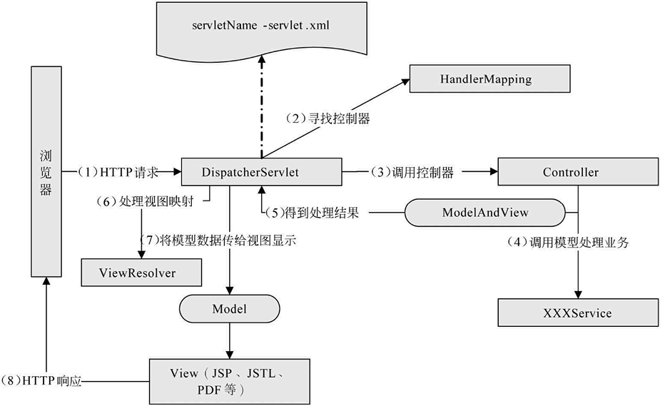

# 

# 项目中遇到的难点

分布式事务：

https://zhuanlan.zhihu.com/p/183753774


# 多线程

线程之间共享变量可以使用volatile关键子，保证可见性和禁止重排序


## Lock和synchronized的区别

https://www.cnblogs.com/dolphin0520/p/3923167.html

synchronized是Java语言内置的一个特性，有以下缺陷：

一个代码块块被synchronized修饰，当一个线程获取了锁，在执行过程中，其他线程只能一直等待，等待获取锁的线程释放锁，synchronized释放锁有两种情况：

- 获取所得线程执行完了该代码块，线程释放对锁的占用
- 线程执行发生异常，此时JVM会让线程自动释放锁

如果这个获取锁的线程由于要等待IO或者其他（网络）原因被阻塞了，但是又没有释放锁，其他线程只能等待，这会影响程序执行效率。通过Lock可以手动释放锁。

1. Lock不是Java语言内置的，synchronized是Java语言的关键子，因此是内置特性，Lock是一个类，通过这个类可以实现同步访问。
2. synchronized在代码块执行完后，系统会自动让线程释放对锁的占用；Lock必须用户手动释放锁，如果没有主动释放锁，可能导致死锁现象。

### Lock锁

lock声明了四个方法来获取锁

1. void lock()：如果锁已经被其他线程获取，则进行等待。

   ```
   Lock lock = ...;
   lock.lock();
   try{
       //处理任务
   }catch(Exception ex){
        
   }finally{
       lock.unlock();   //释放锁
   }
   ```

   

2. boolean tryLock()：尝试获取锁，如果获取成功，则返回true，如果获取失败则返回false，也就是这个方法无论如何都会立即返回，拿不到锁时不会一直在哪等待。

3. Boolean tryLock(time)

   


springBoot的优点，配置文件的形式，yml形式包含那几个形式，springBoot如何启动，


加载bean过程


bean在注入的时候除了反射还有什么方式去找bean。

spring除了反射还有那种注解方式


Mybatis缓存


索引创建，失效场景


Redis在项目中的使用，如何部署的，哨兵机制，主从复制


Kafka是怎么产生和消费的，当消费失败怎么处理


对象直接放到老年代，采用了什么机制


线程池的参数，有几种创造线程池的方法


排查线上omm的工具，怎么定位到具体代码


# Java内存模型JMM

https://www.cnblogs.com/Scramblecode/p/11392639.html

Java内存模型的作用是用来屏蔽掉不同操作系统中的内存差异性来保持并发的一致性。同时JMM规范了JVM如何与计算机内存进行交互。简单说Java内存模型就是Java的一套协议来屏蔽各种硬件和操作系统的内存访问差异，实现平台一致性达到最终的“一次编写，到处运行”。

Java 内存模型是通过内存屏障来禁止重排序的。

JMM抽象示意图：


**多线程之间的通信和同步：**

线程之间的通信方式有两种，共享内存和消息传递。
**共享内存：**在共享内存方式的并发模型中线程是通过读取主内存的共享信息来进行隐性通信的；在共享内存中同步是显性进行的，在代码中必须要去指定方法需要同步执行比如加同步锁等。（堆内存中共享变量之间的通信）

**消息传递：**在消息传递通信中线程之间没有公共的状态，只能通过发送消息来进行显式通信；在消息传递的并发模型中发送消息必须在消息接收之前，所以同步时隐式的。（线程栈的不共享变量之间的通信）


静态变量是存在那个区域的？


cms，G1垃圾回收、垃圾回收算法、B+和红黑树、线程池状态、java为什么选择synchronize，有什么优势、 


线程的状态有哪些


如果多个线程要同时执行，怎么让多个线程先执行


# MyBatis中#和${}区别？

在MyBatis的映射配置文件中，动态传递参数有两种，#{}占位符，${}拼接符。

1. #{}是预编译处理（PreparedStatement）范畴的；${}是字符串替换。
2. 使用#{}可以有效地防止SQL注入，提高系统安全性；${}会导致SQL注入。
3. #{}的变量替换是在DBMS中；${}的变量替换是在动态解析过程中。
4. 变量替换后，#{}对应的变量会自动加上单引号''，${}对应的变量不会加上单引号''。

```
#{}：select * from t_user where uid=#{uid}
${}：select * from t_user where uid='${uid}'
(动态解析过程)传入参数uid为1，然后:
#{}：select * from t_user where uid= ?
${}：select * from t_user where uid= '1'
（DBMS中）最后：
#{}：select * from t_user where uid= '1'
${}：select * from t_user where uid= '1'
```


## 如果一条SQL中同时存在#和&，会先解析哪一个

在动态解析阶段的处理不同，在预处理的时候，#{}会把参数部分用一个占位符？代替；而${}则只是简单的字符串替换。

```
示例：select * from user where name=#{}
如果name值为张三，动态解析后为SQL语句：select * from user where name=?

select * from user where name=${}
如果name值为张三，动态解析后为：select * from user where name='张三'
```


## 什么情况下使用&

1、当表名用参数传递进来的时候，只能使用&{}，所以我们要小心SQL注入的问题。

```
示例：select * from ${tablename} where name=#{name}
如果传过来表名为user;delete user; --,则动态解析之后SQL如下：
select * from user;delete user; -- where name=?
```

2、MyBatis排序时使用order by动态参数时使用&


## 为什么表名和order by要使用${}

因为#{}在变量替换之后会自动加上单引号''，${}输出变量的值，没有单引号。


# spring AOP实现原理

采用横向抽取机制，底层使用动态代理


# Spring循环依赖问题

声明A、B对象

```
@Component
public class A {
  private B b;
  public void setB(B b) {
    this.b = b;
  }
}
@Component
public class B {
  private A a;
  public void setA(A a) {
    this.a = a;
  }
}
```

Spring是通过递归的方式获取目标bean及其所依赖的bean
Spring实例化一个bean的时候，式分两步的，首先实例化目标bean，然后为其注入属性。

https://zhuanlan.zhihu.com/p/162316846

1. 构造器的循环依赖无法解决

2. filed属性注入（setter）循环依赖

3. Prototype field属性注入循环依赖

   非单例bean默认不初始化，只有使用的时候才会初始化。不能解决

提前将对象的实例暴露出去，即对象实例化之后将实例放入缓存中，缓存引入了三级缓存。

Spring通过三级缓存，解决循环依赖的问题。

1. SingletonObjects：用于存放完全初始化好的bean
2. EarlySingletonObject：用于存放原始的bean对象，实例化完成，但是填充属性，用于解决循环依赖。
3. SingletonFactories：单例对象工厂的cache，存放bean工厂对象，用于解决循环依赖问题。
4. 其他缓存：不是解决循环依赖问题的
   1. Set<String> singletonsCurrentlyInCreation  它在Bean开始创建时放值，创建完成时会将其移出
   2. Set<String> alreadyCreated 当这个Bean被创建完成后，会标记为这个

相关方法：

**getSingleton(String beanName, boolean allowEarlyReference)**：获取单例bean。

- 先从一级缓存SingletonObjects中获取，如果获取到直接返回
- 如果获取不到或者对象正在创建中（isSingletonCurrentlyInCreation()）,就从二级缓存EarlySingletonObjects中获取，获取到直接返回
- 如果获取不到，且允许SingletonFactories（allowEarlyReference=true）通过getObject获取，就从三级缓存SingletonFactory.getObject获取，如果获取到，就将对象放入二级缓存，并从三级缓存SingletonFactories中移除

第一次getSingleton A对象，缓存中肯定没有，必须要创建对象。

CreateBean(beanName, mbd, args):

**doCreateBean(final String beanName, final RootBeanDefinition mbd, final @Nullable Object[] args)：**


提前曝光的对象放入Map<String, ObjectFactory> singletonFactories缓存中，如果创建的bean有对应的代理对象，但是spring无法提前知道这个对象是不是有循环依赖的情况，而正常情况下（没有循环依赖情况），spring都是创建好完成品bean之后才创建对应的代理。

怎么做到提前曝光对象而不生成代理呢？spring在对象外面包装一层objectFactory，提前曝光ObjectFactory对象，在被注入时踩在ObjectFactory.getObject()方法内实时生成代理对象，并将生成好的对象放入第二级缓存earlySingletonObjects中。

为什么不选择二级缓存，而要加一层缓存？如果使用二级缓存解决循环依赖，意味着bean在构造完成后就创建代理对象，这样违背了spring设计原则。

# Redis分布式锁


# 常用设计模式

# Spring 事务隔离级别

原子性、一致性、隔离性、持久性。

# Spring框架的事务管理有哪些优点

Spring事务管理**有声明式事务**和**编程式事务**。编程式事务需要写大量的代码，声明式事务可以通过使用spring的<tx:advice>定义事务通知与AOP相关配置实现，另一种通过注解@Transactional

1. 它为不同的事务API如JDBC、Hibernate、JPA提了一个不变的编程模式。
2. 它为编程事务管理提供了一套简单的API而不是复杂的事务API。
3. 它支持声明式事务
4. 他和Spring各种数据访问抽象层很好的集成

# Spring创建对象是单例还是多例？如何创建多例

Spring默认创建的类是单例的，可以通过scope属性更改为多例，scope范围有：

singleton：单例

prototype：多例

```
XML配置文件：
<bean id="user" class="modle.User" scope="prototype">
  </bean>
注解形式：
@Scope(value = ConfigurableBeanFactory.SCOPE_PROTOTYPE) 可设置为多例
public class User {
}
  
```


# 单例模式

双重锁检查

```
public class SingletionClass {

	private static volatile SingletionClass singletionClass;
	
	private SingletionClass() {
		
	}
	
	public static SingletionClass getSingleton() {
		if(singletionClass == null) {
			synchronized (SingletionClass.class) {
				if(singletionClass == null) {
					singletionClass = new SingletionClass();
				}
			}
		}
		return singletionClass;
	}
}
```

## 如何破坏一个单例

单例模式一般都是通过私有化构造方法和静态变量。通过调用指定的public成员方法获取单例模式的对象。所以如果能够使用私有化的构造方法创建对象，就可以创建一个新的对象，即破坏了单例模式。

**使用反射机制破坏单例：**

1. 首先获取该单例的Class对象，通过调用该对象getDeclaredConstructors()方法，获取所有构造方法。
2. 设置构造方法的访问权限为true，调用Constructor的newInstance()方法，即可返回该单例的一个新对象，与原对象的地址不同。

```
public static void main(String[] args) throws InstantiationException, IllegalAccessException, IllegalArgumentException, InvocationTargetException {
		SingletionClass t1 = SingletionClass.getSingleton();
		SingletionClass t2 = SingletionClass.getSingleton();
		System.out.println(t1);
		System.out.println(t2);
		System.out.println(t1 == t2);
		
		Class clazz = SingletionClass.class;
		Constructor[] cons = clazz.getDeclaredConstructors();
		Constructor constructor = cons[0];
		constructor.setAccessible(true);
		SingletionClass newIns = (SingletionClass)constructor.newInstance();
		System.out.println(newIns);
	}
	
	输出：
	com.example.demo.singleton.SingletionClass@15db9742
    com.example.demo.singleton.SingletionClass@15db9742
    true
    com.example.demo.singleton.SingletionClass@6d06d69c
```

​	


# SpringBoot的加载过程


启动是怎么加载的流程。。。。


# 发生oom怎么排查

**OutOfMemoryError**可能出现的错误消息：

- java.lang.OutOfMemoryError: Java heap space
- java.lang.OutOfMemoryError: PermGen space
- java.lang.OutOfMemoryError: Requested array size exceeds VM limit
- java.lang.OutOfMemoryError: request bytes for . Out of swap space?
- java.lang.OutOfMemoryError: (Native method)

https://www.cnblogs.com/c-xiaohai/p/12489336.html

1. **使用dmesg命令查看系统日志**

   dmesg |grep -E ‘kill|oom|out of memory’，可以查看操作系统启动后的系统日志，这里就是查看跟内存溢出相关联的系统日志。

2. **需要启动项目，使用ps命令查看进程**

   ps -aux|grep java 命令查看一下你的java进程，就可以找到你的java进程的进程id

3. **接着使用top命令，查看运行的进程的cpu负载、内存使用、所占资源等**

   top命令显示的结果列表中，会看到%MEM这一列，这里可以看到你的进程可能对内存的使用率特别高。以查看正在运行的进程和系统负载信息，包括cpu负载、内存使用、各个进程所占系统资源等。

   

   

   查看进程中线程的使用情况：
   top  -H -p PID

   

   

4. **使用jstat命令，打印Java堆的状况，包括新生代的两个S0、S1区、Eden区，以及老年代的内存使用率，还有Minor GC和Full GC的次数。**

   用jstat -gcutil 20886 1000 10命令，示每1000毫秒打印一次Java堆状况，打印10次，就是用jstat工具，对指定java进程（20886就是进程id，通过ps -aux | grep java命令就能找到），按照指定间隔，看一下统计信息，这里会每隔一段时间显示一下，包括新生代的两个S0、s1区、Eden区，以及老年代的内存使用率，还有young gc以及full gc的次数。

   通过jstat基本能看出来，其实就是大对象没法回收，一直在内存里占据着。

   

5. **使用jmap命令，可以打印出当前堆中所有每个类的实例数量和内存占用**

   执行jmap -histo pid可以打印出当前堆中所有每个类的实例数量和内存占用，如下，class name是每个类的类名（[B是byte类型，[C是char类型，[I是int类型），bytes是这个类的所有示例占用内存大小，instances是这个类的实例数量。

6. **使用jmap -dump:format=b,file=文件名 [pid]，把当前堆内存的快照转储到.hprof文件中**

   使用jmap -dump:format=b,file=文件名 [pid]，就可以把指定java进程的堆内存快照搞到一个指定的文件里去，但是jmap -dump:format其实一般会比较慢一些，也可以用gcore工具来导出内存快照。然后就可以使用MAT工具，来对hprof文件进行分析。或者使用jdk的目录下的bin目录下的：jvisualvm.exe


但是 JDK 自带了很多监控工具，都位于 JDK 的 bin 目录下，其中最常用的是 jconsole 和 jvisualvm 这两款视图监控工具。jconsole：用于对 JVM 中的内存、线程和类等进行监控；jvisualvm：JDK 自带的全能分析工具，可以分析：内存快照、线程快照、程序死锁、监控内存的变化、gc 变化等。


# AQS

https://blog.csdn.net/mulinsen77/article/details/84583716

AQS即AbstractQueuedSynchronizer，抽象的队列式同步器。是除了Java自带的synchronized关键字之外的锁，这个类在java.util.concurrent.locks包下。

AQS的核心思想就是，如果被请求的共享资源空闲，则将当前请求资源的线程设置为有效的工作线程，并将共享资源设置为锁定状态，如果被请求的共享资源被占有，那么就需要一套线程阻塞等待以及被唤醒时锁分配的机制，这个机制AQS是使用CLH队列锁实现的，即将暂时获取不到锁的线程加入到队列中。

CLH（Craig，Landin，and Hagersten）队列是一个虚拟的双向队列，即不存在队列实例，仅存在节点之间的关联关系，

**AQS是将每一条请求共享资源的线程封装成一个CLH锁队列的一个节点，来实现锁的分配。**

用大白话说，AQS就是基于CLH队列，用volatile修饰共享变量state，线程通过CAS去改变状态符，成功则获取锁成功，失败则进入等待队列，等待被唤醒。

**注意：**AQS是自旋锁。等待唤醒的时候，经常会使用自选的方式，不停的尝试获取锁，知道被其他线程获取成功。


# CMS和G1收集器区别

CMS收集器是并发的且基于标记-清除算法的，会**产生内存碎片**。它清理垃圾的步骤大致分为初始标记、并发标记、重新标记和并发清理。初始标记和重新标记会Stop The World，并发清理是保留上一步骤标记出的存活对象，清理掉其他对象，正是因为采用了并发清理，所以在清理过程中用户线程又会产生垃圾，而导致**浮动垃圾**，只能通过下次垃圾回收进行处理。

清理垃圾的步骤大致分为**初始标记、并发标记、重新标记和并发清理。**
CMS垃圾回收的内存模型还是我们常用的年轻代和老年代的结构；
CMS是基于标记-清除算法的，所以会产生内存碎片；
CMS的并发清理阶段，用户线程会产生垃圾，导致浮动垃圾，只能下次垃圾回收进行处理；
CMS收集器作用于回收老年代；

G1收集器回收垃圾的处理步骤大致为：**初始标记、并发标记、最终标记和筛选回收**。
G1收集器将堆空间划分为若干个等大的Region块，但还是保留了新生代、老年代的概念，但主要以Region为单位进行垃圾回收；
G1收集器是采用标记-整理算法，所以不会产生内存碎片；
G1最终的回收是STW的，所以不会产生浮动垃圾，Region的区域大小是固定的，所以回收时间也是可控的；
G1使用Remembered Set来避免全堆扫描；
G1适用在新生代和老年代；

|                          | **CMS**                      | **G1**                                                       |
| ------------------------ | ---------------------------- | ------------------------------------------------------------ |
| **JDK版本**              | 1.6以上                      | 1.7以上                                                      |
| **回收算法**             | 标记——清除                   | 标记——整理                                                   |
| **运行环境**             | 针对70G以内的堆内存          | 可针好几百G的大内存                                          |
| **回收区域**             | 老年代                       | 新生代和老年代                                               |
| **内存布局**             | 传统连续的新生代和老年代区域 | Region(将新生代和老年代切分成Region，默认一个Region 1 M,默认2048块) |
| **浮动垃圾**             | 是                           | 否                                                           |
| **内存碎片**             | 是                           | 否                                                           |
| **全堆扫描**             | 是                           | 否                                                           |
| **回收时间可控**         | 否                           | 是                                                           |
| **对象进入老年代的年龄** | 6                            | 15                                                           |
| **空间动态调整**         | 否                           | 是（新生代5%-60%动态调整，一般不需求指定）                   |
| **调优参数**             | 多（近百个）                 | 少（十几个）                                                 |

# 什么情况下对象直接进入老年代，使用什么机制

1. 当**分代年龄=-XX:MaxTenuringThreshold **指定的大小时，进入老年代；
2. **动态晋升机制**，根据**-XX:TargetSurvivorRatio**（默认50，即50%）指定的比例，乘以survive一个区的大小，得出**目标晋升空间大小**。然后将分代对象大小，按照分代年龄从小到大相加，**直到大于目标晋升空间大小**，然后，将得出的这个分代年龄以上的对象全部晋升到老年代。（例如：一个survive区的大小为100M，目标晋升空间=50M，对象按年龄从小到大排序，按照顺序把对象占用的空间相加，加到对象年龄=5的时候，对象占用空间>目标晋升空间，然后，将5岁以上的对象全部晋升到老年代）
3. 对于一些GC算法，可能直接在老年代上分配，例如G1 GC中的大对象分配，就是对象在超过Region一半大小的时候，直接在老年代的连续空间分配。

# 垃圾回收算法

### 标记清除算法


### 复制算法


### 标记整理算法


### 分代收集算法

堆内存分为年轻代和老年代。Java默认启动分代GC。

1. 新建对象分配到Eden区，Eden区内存不够时，触发Minor GC；
2. 经过Minor GC会使存活对象进入from区，年龄加1（from区和to区会交换引用地址）；
3. 当**分代年龄=-XX:MaxTenuringThreshold **指定的大小时，进入老年代；
4. **动态晋升机制**，根据**-XX:TargetSurvivorRatio**（默认50，即50%）指定的比例，乘以survive一个区的大小，得出**目标晋升空间大小**。然后将分代对象大小，按照分代年龄从小到大相加，**直到大于目标晋升空间大小**，然后，将得出的这个分代年龄以上的对象全部晋升到老年代。（例如：一个survive区的大小为100M，目标晋升空间=50M，对象按年龄从小到大排序，按照顺序把对象占用的空间相加，加到对象年龄=5的时候，对象占用空间>目标晋升空间，然后，将5岁以上的对象全部晋升到老年代）
5. 当老年代内存不够会触发Full GC，年轻代和老年代会一起进行垃圾回收，此时会触发SWT机制，造成程序的停顿。


创建的对象会分配到Eden区，当Eden区内存不够的时候，触发Minor GC，根据可达性分析算法将存活的对象进行标记，并移动到Survive的from区，同时将对象的年龄加1；此时Eden区有了空闲内存，新创建对象仍会在Eden区分配内存，当Eden区内存又满了之后，Eden区和from区存活的对象进入到to区，存活对象年龄加1，交换form和to区的引用，即此时存活对象在from中，to区保持空闲。如果from区中对象年龄达到阈值15（默认15）或者from区或to区达到整个对象的50%（此处整个对象是指Survive？），则存活对象进入到老年代，如果老年代内存不够用会触发Full GC，即新生代和老年代会一起进行垃圾回收，此时可能会触发SWT机制（stop-the-world），造成程序的停顿。


# 内存单薄？？？


# 为什么要有自定义加载器


# 双亲委派机制


# Redis分布式锁有什么缺点


# Kafka吞吐量高原因

# eureka和zookeeper的区别

服务访问不到eureka怎么处理


# Eureka注册中心

eureka使用的是几级缓存，是因为缓存实现高可用的，使用了二层缓存


Eureka作为服务注册中心，采用CS架构，Eureka提供服务注册和服务发现，包含服务注册中心（Eureka Server）、服务提供者（Service Provider）、服务消费者（Service Consumer）。

- Eureka Server：提供服务注册和发现，多个服务之间会同步数据，做到最终一致。
- Service Provider：将自身服务注册到Eureka
- Service Consumer：从Eureka获取注册服务列表，从而能够消费服务

**服务发现有两种模式：**一种是客户端发现模式，一种是服务端发现模式。Eureka采用的是客户端发现模式。

**服务注册：**

1. Eureka Client客户端启动后**Register**注册到Eureka Server服务端，并从服务端获取注册列表缓存在本地。
2. 客户端每隔一定周期（默认30s），向服务端发送心跳，这时Eureka的**Renew**（更新/续借）
3. 如果服务端在多个心跳周期（默认90s）没有收到客户端发送的心跳，服务端将会在服务注册列表中提出该节点。
4. 如果客户端停止应用，向服务端发送**Cancel**取消请求，服务端收到取消请求后，将客户端从服务注册列表中剔除。

**服务中心：**

1. 当各个微服务节点启动后，Eureka Server服务端会存储服务提供者注册上来的服务信息，并提供二层缓存机制来维护整个注册中心。
2. 如果服务端节点都宕掉，因为服务提供者本地缓存了服务注册列表，所以仍然可以找到服务提供者，但是会出现信息不一致。

**Eureka自我保护机制：**

使用自我保护机制能够使集群更加健壮稳定的运行。

自我保护机制是说，如果15分钟内超过85%的客户端节点都没有正常的心跳，那么Eureka Server认为客户端与注册中心发生了网络故障，Eureka Server进入自我保护机制。

**为什么要开启自我保护？**

如果Eureka Server在一定时间内（默认90s）没有收到客户端的心跳，会将客户端节点从服务注册列表中剔除，但是在某些时候，遇到网络分区故障，服务节点实际上是正常状态，但是无法和Server通信，如果没有引入自我保护机制，Server会将该服务节点剔除。

**自我保护机制缺点**

如果在自我保护机制中，刚好某些服务节点非正常下线，但是Eureka Server并不会剔除该服务节点，服务消费者就会获取到一个无效的服务实例。

**Eureka Server 进入自我保护机制后**

1. Eureka Server不在从注册表中剔除因为长时间没有和注册中心续约的服务。
2. Server仍能够接收新服务的注册和查询请求，但是不会同步到其他Server节点上。
3. 网络正常后，当前Server节点会将新的服务节点信息同步到其他Server节点上。

**如何开启自我保护**

eureka.server.enable-self-presercation=true/false 开启或关闭

**解除自我保护**

1. 当服务的网络分区故障接触后，客户端能够和服务端进行交互，在续约的时候，更新每分钟的续约数，当每分钟的续约数大于85%时，则自动解除。
2. 重启服务

**Eureka的健康检查**


**Eureka的重试机制**

Eureka实现的服务治理机制强调了CAP的AP，机可用性和分区容错性，牺牲了一定的一致性。

从 Camden SR2 版本开始，Spring Cloud 就整合了 Spring Retry 来增强 RestTemplate 的重试能力。


**Eureka多级缓存机制**

Eureka Server的缓存是通过一个只读，一个读写缓存来实现的。先从一级缓存取，如果没有再从二级缓存取

- 一级缓存：ConcurrentHashMap<key,value> readOnlyCacheMap本质上是一个HashMap，无过期时间，保存数据信息对外输出。readOnlyCacheMap依赖于定时器的更新，通过与readWriteCacheMap的值对比，以readWriteCacheMap为准。

  responseCacheUpdateIntervalMs：readOnlyCacheMap缓存更新间隔，默认30s

- 二级缓存：LoaDing<key,value>readWriteCacheMap本质是Guava缓存，包含失效机制，保护数据信息对外输出。

**当服务节点发生注册，下线，过期，状态变更等变化时**

1. 在内存中更新注册表信息
2. 同时过期掉二级缓存readWriteCacheMap缓存，缓存清除只是会清除readWriteCacheMap缓存，readOnlyCacheMap只读缓存并没有更新，它只能依赖那个30s的定时任务来更新。
3. 一段时间后（默认30s），后台线程发现readWriteCacheMap缓存为空，于是将readOnlyCacheMap中的缓存清空。
4. 当有服务消费者拉取注册表信息时，会调用ClassLoad的load方法，将内存中的注册表信息加载到各层缓存中，并返回注册表信息。

在Eureka Server中会有两个线程，一个是定时同步两个缓存的数据，默认30s，一个是定时检测心跳，默认90s。


https://zhuanlan.zhihu.com/p/334711540

# CAP理论

CAP理论是指一个分布式系统最多只能同时满足Consistency（一致性）、Availability（可用性）、Partition Tolerance（分区容错）这三项中的两项。


## Consistency 一致性

一致性是指所有的节点在同一时间的数据完全一致。对于一致性，也可以从客户端和服务端两个不同的视角来理解。

**客户端：**从客户端看，一致性主要指多并发访问时更新后的数据如何获取的问题。

**服务端：**从服务端看，则是更新后的数据如果分布到整个系统，以保证数据最终一致。

一致性的程度不同，大致分为强一致性、弱一致性和最终一致性三大类。

- **强一致性：**对于关系型数据库，要求更新过的数据能被后续的访问看到。
- **弱一致性：**能容忍后续的部分或全部访问不到。
- **最终一致性:**如果经过一段时间后要求能访问到更新后的数据。

## Availability可用性

可用性指服务一直可用，而且是正常响应时间。不管什么时候访问，都可以正常的获取数据值。

## Partition tolerance 分区容错性

分区容错性指遇到某节点或网络分区故障的时候，仍然能够对外提供满足一致性和可用性的服务。

## CAP特性取舍

- 满足CA舍弃P：也就是满足一致性和可用性，舍弃分区容错性。就意味着系统不是分布式的了，因为涉及分布式的想法就是把功能分开，部署到不同机器上。
- 满足CP舍弃A：满足一致性和分区容错性，舍弃可用性。如果允许系统有段时间的访问失效等问题，这个是可以满足的。例如并发买票，后台网络出现故障，买的时候系统崩溃。
- 满足AP舍弃C：满足可用性和分区容错性，舍弃一致性。意味着你的系统在并发访问的时候会出现数据不一致的情况。

事实证明，大多数是实现了一致性，向12306、淘宝，看到还有一张票，但是买的时候已经没有了。


项目中因为对数据不要求实时性，只要能够满足最终一致性即可，但必须保证服务的可用性，所以时牺牲掉了一致性，即满足AP舍弃C


# MySQL语句limit

limit：limit i,n   i为查询结果的索引值（默认从0开始）；n表示查询结果返回的个数。


# MySql有哪些索引

ALTER TABLE table_name ADD [INDEX | UNIQUE | PRIMARY KEY] index_name(column_list)

有普通索引	、唯一索引和主键索引。

**组合索引（a,b,c），查询语句select * from user where a="" and c="" and b="",会使用到索引吗？**

可以使用，索引的最左匹配原则指出，MySQL会一致向右匹配直到遇到范围查询（>,<,between,like），比如a=1 and b<1 and c=1,c是用不到索引的，可以把范围查询的索引放到最后一个，即组合索引为（a,c,b）


possible_keys：可能使用到的索引.

key：实际使用到的索引。

key_len：索引中被使用部分的长度，以字节计。

ref：列出是通过常量（const），还是某个表的某个字段（如果是join）来过滤（通过key）的。

rows：MySQL所认为的它在找到正确的结果之前必须扫描的记录数。


主键索引又为聚簇索引，主键索引的叶子节点存放了整张表的行记录数据；非聚簇索引又为非主键索引，叶子节点存储的是主键索引值，通过非主键索引查找数据时会回表，找到主键索引。

B+树利用空间局部性原理，相比于平衡二叉树，红黑树，它的高度低，减少磁盘IO次数。

# MySQL索引为什么使用B+树结构

MySQL的InnoDB存储引擎默认使用了B+ tree。为什么使用B+树？和Hash索引区别

B+ Tree是一种多路平衡查询树，所以他的节点是天然有序的（左子节点小于父节点，右子节点大于父节点），对于范围查询的时候不需要做全表扫描。

Hash索引在存储关系上是无序的，对于区间查询是无法直接通过索引查询的，需要全表扫描，适合做等值查询。

哈希索引不支持组合索引的最左匹配规则 如果有大量重复键值得情况下，哈希索引的效率会很低，因为存在哈希碰撞问题


扩展：

**覆盖索引：**指一个查询语句的执行只用从索引中就能取得，不必从数据表中读取。例如组合索引（name,age）,SQL语句select age from user where name='zhang'，可以通过覆盖索引查询，无需回表。

**最左前缀匹配：**在检索数据时会从联合索引的最左边开始匹配，直到遇到范围查询。

**索引下推：**5.6中的优化，可以减少存储引擎查询基础表的次数，也可以减少Mysql服务器从存储引擎接受数据的次数。
针对下面SQL，如果没有使用索引下推优化，MySQL会通过zipcode=’95054‘从存储引擎中查询对应的数据，返回到MySQL服务端，然后MySQL服务端基于lastname和address的条件来判断数据是否符合条件;
如果使用了索引下推优化，MySQL首先会返回符合zipcode=‘95054’的索引，然后根据lastname和address筛选出符合条件的索引，然后回表，找到数据返回给服务端，可以减少回表次数。

```
SELECT * FROM people WHERE zipcode=‘95054’ AND lastname LIKE ‘%etrunia%’ AND address LIKE ‘%Main Street%’;
```

当使用explan进行分析时，如果使用了索引条件下推，Extra会显示Using index condition。

# MySQL索引失效场景

- 存在null值条件
- 列与列对比，比如select * from user where id=c_id
- NOT条件
- LIKE通配符，尽量采用后置通配符，可以走INDEX RANGE SCAN
- 条件上包含函数
- 查询条件数据类型的转换
- 符合索引前导列区分大
- Connect By Level
- 谓词运算
- Vistual Index
- Invisible Index


# MySQL是否解决幻读，如何解决幻读?


MySQL默认的事务处理级别是可重复读，提供的四种隔离级别：

- 未提交读（Read Uncomitted）：允许脏读，也就是可能读取到其他会话中未提交事务修改的数据。
- 提交读（Read Committed）：解决了脏读，存在幻读，只读取已经提交的数据。（幻读：在一次事务中，多次查询之后，结果集的个数不一致的情况叫做幻读）
- 可重复读（Repeated Read）：在同一事务内的查询都是事务开始时刻一致的。解决了脏读和幻读
- 串行读（Serializable）：完全串行化读，每次读都要获得表级共享锁，读写相互都会阻塞。

MySQL通过加锁解决了幻读，MySQL中InnoDB锁住的是索引，当没有索引的时候就会锁表。

**行锁的算法**

MySQl通过加锁解决了幻读，但是如果行锁只是锁住了一行记录，好像并不能防止幻读，所以行锁锁住一条记录只是一种情况，行锁有三种算法：记录锁、间隙锁和临键锁。临键锁防止了幻读。

- 记录锁（Record Lock）：当我们的查询能命中一条记录的时候，InnoDB就会使用记录锁，锁住所命中的这一行记录。
- 间隙锁（Gap Lock）：当我们的查询没有命中记录的时候，这时候InnoDB就会加上一个间隙锁。间隙锁主要是会阻塞插入操作。
- 临键锁（Next-Key Lock）：临键锁就是记录锁和间隙锁的结合。当我们进行一个范围查询，不但命中过了一条或者多条记录，且同时包括了间隙，这时候就会使用临键锁，临键锁是InnoDB中默行锁的默认算法。

https://juejin.cn/post/6885614691595321357

# 项目中对高可用做了哪些东西


对系统进行集群部署，内部采用负载均衡、实时监控、优化配置；外部增加硬件配置


# 集群中的服务挂掉了怎么处理


# Redis内存淘汰策略

## Redis过期策略

### 定期刪除：

redis会将每个设置了过期时间的key放到一个独立的字典中，以后会定期遍历这个字典来删除到期的key。

Redis默认会每秒进行十次过期扫描（100ms一次），过期扫描不会遍历过期字典里面的所有key，而是采用一种简单的贪心策略。

1. 从过期字典中随机20个key；
2. 删除这20个key中已经过期的key；
3. 如果过期的key比率超过1/4，就重复步骤1.

采用随机抽取，减少CPU的负载，如果redis存储了几十万个key，每隔100ms就遍历所有设置过期时间的key，会给CPU带来很大的负载。

### 惰性删除：

就是客户端访问这个key的时候，redis对key的过期时间进行检查，如果过期了就立即删除，不会返回任何东西。

总结：定期删除是集中处理；惰性删除是零散处理。


## 为什么需要淘汰策略

因为不管是定期删除还是惰性删除都不是一种完全精准的删除，还是会存在key没有被删除的场景。所以内存淘汰策略进行补充。

### 内存淘汰策略

配置文件中使用maxmemory-policy 设置内存淘汰策略；maxmemery最大内存

- noeviction：默认策略，当内存使用达到设置的最大值时，所有申请内存的操作（如set，lpush等）都会报错，只读操作如get命令可以正常执行，不会驱逐任何键。
- volatile-lru：从设置了过期时间的key中删除**最久没有使用**的键。
- allkeys-lru：通过LRU算法删除**最久没有使用**的键值。
- volatile-lfu：从设置了过期时间的key中删除马上要过期的键。
- allkeys-lfu：从所有key中删除使用频率最少的键值。
- volatile-random：从设置了过期key的集合中随机删除。
- allkeys-random：从所有key中随机删除。
- volatile-ttl：从设置了过期时间的key中删除马上快要过期的键。

## LRU（Least Recently Used）算法

表示最近最少使用，该算法根据数据的历史访问记录来淘汰数据，其核心思想就是“如果数据最近被访问过，那么将来被访问的几率也更高”

### 标准LRU实现方式

1. 新增key value的时候首先在链表结尾添加Node节点，如果超过LRU设置的阈值就淘汰队头的节点并删除掉HashMap中对应的节点。

2. 修改key对应的值的时候先修改对应的Node中的值，然后把Node节点移动队尾。

3. 访问key对应的值的时候把访问的Node节点移动到队尾即可

### **Redis的LRU实现**

Redis维护了一个24位时钟，可以简单理解为当前系统的时间戳，每隔一定时间会更新这个时钟。每个key对象内部同样维护了一个24位的时钟，当新增key对象的时候会把系统的时钟赋值到这个内部对象时钟。比如我现在要进行LRU，那么首先拿到当前的全局时钟，然后再找到内部时钟与全局时钟距离时间最久的（差最大）进行淘汰，这里值得注意的是全局时钟只有24位，按秒为单位来表示才能存储194天，所以可能会出现key的时钟大于全局时钟的情况，如果这种情况出现那么就两个相加而不是相减来求最久的key。

Redis中的LRU与常规的LRU实现并不相同，常规LRU会准确的淘汰掉队头的元素，但是Redis的LRU并不维护队列，只是根据配置的策略要么从所有的key中随机选择N个（N可以配置）要么从所有的设置了过期时间的key中选出N个键，然后再从这N个键中选出最久没有使用的一个key进行淘汰。


# Config中心配置的原理

三台集器，如果要改一个配置，配置信息一致性原理是怎样的？


# Ribbon负载均衡怎么做的

默认是用什么策略

随机、轮询、哈希一致性

# Hystrix服务熔断使用方法级别还是接口级别


# SpringMVC工作流程



1. 客户端发起http请求到DispatcherServlet
2. DispatcherServlet控制器寻找一个或多个HandlerMapping，找到合适的控制器，并返回给DispatcherServlet。
3. DispatcherServlet将请求提交到Controller。
4. 控制器调用业务逻辑进行处理后返回ModelAndView给DispatcherServlet
5. DispatcherServlet寻找一个或多个ViewResolver视图解析器，找到ModelAndView指定的视图View
6. 渲染视图显示给浏览器

# 如何设计幂等性

- 方法一：令牌Token机制（全局ID）（记录并检查操作）

  客户端在调用接口的时候先向后端请求一个全局ID（Token），请求的时候携带这个token一起请求，后端对这个全局ID校验来保证幂等操作。

  服务器端派发token并将token记录在缓存汇中，客户端携带该token请求服务，如果次token有效，处理请求，并删除token，token无效忽略此次请求。

- 方法二：数据库去重表

  在往数据库中插入数据的时候，利用数据库唯一索引特性，保证数据唯一，也可以是多个字段的组合，保证唯一性。

- 方法三：状态机制

  添加业务状态，比如库存单据状态已审核、待出库、出库中、已归档等，后端通过不同状态保证幂等性，比如扫描出库的时候，单据状态必须是待出库状态

# SpringBoot的常用注解


@ComponentScan：

@EnableAutoConfiguration：

# Kafka

**Kakfa如何实现高吞吐量**

- 顺序读写：Kafka是将消息记录持久化到磁盘上的，采用顺序读写。

- Page Cache（内核缓存）：为了优化读写性能，Kafka利用了操作系统本身的Page Cache，不是JVM空间内存，这样做的好处：

  - 避免Object消耗：如果是使用 Java 堆，Java对象的内存消耗比较大。
  - 避免GC问题：随着JVM中数据不断增多，垃圾回收将会变得复杂与缓慢，使用系统缓存就不会存在GC问题。

- 零拷贝：linux操作系统 “零拷贝” 机制使用了sendfile方法， 允许操作系统将数据从Page Cache 直接发送到网络，只需要最后一步的copy操作将数据复制到 NIC 缓冲区， 这样避免重新复制数据 。示意图如下：
  

- 分区分段+索引：

  Kafka的message是按照topic分类存储的，topic中的数据又是一个个partition即分区存储到不同的broker节点。每个partition对应操作系统上的一个文件夹，partition实际上又是按照分段存储的。

  为了进一步的查询优化，Kafka又默认为分段后的数据建立了索引文件，即文件系统上的.index文件

- 批量读写：Kafka数据读写也是批量的而不是单条的。

- 批量压缩：在很多情况下，系统的瓶颈不是CPU或磁盘，而是网络IO，对于需要在广域网上的数据中心之间发送消息的数据流水线尤其如此。进行数据压缩会消耗少量的CPU资源,不过对于kafka而言,网络IO更应该需要考虑。

  

**producer向kafka写入消息时，怎么保证消息不丢失：**

通过ACK应答机制，可以设置参数来确定是否确认kafka接收到数据，参数为（0，1，all），0：不需要集器返回，不确保消息发送成功；1：只要leader应答就可以发送下一条；all：所有follower都完成从leader的同步


**消费数据：**

同一个消费者组中的消费者可以消费同一topic下不同分区的数据，但是不会组内多个消费者消费同一分区的数据。

将提交类型修改为手动提交，可以保证至少被消费一次，但此时会出现重复消费的情况。消费者客户端配置enable.auto.commit为false开启手动提交。


https://zhuanlan.zhihu.com/p/68052232

# 线程池参数

ThreadPollExecutor：corePollSize、

# 项目中使用多线程


# 线程的start方法和run方法区别


## start()方法：

启动新线程；将线程从新建状态转移到可运行状态；开始执行run()方法。

## run()方法：

run()方法是Runnable接口的抽象方法，由JVM直接调用，不会创建新线程。相当于调用普通方法。


# 线程池ThreadPoolExecutor的参数

**ThreadPoolExecutor参数**：

1. int corePoolSize：核心线程大小
2. int maximumPoolSize：最大线程大小
3. long keepAliveTime：超过corePoolSize的线程多久不活动被销毁时间
4. TimeUnit unit：keepAliveTIme时间单位
5. BlockingQueue<Runnable> workQueue：任务队列
6. ThreadFactory threadFactory：线程池工厂
7. RejectedExecutionHandler handler：拒绝策略


**Executors：创建线程池类。**

Executors.newFixedThreadPool(nThreads)：创建可容纳固定数量线程的池子，每个线程的存活时间是无限的，当池子满了就不在添加线程了；如果池中所有线程均在繁忙状态，对于新任务，会进入阻塞队列中（无界的阻塞队列）。适用执行长期任务

```
public static ExecutorService newFixedThreadPool(int nThreads) {
        return new ThreadPoolExecutor(nThreads, nThreads,
                                      0L, TimeUnit.MILLISECONDS,
                                      new LinkedBlockingQueue<Runnable>());
    }
```

Executors.newCachedThreadPool()：当有新任务到来，则插入到SynchronousQueue中，由于SynchronousQueue是同步队列，因此会在池中寻找可用线程来执行，如果有可用线程则执行，如果没有就新建线程来执行；若池中空闲线程超过指定时间，则该线程会销毁。

```
 public static ExecutorService newCachedThreadPool() {
        return new ThreadPoolExecutor(0, Integer.MAX_VALUE,
                                      60L, TimeUnit.SECONDS,
                                      new SynchronousQueue<Runnable>());
    }
```

Executors.newSingleThreadExecutor()：创建只有一个线程的线程池，当该线程繁忙时，对于新任务会进入阻塞队列中（无界的阻塞队列）。适用按顺序执行的场景

```
public static ExecutorService newSingleThreadExecutor() {
        return new FinalizableDelegatedExecutorService
            (new ThreadPoolExecutor(1, 1,
                                    0L, TimeUnit.MILLISECONDS,
                                    new LinkedBlockingQueue<Runnable>()));
    }
```


# 线程池有哪些拒绝策略

当线程池的任务缓存队列已满并且线程池中的线程数目达到最大maximumPoolSize线程数时，如果还有任务到来就会采取拒绝策略，通常有一下四种：

ThreadPoolExcecutor.AbortPolicy：丢弃任务并抛出RejectedExecutionException异常，默认策略

ThreadPoolExecution.DiscardPolicy：丢弃任务，但是不抛出异常

ThreadPoolExecution.DiscardOldestPolicy：丢弃队列最前面的任务，然后重新提交被拒绝的任务。喜新厌旧的拒绝策略。

ThreadPoolExecution.CallerRunsPolicy：由调用线程（调用任务的线程）直接处理该任务

# 怎么终止线程

1. 使用推出标志，使线程正常退出，如果run方法中有while(true)，可改变标志位。
2. 使用stop方法强制终止
3. 使用interrupt方法中断线程，并不会立即中断线程，配合使用Thread.isInterrupted()；判断是否被中断，Thread.interrupted()判断是否被中断，并清除当前中断状态

# 线程start方法和run方法

线程调用start方法后，进入就绪状态；执行run方法不会新建线程，只是调用了一个普通方法。

# 多线程的问题

## 线程安全问题

**原子性：**一个操作或则多个操作 要么全部执行并且执行的过程不会被任何因素打断，要么就都不执行、

原子操作：即不会被线程调度机制打断的操作，没有上下文切换

解决：通过加锁synchronized或Lock保证原子性


**可见性**

使用Volatile关键字，或者加锁


**有序性**


## 活跃性问题

活跃性是指某件正确的事情最终会发生，当某个操作无法继续下去的时候，就会发生活跃性问题。

活跃性问题一般有这样几类：死锁、活锁、饥饿问题。

1. 死锁：死锁是指多个线程因为环形的等待锁的关系而永远的阻塞下去。

   

   2.活锁：死锁是两个线程都在等待对方释放锁导致阻塞，而活锁的意思是线程没有阻塞，还活着。当多个线程都在运行并且修改各自的状态，而其他线程彼此依赖这个状态，导致任何一个线程都无法继续执行，只能重复着自身的动作和修改自身的状态，这种场景就发生了活锁。（走路时，碰到互相让路的场景）

   3.饥饿：如果一个线程无其他异常却迟迟不能继续运行，那基本是处于饥饿状态了。

   常见场景：

   - 高优先级的线程一直在运行消耗CPU，所有低优先级线程一直处于等待；

   - 一些线程被永久阻塞在一个等待进入同步块的状态，而其他线程总是能在他之前持续的对该同步块进行访问。

     经典的饥饿问题就是哲学家用餐问题。


## 性能问题

多线程并发一定比单线程串行执行快吗，答案是不一定，因为多线程有**创建线程**和**上下文切换**的开销。

创建线程需要向操作系统申请资源，对操作系统来说创建一个线程是昂贵的，需要给它分配内存，列入调度等

上下文切换，为了保证每个线程都能得到CPU，通常为不同线程分配**时间片**当CPU从执行一个线程切换到另一个线程时，CPU需要保存当前线程的本地数据、程序指针等状态，并加载下一个要执行的线程的本地数据、程序指针等，这个开关被称为**上下文切换。**

一般减少上下文切换的方法有：无锁并发编程、CAS算法、使用协程等。


# Nginx配置文件


# Token挟持

如果一个用户的token被其他用户挟持了，怎么解决这个安全问题：

1. 在存储的时候把token进行对称加密存储，用时解开.
2. 将请求URL、时间戳、token三者进行合并加盐签名，服务端校验有效性


# HTTP和HTTPs区别

**http1.0、http1.1、http2区别**


HTTPS是一种通过计算机网络进行安全通信的传输协议，经由HTTP进行通信，利用SSL/TLS建立全信道，加密数据包

# SSL


# ThreadLocal


# Synchronized底层实现原理

反编译之后


# Object的方法

clone()：由于 Object 本身没有实现 Cloneable 接口，所以不重写 clone 方法并且进行调用的话会发生 CloneNotSupportedException 异常。要实现Cloneable接口

finalize()：当对象的内存不再被使用时，GC在收集垃圾时就会调用这个方法，但是GC是回收Java开辟的内存空间，如果是其他方式开辟的内存空间（c++的new关键字）是不能被GC的，因此我们应该在这个方法里释放掉非Java代码开辟的内存空间。


# 动态代理中是怎么使用反射的

通过Proxy的newProxyInstance(ClassLoader loader, Class<?>[] interfaces,  InvocationHandler h)方法

# Spring启动过程

https://blog.csdn.net/hjukyjhg56/article/details/108529552

https://zhuanlan.zhihu.com/p/82136894


refresh()：在这个方法中进行了bean的实例化、初始化、自动装配、AOP等功能


Spring Bean的生命周期：

new->属性注入->Init生命周期初始化方法->初始化回调方法->代理AOP->放入单例池singletonObject

如何加载bean的


spring的bean注入


# MySQL如何保证事务的原子性

MySQL的事务ACID，原子性、一致性、隔离性、持久性


# MySQL闭包表


# Maven公司私服仓库和本地仓库怎么一起做


# Redis好处


# Redis数据结构底层是怎么实现的


# 开闭原则的理解


# 雪花算法


- **1bit**，不用，因为二进制中最高位是符号位，1表示负数，0表示正数。生成的id一般都是用整数，所以最高位固定为0。

- **41bit-时间戳**，用来记录时间戳，毫秒级。
   \- 41位可以表示个数字，
   \- 如果只用来表示正整数（计算机中正数包含0），可以表示的数值范围是：0 至 ，减1是因为可表示的数值范围是从0开始算的，而不是1。
   \- 也就是说41位可以表示个毫秒的值，转化成单位年则是年

- **10bit-工作机器id**，用来记录工作机器id。
   \- 可以部署在个节点，包括5位datacenterId和5位workerId
   \- 5位（bit）可以表示的最大正整数是，即可以用0、1、2、3、....31这32个数字，来表示不同的datecenterId或workerId

- **12bit-序列号**，序列号，用来记录同毫秒内产生的不同id。
   \-  12位（bit）可以表示的最大正整数是，即可以用0、1、2、3、....4094这4095个数字，来表示同一机器同一时间截（毫秒)内产生的4095个ID序号。

**SnowFlake可以保证**

1. 所有生成的id按时间趋势递增
2. 整个分布式系统内不会产生重复id（因为有datacenterId和workerId来做区分）


# 

# 算法

1. 找出字符串中重复子串的长度

   解决思路：滑动窗口

2. 迭代

   迭代的条件：

   - 有一个初始值的变量
   - 一个说明变量如何更新的规则
   - 一个结束条件。

   循环三要素：循环遍历、循环体、循环终止条件。

   和递归一样，时间要求随着输入的增长呈线性的可以叫做线性迭代。

3. 递归

https://juejin.cn/post/6844904120634064903

