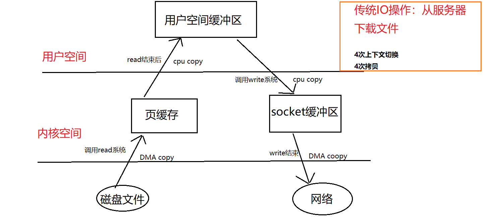
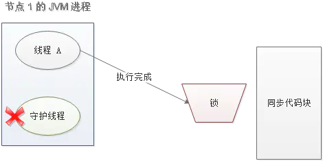

# 什么是Spring？为什么使用Spring？

Spring是一个轻量级的开源框架，使Java EE开发更加简单。

Spring 提供IOC技术，容器会帮你管理依赖对象，从而不需要自己创建和管理依赖对象，更轻松的实现了程序的解耦。

Spring提供了事务支持，使事务操作变得更见方便。

Spring提供了面向切面编程，这样可以方便处理某一类问题。

更方便的框架集成，Spring可以很方便的集成其他框架，比如Mybatis、Hibernate。

# Spring由哪些模块组成？

core module、bean module、context module、Expression Language module、ORM module、Transaction module、jdbc module、Web module、web-servlet module。

# 核心容器（应用上下文）模块

Context module，Spring的基础模块，提供Spring框架的基础功能，BeanFactory是任何以spring为基础的应用的核心。Spring框架建立在此模块之上，它使Spring成为一个容器。

# BeanFactory，实现举例

Bean工厂是工厂模式的一个实现，提供了控制反转功能，用来把应用的配置和依赖从应用代码中分离。最常见的BeanFactory实现是XMLBeanFactory类。

XMLBeanFactory根据XML文件中的定义加载bean，


# Spring Boot自动装配原理


# List集合

实现线程安全的集合方式

- 使用Vector，jdk1.1出现的，add方法有同步锁，保证线程安全

- 使用Collections.synchronizedList()方法，List<String> list = Collections.synchronizedList(new ArrayList<>());

- 使用CopyOnWriteArrayList.
  List<String> list = new CopyOnWriteArrayList<String>();

  CopyOnWriteArrayList是一个线程安全的List，底层是通过复制数组的方式实现的，以add方法实现说明，在add方法里，会首先加上Lock.lock()锁锁住，然后复制一个新的数组，向新数组中添加元素，最后将数组array指向新数组。get()方法又或是size()方法只是获取array所执行的数组的元素或大小。
  
  **CopyOnWriteArrayList缺点：**显然，copyOnWriteArrayList是很耗费内存的，每次add/set都会复制出一个新数组出来；另外CopyOnWriteArrayList只能保证数据最终一致性，不能保证数据的实时一致性；
  
  **Copy-On-write机制：**CopyOnWrite容器即写时复制容器。添加新元素时，不直接往当前容器Object[]添加，而是先将当前容器进行copy，复制出一个新的容器Object[] newElements，然后向新的容器newElements中添加元素，添加之后再将原容器的引用指向新的容器setArray(newElemetns)，这个过程是在锁定的过程Locl.loc()。这样做可以对CopyOnWrite容器进行并发的读，而不需要加锁，因为当前容器不会添加任何元素。所以CopyOnWrite容器也是一种读写分离的思想。

​		List时Java里的一个接口，常见的实现类有ArrayList和LinkedList，在开发中用的最多的时ArrayList，ArrayList底层数据结构是数组，LinkedList底层数据结构是链表。

​		**Java本身有数组为什么要用ArrayList**：原生数组有一个缺点，使用时必须要为它创建大小，而ArrayList不用。如果数组的大小指定多了，造成内存浪费，执行少了，装不下。ArrayList实现了动态扩容，当我们new ArrayList()时，默认是一个空的Object数组，大小为0，当我们第一次add添加数据的时候，会给数组初始化一个默认值为10的大小，每一次add的时候都会计算数组大小是否够用，如果不够进行扩容，扩容为原来的1.5倍。

​		在开发过程中，遍历的需求要比增删多，即便是增删也只是在list尾部添加，事件复杂度也就是O(1)，另外，ArrayList的增删底层调用的Arrays.copyOf()被优化过，现代CPU对内存的操作可以块操作，ArrayList的增删不比LinkedList慢。

**Vector介绍：**Vector底层结构是数组，相比于ArrayList，它是线程安全的，在扩容时它是直接扩容两倍的。

# Java注解

Java注解就是代码中的特殊标记，这些标记可以在编译、类加载、运行时被读取，并执行相应的处理。注解在开发中非常常见，比如在使用各种框架时，像@Controller、@Param、@Select等等，像lombok的注解@Data、@Slf4j等，除了框架实现的注解，Java原生也有@Override、@Deprecated、@FunctionInterface等注解，不过原生的注解大多用于标记和检查。原生Java除了提供基本注解之外，还有一种Annotation（元注解），所谓Annotation就是用来修饰注解的，常用的Annotation有@Retention和@Target。@Retention可以理解为注解的生命周期，@Retention注解传入的RetentionPolicy枚举值有SOURCE、CLASS、和RUNTIME，而@Target表示这个注解可以修饰哪些地方（方法、成员变量、包）。

**自定义注解实现过程：**如果想在编译期间处理注解相关的逻辑，需要继承AbstractProcessor并实现Process方法，比如看到lombok就用AnnotationProcessor继承了AbstractProcessor。

​		一般来说，只要自定义注解中@Retention注解设置为SOURCE和CLASS这两个级别，那么就需要继承并实现，因为这两个级别等加载到jvm的时候，注解就被抹除了。从此引申出lombok的实现原理就是在这里（为什么使用了@Data注解就有set/get方法了，就是在这里加上去的）

​		一般来说自己定义的注解都是RUNTIME级别的，因为大多数情况是根据运行时环境去做一些处理，我们现实在开发过程中写自定义注解需要配合反射来使用，因为反射是Java获取运行时的信息的重要手段，所以，当使用了自定义注解，在Spring AOP的逻辑处理中，判断是否带有自定义注解，如果有则将监控的逻辑写在方法的前后。

# Java泛型

泛型简单来说就是**在创建对象或调用方法时才明确下具体的类型**。使用泛型的好处是代码更加简洁、程序更加健壮、编译期间没有警告，在运行期间就不会有ClassCastException异常。

在平常工作中，在操作集合的时候用的比较多，List list = new ArrayList<>();list.add("好哎"); 其他场景就是写 基础组件的时候，组件为了做到足够的通用性，是不知道用户要传入什么类型参数进来的，所以在这种情况下用泛型就是很好的实践。这块可以参考SpringData JPA的JpaRepository写法。

写组件离不开Java反射机制，所以一般组件是泛型+反射实现的。

# Java NIO

**NIO和传统IO有什么区别：**传统IO是一次一个字节的处理数据，NIO是以块的形式处理数据。最主要的是，NIO可以实现非阻塞，而传统IO只能是阻塞。IO的实现场景是文件IO和网络IO，NIO在网络IO场景下提升就尤其明显了。

Java NIO有三个核心部分组成：Buffer（缓冲区）、Channel（管道）、Selector（选择器）。可以简单理解为Buffer是存储数据的地方，Channel是运输数据的载体，Selector用于检查多个Channel的状态变更情况。

**IO模型有几种：**在Unix下有阻塞IO、非阻塞IO、IO复用、信号驱动、异步IO。在开发中用的最多的是阻塞IO、非阻塞IO以及IO复用。

**IO复用模型：**以Linux为例，我们知道，Linux对文件的操作实际上就是通过文件描述符(fd)。IO复用模型指的是通过一个进程监听多个文件描述符，一旦某个文件描述符准备就绪，就去通知程序做相应的处理，这种通知的方式，优势并不在于对于单个连接能处理的更快，而是在于它能处理更多的连接。 在Linux下，IO复用模型的函数有select/poll和epoll。

**select和epoll的区别：**select函数支持最大的连接是1024或2048，因为在select函数下要传入fd_set参数，这个fd_set的大小要么是1024或2048（其实看操作系统的位数）。fd_set就是bitmap的数据结构，可以简单理解为只要位为0，说明数据还没有到缓冲区，如果位为1，说明数据已经到缓冲区，而select函数做的就是每次将fd_set遍历，判断标志位是否发生变化，如果有变化则通知程序做中断处理。

​	epoll是在Liinux2.6内核正式提出，完善了select的一些缺点。它定义了epoll_event结构体来处理，不存在最大连接数的限制。并且它不像select函数每次把所有的文件描述符(fd)都遍历，简单理解就是epoll把就绪的文件描述符(fd)专门维护了一块空间，每次从就绪列表里面拿就好了，不再进行对所有文件描述符(fd)进行遍历。

**什么是零拷贝：**零拷贝只要是避免CPU将数据从一块存储拷贝到另一块存储的技术。有两种实现方式，一种是减少拷贝次数（用户空间和内核空间拷贝），另一种是写时复制，减少系统开销，即应用程序需要修改数据时才拷贝到自己的应用空间。

为了保证内核安全，操作系统将虚拟空间划分为【用户空间】和【内核空间】，所以在读系统数据的时候会有状态切换，因为应用程序不能直接去读取硬盘的数据。

**传统IO**从服务器下载文件，这时服务器端任务是将文件不做修改的从已连接的socket发出去，执行read()、write()方法。
硬盘—>内核缓冲区—>用户缓冲区—>内核socket缓冲区—>协议引擎。



**使用mmap技术（内存映射）**

mmap技术是内核缓冲区与用户缓冲区数据共享，减少一个拷贝次数。

磁盘上的数据通过DMA拷贝到内核缓冲区，接着操作系统会把这段内核冲区与应用程序共享，减少内核缓冲区的内容往用户空间拷贝。
硬盘—>内核缓冲区--->用户缓冲区---->内核socket缓冲区—>协议引擎


**使用sendFile**

sendFile系统调用在两个文件描述符之间直接传递数据（完全在内核中操作）从而避免了数据在内核缓冲区和用户缓冲区之间的拷贝，操作效率很高。

sendFIle()系统调用不需要将数据拷贝或者映射到应用程序地址空间中去，所以sendFIle只**适用于应用程序地址空间不需要对所访问数据进行处理**的情况。
硬盘—>内核缓冲区—>内核socket缓冲区—>协议引擎


**使用带有DMA收集拷贝功能的sendFIle**

DMA收集拷贝功能，从磁盘读出的数据只需要将缓存描述符传到网络协议栈中去，之后在其缓冲区中建立起数据包的相关结构，然后DMA收集拷贝功能将所有数据结合成一个网络数据包。网卡的DMA引擎会在一次操作中从多个位置读取包头和数据，linux2.4版本后可实现。
硬盘—>内核缓冲区—>协议引擎。


DMA：是指外部设备不通过CPU而直接与系统内存交换数据的接口技术。	

# Java反射和动态代理

反射就是Java可以在运行时获取类的信息。所谓运行时就是class文件被JVM装载运行。在运行时获取类的信息，其实就是为了让我们的代码更具有通用性和灵活性。要理解反射需要抛开我们日常写的业务代码。以更高的维度或者说是抽象的思维去看待我们所写的”工具“。

**所谓工具：**在单个系统中叫做"utils"，被多个系统使用达成jar包叫做”组件“，组件继续发展壮大就叫做”框架“。约定大于配置，配置大于硬编码。

**泛型是擦除的，为什么反射会得到泛型的信息？为什么下面代码能得到泛型信息？：**

```
// 抽象类，定义泛型<T>
public abstract class BaseDao<T> {
    public BaseDao(){
        Class clazz = this.getClass();
        ParameterizedType  pt = (ParameterizedType) clazz.getGenericSuperclass(); 
        clazz = (Class) pt.getActualTypeArguments()[0];
        System.out.println(clazz);
    }
}

// 实现类
public class UserDao extends BaseDao<User> {
    public static void main(String[] args) {
        BaseDao<User> userDao = new UserDao();

    }
}
// 执行结果输出
class com.entity.User
```

泛型擦除是有范围的，定义在类范围上的泛型信息是不会被擦除的，Java编译器仍在class文件以Signature属性的方式保留了泛型信息。Type作为顶级接口，Type下还有几种类型，比如TypeVariable、ParameterizedType、WildCardType、GenericArrayType以及class。通过这些接口我们可以在运行时获取泛型相关的信息。

**动态代理：**动态代理是代理模式的一种，代理模式是设计模式之一。代理模型有静态代理和动态代理。静态代理需要自己写代理类，实现对应的接口，比较麻烦。
在Java中，动态代理常见的有两种实现方式：JDK动态代理和CGLIB动态代理。
在业务中使用动态代理，一般是为了给需要实现的方法添加预处理或添加后续操作，但不干预实现类的正常业务。Spring的AOP原理就是基于动态代理实现的。

代理模式最主要的就是有一个公共接口，一个具体的类，一个代理类。代理类具有是积累的

**JDK动态代理：**JDK是基于接口的动态代理，基于反射的机制。记住类：InvocationHandler、Proxy。

第一步：创建一个接口

```
public interface Subject {
    void hello(String param);
}
```

第二步：实现接口

```
public class SubjectImpl implements Subject {
    @Override
    public void hello(String param) {
        System.out.println("hello  " + param);
    }
}
```

第三步：创建SubjectImpl的代理类，实现InvocationHandler

```
public class SubjectProxy implements InvocationHandler {
    private Subject subject;

    public SubjectProxy(Subject subject) {
        this.subject = subject;
    }

    @Override
    public Object invoke(Object proxy, Method method, Object[] args) throws Throwable {
        System.out.println("--------------begin----------");
        // 利用反射调用类里面的实际方法
        Object invoke = method.invoke(subject, args);
        System.out.println("--------------end-----------");
        // 方法的返回值，如果没有返回null
        return invoke;
    }
}
```

编写代理类实际的调用，利用Proxy类创建代理之后的Subject类

```
public static void main(String[] args) {
        Subject subject = new SubjectImpl();
        InvocationHandler subjectProxy = new SubjectProxy(subject);
        Subject proxyInstance = (Subject) Proxy.newProxyInstance(subjectProxy.getClass().getClassLoader(), subject.getClass().getInterfaces(), subjectProxy);
        proxyInstance.hello("world");
    }

```

**CGLIB动态代理：**利用ASM框架，通过修改其字节码生成子类来处理。通过继承，可以继承父类的所有公开方法，然后可以重写方法，在重写时对这些方法增强，这就是cglib的思想。

第一步：引入CGLIB的jar

第二部：创建代理类

```
public class CGsubject {
    public void sayHello(){
        System.out.println("hello world");
    }
}
```

第三步：实现MethodInterceptor接口，对方法进行拦截处理

```
public class HelloInterceptor implements MethodInterceptor{
    @Override
    public Object intercept(Object o, Method method, Object[] objects, MethodProxy methodProxy) throws Throwable {
        System.out.println("begin time -----> "+ System.currentTimeMillis());
        Object o1 = methodProxy.invokeSuper(o, objects);
        System.out.println("end time -----> "+ System.currentTimeMillis());
        return o1;
    }
}
```

第四：创建被代理类

```
public class Main {

    public static void main(String[] args) {
        Enhancer enhancer = new Enhancer();
        enhancer.setSuperclass(CGsubject.class);
        enhancer.setCallback(new HelloInterceptor());
        CGsubject cGsubject = (CGsubject) enhancer.create();
        cGsubject.sayHello();
    }

}
```

# 多线程基础

**进程和线程区别：**进程是系统进行资源分配和调度的独立单位，每个进程都有它自己的内存空间和系统资源。进程实现多处理机环境下的进程调度，分派，切换时需要花费较大的时间和空间开销，为了提高系统的执行效率，减少处理机空间时间和调度切换的时间，以及便于系统管理，所以有了线程，线程取代了进程调度的基本功能。进程作为资源分配的基本单位，线程作为资源调度的基本单位。

**为什么使用多线程：**可以提高系统的资源利用率，现在CPU都是多核的，如果只用单线程，只用到一个核心，其他核心就空闲了。工作中多线程是随时可见的，系统Web服务器用的Tomcat，Tomcat处理每一个请求，都会从一个线程连接池取一个线程去处理，又比如我们连接数据库会用对应的连接池c3p0/Druid/dbcp等，都用到了多线程。

**实际工作中有用到过多线程吗？**比如说，要跑一个定时任务，该任务的链路执行时间和过程都非常长，我这边就用一个线程池对该定时任务的请求进行处理，这样做的好处可以及时返回结果给调用方，提高系统的吞吐量。还有，系统中用到很多生产者消费者模式，会用多线程消费队列中的消息，提高并发度。

**什么是线程安全：**在访问共享资源的时候，线程安全的代码会通过同步机制保证各个线程都可以正常且正确的执行，不会出现数据污染等意外情况。

**平时怎么解决或怎思考线程安全问题：**其实大部分时间没有显示处理线程安全问题，因为大部分都由框架做了，如提到的Tomcat、Durid、SpringMVC等等。很多时候，我们判断是否要处理线程安全问题，就看有没有多线程访问一个共享变量，解决线程安全问题思路有以下：1.能不能保证操作的原子性，考虑atomic包下的类够不够用。2.能不能保证操作的可见性，考虑volatile关键字够不够我们使用。3.如果设计对线程的控制（比如一次能使用多少个线程，当前线程触发的条件是否依赖其他线程的结果），考虑CountDownLatch/Semaphore等等。4.如果是集合，考虑java.util.concurrent包下的集合类。5.如果synchrinized无法满足，考虑lock包下的类。总的来说，就是先判断是否有线程安全问题，如果存在根据具体情况去判断使用什么方式去处理线程安全问题。虽然synchronized很厉害，但是无脑使用，会影响程序的性能。

**死锁，什么情况下造成死锁？**造成死锁的原因简单概括为当前线程拥有其他线程需要的资源，其他线程拥有当前线程已拥有的资源，都不放弃自己拥有的资源。
避免死锁方式一般有以下几种：1.固定加锁的顺序，比如，可使用Hash值的大小来确定加锁先后。2.尽可能缩减枷锁的范围，等到操作共享变量的时候再加锁。3.使用可释放的定时锁（一段时间申请不到锁的权限了，直接释放掉）

# CAS

CAS全称compareAndSwap，比较并交换，他是一个原子性的操作，对应到CPU指令为cmpxchg，CAS有三个操作数：当前值A，内存值V，要修改的新值B，假设当前值A与内存值V相等，那就将内存值V改为B；假设当前值与内存值不相等，要么重试，要么放弃更新。将当前值与内存值进行对比，判断是否被修改过，这就是CAS的核心。

**为什么要用CAS：**synchronized锁每次只让一个线程去操作共享资源，CAS相当于没有加锁，多个线程都可以直接操作共享资源，在实际修改的时候才判断是否修改成功，很多情况下会比synchronized高效很多，比如，对一个变量累加，没有必要使用synchronized锁，使用JUC包下的Atomic就可以满足。

**CAS缺点：**会带来ABA问题，CAS更新的时候只会比较当前值和内存值是否相等，这会带来个问题，举例说，假设线程A读到当前值为10，可能线程B把值修改为100，线程C又把值修改回10，等线程A拿到执行权后，因为当前值和内存值是一致的，线程A是可以修改的，但是站在线程A的角度，这个值是从未被修改过的，这就是所谓的ABA问题。
要解决ABA问题，Java也提供了AtomicStampedReference类供我们用，其实就是加一个版本，比对的就是内存值+版本是否一致。

**解读，LongAdder对象比AtomicLong性能更好，减少乐观锁的重试次数：**AtomicLong做累加的时候实际上是多个线程操作同一个目标资源，在高并发的时候，只有一个线程是执行成功的，其他线程都会失败，不断自旋，自旋会成为瓶颈。LongAdder思想是把操作目标资源分散到数组cell中，每个线程对自己的cell变量进行原子操作，大大降低失败的次数，这就是为什么在高并发下使用LongAdder。

# synchronized

synchronized锁是一种互斥锁，一次只允许一个线程进入被锁住的代码，synchronized是Java的一个关键字，他能够将代码块/方法锁起来。如果synchronized修饰的是实例方法，对应的锁则是对象实例；如果修饰的是静态方法，对应的锁是当前类的Class实例；如果修饰的是代码块，对应的锁则是传入synchronized的对象实例。

**synchronized原理：**通过反编译可以发现，当修饰方法时，编译器回生成ACC_SYNCHRONIZED关键字来标识，当修饰代码块时，会依赖monitorenter和monitorexit指令，但无论synchronized修饰的是方法还是代码块，对应的锁都是一个实例（对象）。在内存中，对象一般由三部分组成，分别是对象头、对象实例数据和对其填充，重点在对象头，对象头又由俩部分组成，但我们重点关注对象头Mark Word的信息，Mark Word会记录对象关于锁的信息，每个对象都会有一个与之对应的monitor对象，monitor对象中存储着当前持有锁的线程以及等待锁的线程队列。

**JDK1.6之后synchronized锁做了很多优化：**在JDK1.6之前是重量级锁，它加锁需要依赖底层操作系统的mutex相关指令，所以会有内核态和用户态之间的切换，性能损耗十分明显。
JDK1.6之后引入偏向锁、轻量级锁（自旋锁）在JVM层面实现加锁的逻辑，不依赖底层操作系统，就没有切换的消耗，所以，Mark Word对锁的状态的记录一共4种：无锁、偏向锁、轻量级锁和重量级锁。
*偏向锁*：指JVM会认为只有某个线程才会执行同步代码（没有竞争的环境），当第一个线程访问的时候会在锁对象的Mark Word记录这个线程的ID，只要其他线程执行代码，会比对线程ID是否相同，相等则直接获取锁，执行同步代码，否则，用CAS来尝试修改当前的线程ID，如果修改成功，还是能修获取到锁，执行代码，如果CAS失败了，说明有竞争环境，此时会对偏向锁撤销，升级为轻量级锁。
*轻量级锁*：在轻量级锁状态下，当前线程会在栈帧下创建Lock Record，LockRecord会把Mark Word的信息拷贝进去，且有个Owner指针指向加锁的对象，线程执行到同步代码时，则用CAS试图将Mark Word的指向到线程栈帧的Lock Record，假设CAS修改成功，则获取得到轻量级锁，假设修改失败，则自旋（重试），自旋一定次数（默认10次），则升级为重量级锁。
简单总结：synchronized原来只是重量级锁，依赖操作系统指令，需要用户态和内核态切换，性能损耗十分严重。重量级锁用到monitor对象，而偏向锁则在Mark Word记录线程的ID进行比对，轻量级锁则是拷贝线程ID到Lock Record，用CAS+自旋的方式获取。锁只有升级没有降级。

一个线程进入临界区，偏向锁；多个线程交替进入临界区，轻量级锁；多个线程同时进入临界区，重量级锁。同步代码执行时间短，线程少，适用轻量级锁，同步代码执行时间长，线程多，适用重量级锁。

# AQS&&ReentrantLock


# Java集合

Array List：默认大小为10，每次扩容，扩容到当前容量的1.5倍。这里是在执行add方法时才分配内存。ArrayList是线程不安全的，可以使用Collections.synchronizedList()实现线程安全。

Vector：默认大小为10，每次扩容，若定义了增长因子，新长度=之前长度+增长因子，若没有定义增长因子，则扩容为原来的2倍。这里在创建对象时便分配内存。Vector是线程安全的。大多数方法使用synchronized修饰


# HashMap和HashTable区别

HashMap的key、value可以为null，HashTable不允许。

HashMap是非线程安全的，HashTable是线程安全的。

HashTable是保留类，不建议使用，在单线程下可使用HashMap替代，在多线程下可以使用ConcurrentHashMap替代。

**ConcurrentHashMap**

JDK7:

数据结构：ReentrantLock+Segment+HashEnrty，一个segment包含一个HashEntry数组，每个HashEntry又是一个链表结构。

元素查询：二次hash，第一次hash定位到Segment，第二次hash定位到元素所在链表的头部。

锁：Segment分段锁，Segment继承了ReentrantLock，锁定操作的Segment，其他Segment不受影响，并发度为Segment个数，可以通过构造函数指定，数组扩容不会影响其他Segment

get方法无需枷锁，volatile保证

JDK8：

数据结构：Synchronized+CAS+Node+红黑树，Node的val和next都用volatile修饰，保证可见性。

查找，替换，赋值操作都使用CAS提高效率。扩容，hash冲突等使用Synchronized

锁：锁链表的head节点，不影响其他元素的读写，锁粒度细，效率更高，扩容时，阻塞所有的读写操作，并发扩容。

读操作无锁：Node节点的val和next使用volatile修饰，读写线程对该变量互相可见

数组用volatile修饰，保证扩容时倍线程感知。


# TCP和UDP的区别，TCP为什么是三次握手，不是两次


TCP是面向连接的、可靠的、基于字节流的传输层协议。而UDP是一个面向无连接的传输层协议。所以UDP是不可靠的。

TCP三次握手是为了实现可靠数据传输，过程如下：

1. 客户端发送SYN报文给服务器端，进入SYN_SEND状态。
2. 服务器端收到SYN报文，回应一个SYN，ACK报文，进入SYN_RECV状态
3. 客户端收到服务器端的SYN报文，回应一个ACK报文，进入Established状态


TCP四次挥手，无论是客户端还是服务器端都可以执行主动关闭，过程如下：

1. 某个应用进程首先调用close，该端的TCP于是发送一个FIN分节，表示数据发送完毕。
2. 被动关闭端执行被动关闭，这个FIN由TCP确认。
3. 一段时间后，接收到这个文件结束符的被动关闭端调用close关闭它的套接字，这导致他的TCP也发送一个FIN。
4. 主动关闭端确认这个FIN。

既然每个方向都需要一个FIN和ACK，因此通常需要4个分节。但存在特殊情况，步骤1的FIN随数据一起发送；步骤2和步骤3有可能合并成一个分节发送。


索引失效场景


垃圾回收，无效内存销毁条件


# 什么是分布式锁

为了防止分布式系统中的多个进程之间相互干扰，我们需要一种分布式协调技术进行调度。而这个分布式协调技术的核心就是来实现这个分布式锁。

**为什么使用分布式锁**

如果成员变量A存在JVM1、JVM2、JVM3单个JVM内存中；A同时会在在三个JVM上分配一块内存，三个请求同时对这个变量操作，显然这个结果是不对的；即使不是同时发送请求，三个请求分别操作三个不同JVM内存区域的数据，变量A之间不存在共享，也不具有可见性，处理结果也是不对的。

类似多线程环境下成员变量，多个线程对同一变量进行操作，结果必然是不对的，要对变量进行加锁。

**分布式锁应该具备那些条件**

- 在分布式环境下，一个方法在同一时刻只能被一个机器的一个线程执行
- 高可用的获取锁与释放锁
- 高性能的获取锁与释放锁
- 具备可重入特性
- 具备琐失效机制，防止死锁
- 具备非阻塞锁特性，即如果没有获取到锁将直接返回获取锁失败

**分布式锁的实现有哪些**

- Memcached：利用Memcached的add命令。此命令是原子性操作，只有key不存在的情况下，才能add成功，也就意味着线程得到了锁。
- Redis：和Memcache的方式类似，利用Redis的setnx命令。此命令同样是原子性操作，只有在key不存在的情况下，才能set成功。
- Zookeeper：利用Zookeeper的顺序临时节点，来实现分布式锁和等待队列。Zookeeper设计的初衷，就是为了实现分布式锁服务的。

**通过Redis分布式锁的实现**

分布式锁实现的三个核心要素：加锁、解锁、锁超时。

**加锁**

最简单的方式是使用setnx命令。key是锁的唯一标识，按业务来决定命名.比如秒杀场景。

```
// key设置命名lock_sale_商品ID，value设置为1
setnx(lock_sale_商品ID,1)
//setnx(key,value)
```

当一个线程执行setnx返回1，说明key原本不存在，该线程得到了锁。当setnx返回0，说明key已经存在，线程抢锁失败。

**解锁**

线程执行完任务后，需要释放锁，以便其他线程可以进入

```
del(lock_sale_商品ID);
//del(key)
```

**锁超时**

如果一个得到锁的线程在执行任务过程中挂掉，来不及显示的释放锁，这快资源将会被永远锁住（**死锁**），别的线程再也别想进来。所以setnx必须设置一个超时时间，以保证即使没有被显示释放，这把锁也会在一定时间后被自动释放，使用expire命令。

```
expire（lock_sale_商品ID， 30）
//expire(key,timeout)
```

综合伪代码如下：

```
if（setnx（lock_sale_商品ID，1） == 1）{
    expire（lock_sale_商品ID，30）
    try {
        do something ......
    } finally {
        del（lock_sale_商品ID）
    }
}
```

**存在什么问题**

1. setnx和expire的非原子性

   假设，当线程A获取锁，setnx刚执行成功，还没来得及设置超时时间，执行expire，节点1（线程A在节点1上）挂了。这把锁就没有设置超时时间，变成死锁。

   **解决：**使用set命令取代setnx，可设置超时时间

   ```
   set（lock_sale_商品ID，1，30，NX）
   //set(key,value, timeout, unit)
   ```

2. ​	del导致误删

   又一个极端场景，假设某线程A获取锁，并设置了超时时间是30秒，某些原因导致线程A执行的很慢，过了30秒也没执行完，这时候锁过期自动释放锁，线程B得到了锁。

   随后，线程A执行完了任务，然后执行del指令释放锁。但这时候线程B还没执行完，实际上线程A删除的是线程B加的锁。

   **解决：**可以在del释放锁之前判断当前锁是不是自己加的锁。具体实现可以在加锁的时候把当前线程ID当作value。在删除之前验证key对应的value是不是自己线程的ID。

   ```
   加锁：
   String threadId = Thread.currentThread().getId()
   set(key,threadId.30,nx)
   解锁：
   if(threadId.equals(redisClient.get(key))){
   	del(key);
   }
   ```

   但是，这样做又隐含了一个新的问题，判断和释放是两个独立的操作，不是原子性。

3. 出现并发的可能性

   还是第二点的场景，虽然避免了误删key的情况，但是同一时间有多个线程访问代码块，会存在大量的判断，仍然是不完美的。

   **解决：** **续命锁**，可以给获得锁的线程开启一个**守护线程**，用来给快要过期的锁续命。

   

   当过去了29秒，线程A还没有执行完，这时候守护线程会执行expire指令，为这把锁续命20秒。守护线程从第29秒开始，每20秒执行一次。

   

   当线程A执行完任务，会显示关掉守护线程。

   

   另一种情况，如果节点1突然断电，由于线程A和守护线程在同一个进程，守护线程也会停止，这把锁到了超时时间，没人给他续命，也就自动释放了。


# 资源隔离，线程池和信号量在项目中是怎么选择的

线程池隔离


信号量隔离


Hystrix资源隔离策略有两种，线程池和信号量。


# 索引是怎么创建的

**建立索引的原则**

1. 最左匹配原则，MySQL会一直向右匹配直到遇到范围查询(>,<,between,like)，比如a=1 and b=1 and c<1 and d=1,如果建立索引（a,b,c,d）顺序的索引，d是用不到索引的，如果建立（a,b,d,c）的索引则都可以用到，abd的顺序可以任意调整。
2. 索引列不能参与计算，因为b+树存储的是数据表中字段值，在进行检索时，不可能把所有元素都应用函数再比较。例如date_form(now(),format)='2021-01-01'，改为now()=date_form('2021-01-01',format)
3. 尽量扩展索引，不要新建索引，比如表中存在索引a，现在要加（a，b）索引，那么只需要修改原来的索引就可以了。
4. 尽量选择区分度高的列作为索引，区分度的公式=count(distinct col)/count(*)，表示字段值不重复的比例，比例越大，扫描的记录数越少，主键的区分度是1，而一些状态，性别字段可能在大数据面前区分度就是0，这个比例的经验值至少是0.1以上，即平均1条扫描10条记录
5. 


# Hystrix在项目中怎么使用的

Hystrix的主要作用有依赖隔离、熔断、降级、监控报警。

对于超时的请求，业务不会被中断。当超时引发熔断器启动后，后续一段时间内的请求都将进入fallback，不会再调用业务。

如果大量的请求进入，虽然得到了fallbackMethod返回的结果，到那时仍然会电泳restTemplate线程池中的资源，还是会出现雪崩现场。


使用Redis原因，Redis最常用的数据类型